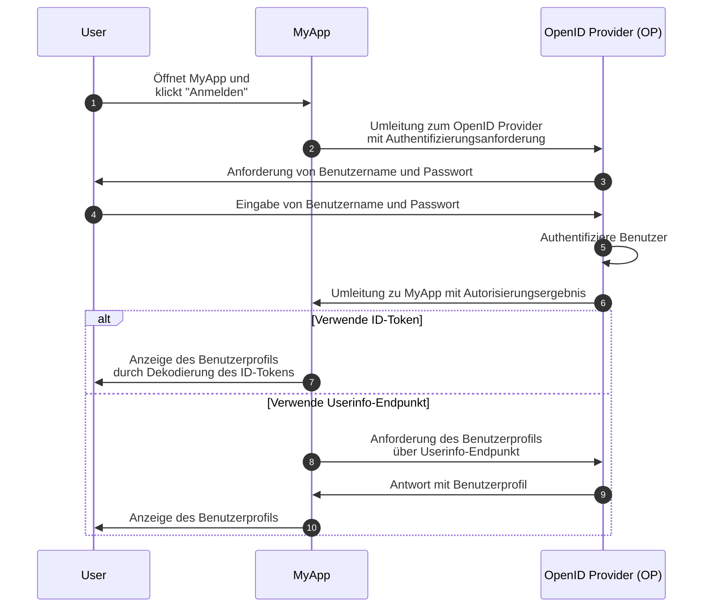
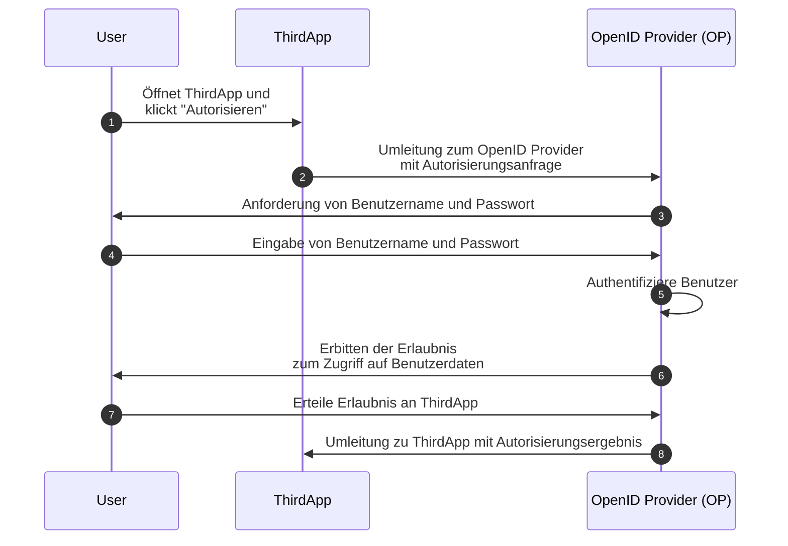

## Was ist OpenID Connect (OIDC)?

OpenID Connect (OIDC) fügt die Authentifizierungsfunktionen zu <Ref slug="oauth-2.0" />, einem Autorisierungs-Framework, hinzu, indem es eine Identitätsschicht darüber einführt. OIDC ermöglicht es Clients, Benutzer zu authentifizieren und Identitätsinformationen in Form von <Ref slug="id-token">ID-Token</Ref> und <Ref slug="userinfo-endpoint" /> Antworten zu erhalten.

Schauen wir uns ein Beispiel an. Angenommen, du hast eine Webanwendung namens MyApp, und Benutzer können sich mit Benutzername und Passwort anmelden; nach der Anmeldung können sie auf ihre Profilinformationen zugreifen. Hier ist ein vereinfachter Ablauf:



Einige Begriffe können neu für dich sein, lass sie uns klären:

### OpenID Provider (OP)

Ein OpenID Provider (OP) ist ein <Ref slug="identity-provider" />, der die OIDC- und OAuth 2.0-Spezifikation implementiert. Das heißt, ein OP ist auch ein OAuth 2.0 <Ref slug="authorization-server" />.

OPs sind verantwortlich für die Authentifizierung von Benutzern und die Ausgabe von ID-Token und Zugriffstoken an Clients.

### Tokens

- <Ref slug="id-token">ID-Token</Ref> sind <Ref slug="jwt">JSON Web Tokens</Ref>, die Benutzeridentitätsinformationen wie Name, E-Mail und Profilbild darstellen.
- <Ref slug="access-token">Zugriffstoken</Ref> werden verwendet, um auf geschützte Ressourcen im Namen des Benutzers zuzugreifen (wie bei OAuth 2.0), z. B. auf den Userinfo-Endpunkt.

### Authentifizierungsanforderung und -ergebnis

- <Ref slug="authentication-request" /> ist eine Anforderung, die vom Client an den OP gestellt wird, um den Benutzer zu authentifizieren. Sie enthält Parameter, um bestimmte Anforderungen zu spezifizieren, und beeinflusst den Authentifizierungsprozess.
- Abhängig von der Authentifizierungsanforderung kann das Authentifizierungsergebnis variieren. Wichtig ist, dass das Ergebnis die notwendigen Informationen für den Client enthält, um den Benutzer zu identifizieren.

### Userinfo-Endpunkt

<Ref slug="userinfo-endpoint" /> ist ein OIDC-spezifischer Endpunkt, der es Clients ermöglicht, Benutzerprofilinformationen abzurufen. Es ist eine Alternative zur Verwendung von ID-Token, da der Userinfo-Endpunkt typischerweise detailliertere Benutzerinformationen bereitstellt als das ID-Token.

OIDC überlässt es dem OpenID Provider (OP) zu entscheiden, welche Informationen im ID-Token und in der Userinfo-Antwort enthalten sind. Bevor du also das ID-Token analysierst oder den Userinfo-Endpunkt aufrufst, solltest du die Dokumentation des OP überprüfen, um zu verstehen, welche Informationen verfügbar sind.

## Begriffsunterschiede zwischen OAuth 2.0 und OIDC

Da OIDC auf OAuth 2.0 aufbaut, teilen beide Spezifikationen viele Begriffe. Während sich OAuth 2.0 jedoch auf die Autorisierung konzentriert, führt OIDC Authentifizierung und Identität ein, wodurch einige Begriffe im Kontext von OIDC ungeeignet sein können. Hier sind einige bemerkenswerte Unterschiede:

| OAuth 2.0             | OpenID Connect (OIDC)  |
|-----------------------|------------------------|
| Authorization server  | OpenID Provider (OP)   |
| Authorization request | Authentication request |
| Grant                 | Flow                   |

Im Wesentlichen können die obigen Begriffe auf dasselbe Thema verweisen, aber sie haben unterschiedliche Bedeutungen im Kontext von OAuth 2.0 und OIDC:

- **OpenID Provider (OP)** ist ein OAuth 2.0 <Ref slug="authorization-server" />, der die Möglichkeit hat, Benutzer zu authentifizieren und ID-Token auszustellen.
- **<Ref slug="authentication-request" />** ist eine OAuth 2.0 <Ref slug="authorization-request" />, die OIDC-spezifische Parameter verwendet, um die Authentifizierung des Endbenutzers anzufordern und ein ID-Token zu erhalten.
- **Flow** ist ein allgemeinerer Begriff, der in OIDC verwendet wird, um den Benutzer-Authentifizierungs- und -Autorisierungsprozess zu beschreiben, der mehrere Schritte und Interaktionen umfassen kann, anstatt nur einen einfachen Anforderungs-Antwort-Zyklus. Es ist im Wesentlichen dasselbe wie ein <Ref slug="oauth-2.0-grant" />.

## OIDC-Flows

Wie das obige Beispiel zeigt, werden OIDC-Flows vom Client (z. B. MyApp) mit einer Authentifizierungsanforderung an den OP initiiert. Die Authentifizierungsanforderung gibt den zu verwendenden Flow an, der einer der folgenden sein kann:

- **<Ref slug="authorization-code-flow" />**: Der sicherste und empfohlene Flow für Benutzer-Authentifizierung und -Autorisierung. <Ref slug="pkce" /> wird für alle Clients in <Ref slug="oauth-2.1" /> durchgesetzt.
- **<Ref slug="implicit-flow" />**: Ein vereinfachter Flow, der aufgrund von Sicherheitsbedenken in OAuth 2.1 veraltet ist.
- **<Ref slug="hybrid-flow" />**: Ein OIDC-Flow, der den Autorisierungscode-Flow mit dem impliziten Flow kombiniert. Aus Sicherheitsgründen wird es auch nicht für neue Anwendungen empfohlen.

Autorisierungscode-Flow und impliziter Flow werden von OAuth 2.0 erweitert, um ID-Token einzuschließen, während der Hybrid-Flow ein OIDC-spezifischer Flow ist, der beides kombiniert. Klicke auf die obigen Links, um mehr über jeden Flow zu erfahren.

## OIDC-Scopes und Claims

Wie OAuth 2.0 verwendet OIDC <Ref slug="scope" /> Werte, um die Berechtigungen anzugeben, die der Client anfordert. Da <Ref slug="id-token">ID-Token</Ref> <Ref slug="jwt">JSON Web Tokens</Ref> sind, können sie <Ref slug="claim">Claims</Ref> (Namens-Wert-Paare) enthalten, die Benutzeridentitätsinformationen gemäß den angeforderten Scopes in der <Ref slug="authentication-request" /> darstellen. Solche Claims werden auch in der <Ref slug="userinfo-endpoint" /> Antwort zurückgegeben.

OIDC definiert mehrere Standardscopes und entsprechende Claims, die Clients in der Authentifizierungsanforderung anfordern können:

- **openid**: Gibt an, dass der Client ein OIDC-Client ist und ein ID-Token anfordert.
- **profile**: Fordert Zugriff auf die Standardprofil-Claims des Benutzers an, die sind: `name`, `family_name`, `given_name`, `middle_name`, `nickname`, `preferred_username`, `profile`, `picture`, `website`, `gender`, `birthdate`, `zoneinfo`, `locale` und `updated_at`.
- **email**: Fordert Zugriff auf die Claims `email` und `email_verified` des Benutzers an.
- **address**: Fordert Zugriff auf das `address` Claim des Benutzers an.
- **phone**: Fordert Zugriff auf die Claims `phone_number` und `phone_number_verified` des Benutzers an.
- **offline_access**: Fordert ein Refresh-Token an, um dem Client zu ermöglichen, neue Zugriffstoken ohne Benutzerinteraktion zu erhalten.

Siehe [Standard Claims](https://openid.net/specs/openid-connect-core-1_0.html#StandardClaims) und [Requesting Claims using Scope Values](https://openid.net/specs/openid-connect-core-1_0.html#ScopeClaims) in der OIDC-Spezifikation für mehr Informationen zu Scopes und Claims. Siehe auch <Ref slug="offline-access" /> für eine detaillierte Erklärung des `offline_access` Scopes.

> [!Hinweis]
> OpenID Providers (OPs) können zusätzliche Scopes und Claims über die Standardwerte hinaus unterstützen. Überprüfe die Dokumentation des OP für weitere Details.

## Autorisierung in OIDC

Wenn du mit OAuth 2.0 vertraut bist, fällt dir vielleicht auf, dass das obige Beispiel keinen <Ref slug="authorization" />-Prozess beinhaltet. Das Beispiel lässt den Teil der Benutzerzustimmung weg, da wir angenommen haben, dass MyApp eine interne Anwendung ist, die keinen Drittparteizugriff auf Benutzerdaten beinhaltet. Die Autorisierung wird immer noch vom OP durchgesetzt, aber sie wird nicht explizit im Flow gezeigt.

Der Benutzerzustimmungsteil ist erforderlich, wenn ein Drittparteiclient (z. B. eine Anwendung, die nicht vom OP betrieben wird) Zugriff auf Benutzerdaten anfordert. In solchen Fällen wird der OP den Benutzer um Erlaubnis bitten, bevor er das ID-Token oder Zugriffstoken ausgibt. Angenommen, es gibt eine Drittanbieteranwendung namens ThirdApp, die auf Benutzerdaten zugreifen möchte:



Sobald der Autorisierungsprozess abgeschlossen ist und ThirdApp das Autorisierungsergebnis erhält (normalerweise ein <Ref slug="access-token" />), kann es auf die Benutzerdaten vom <Ref slug="resource-server" /> zugreifen.

Siehe <Ref slug="oauth-2.0" /> für weitere Informationen zu OAuth 2.0 und Autorisierungsflows.

### Scopes

Ähnlich wie OAuth 2.0 verwendet OIDC <Ref slug="scope" /> Werte, um die Berechtigungen anzugeben, die der Client anfordert. Wir haben die Standardscopes und Claims in [OIDC-Scopes und -Claims](#oidc-scopes-and-claims) behandelt. Es ist zu beachten, dass diese Scopes und Claims in OIDC als reservierte Werte behandelt werden sollten, was bedeutet, dass du sie NICHT für geschäftsspezifische Zwecke verwenden solltest.

In der Praxis kann dein OpenID Provider (OP) benutzerdefinierte Scopes und Claims für deine geschäftlichen Anforderungen unterstützen. Konsultiere die Dokumentation des OP für weitere Informationen zu benutzerdefinierten Scopes und Claims. Wenn du keine benutzerdefinierten Scopes und Claims definierst, kann der OP sie direkt ignorieren oder eine Fehlermeldung zurückgeben.

### Ressourcenindikatoren

Da Frameworks wie OIDC und der OP möglicherweise bestimmte Scopes und Claims für bestimmte Zwecke reserviert haben, ist es in der Regel empfohlen, einen Präfix oder Namespace zu verwenden, um Konflikte mit reservierten Werten zu vermeiden, wenn benutzerdefinierte Scopes und Claims definiert werden. Zum Beispiel könntest du deine benutzerdefinierten Scopes mit `myapp:` voranstellen, um anzuzeigen, dass sie spezifisch für deine Anwendung sind.

```json
{
  "scope": "myapp:custom_scope"
}
```

Dies kann jedoch nicht garantieren, dass deine benutzerdefinierten Scopes und Claims nicht mit zukünftigen reservierten Werten in Konflikt geraten, und es könnte die Token-Größe aufblähen. Eine OAuth 2.0-Erweiterung namens <Ref slug="resource-indicator">Ressourcenindikatoren</Ref> bietet eine flexiblere und skalierbarere Möglichkeit, dasselbe Ziel zu erreichen. Ressourcenindikatoren sind URIs, die die angeforderten Ressourcen darstellen, und sie können die tatsächlichen API-Endpunkte sein, um die realen Ressourcen widerzuspiegeln. Zum Beispiel kannst du `https://api.myapp.com` als Ressourcenindikator verwenden, um die API-Ressourcen zu repräsentieren, auf die dein Client zugreifen möchte.

Da OIDC auf OAuth 2.0 aufbaut, kannst du Ressourcenindikatoren in OIDC-Authentifizierungsanfragen verwenden, wenn sie ordnungsgemäß konfiguriert wurden. Hier ist ein nicht-normatives Beispiel einer Authentifizierungsanfrage mit einem Ressourcenindikator:

```http
GET /authorize?response_type=code
  &client_id=YOUR_CLIENT_ID
  &redirect_uri=https%3A%2F%2Fclient.example.com%2Fcallback
  &scope=openid%20profile
  &resource=https%3A%2F%2Fapi.example.com HTTP/1.1
Host: your-openid-provider.com
```

Um Ressourcenindikatoren zu verwenden, musst du zuerst bestätigen, dass dein OP diese Erweiterung (RFC 8707) unterstützt. Wenn sie unterstützt wird, solltest du einen Ressourcenindikator-URI beim OP registrieren und ihn im `resource` Parameter der Authentifizierungsanfrage verwenden.

Siehe <Ref slug="resource-indicator" /> für detaillierte Informationen zu Ressourcenindikatoren.

## OIDC Sicherheitsüberlegungen

### Sichere Kommunikation

Alle Kommunikationen zwischen dem Client, OP und dem Ressourcenserver sollten mithilfe von HTTPS gesichert werden, um ein Abhören oder Manipulieren der Daten zu verhindern.

### Sichere Flows wählen

Bei der Implementierung von OIDC wird empfohlen, Folgendes zu verwenden:

- <Ref slug="authorization-code-flow" /> mit <Ref slug="pkce" /> für Benutzer-Authentifizierung und -Autorisierung (durchgesetzt in <Ref slug="oauth-2.1" />).
- <Ref slug="client-credentials-flow" /> für die Kommunikation zwischen Maschinen.

Impliziter Flow und Hybrid-Flow sind aufgrund von Sicherheitsbedenken veraltet, daher vermeide die Verwendung für neue Anwendungen und überlege, bestehende Anwendungen auf sicherere Flows zu migrieren.

### ID-Token-Validierung

Wenn ein ID-Token vom OP empfangen wird, sollte der Client das Token validieren, um seine Integrität und Authentizität sicherzustellen. Der Validierungsprozess sollte mindestens folgende Prüfungen beinhalten:

- **Issuer (Aussteller)**: Das `iss` Claim sollte mit der URL des OP übereinstimmen.
- **Audience (Zielgruppe)**: Das `aud` Claim sollte mit der Client-ID des Clients übereinstimmen.
- **Expiration (Ablauf)**: Das `exp` Claim sollte in der Zukunft liegen.
- **Signature (Signatur)**: Das Token sollte vom <Ref slug="signing-key" /> des OP signiert sein.

### Verwendung von Zugriffstoken

Zugriffstoken werden verwendet, um im Namen des Benutzers auf geschützte Ressourcen zuzugreifen. Clients sollten Zugriffstoken als sensible Informationen behandeln und folgende Best Practices befolgen:

- **Token-Speicherung**: Speichere Zugriffstoken sicher und vermeide deren Exposition gegenüber unbefugten Parteien.
- **Token-Ablauf**: Zugriffstoken sollten eine kurze Ablaufzeit (z. B. 1 Stunde) haben, um das Risiko eines unbefugten Zugriffs im Falle einer Kompromittierung des Tokens zu reduzieren.
- **Token-Widerruf**: Implementiere Mechanismen zum Widerruf von Token, um Zugriffstoken bei Bedarf ungültig zu machen.

### Benutzerzustimmung

Wenn ein Drittparteiclient den Zugriff auf Benutzerdaten anfordert, sollte der OP sicherstellen, dass der Benutzer über die angeforderten Berechtigungen informiert ist und seine Zustimmung erteilt. Der Benutzerzustimmungsprozess sollte transparent sein und klare Informationen darüber bereitstellen, welche Daten zugriffen werden und wie sie verwendet werden.

<SeeAlso slugs={["oauth-2.0", "authorization-code-flow", "implicit-flow", "hybrid-flow", "pkce", "resource-indicator"]} />

<Resources
  urls={[
    "https://blog.logto.io/secure-cloud-apps-with-oauth-and-openid-connect",
    "https://openid.net/specs/openid-connect-core-1_0.html",
  ]}
/>