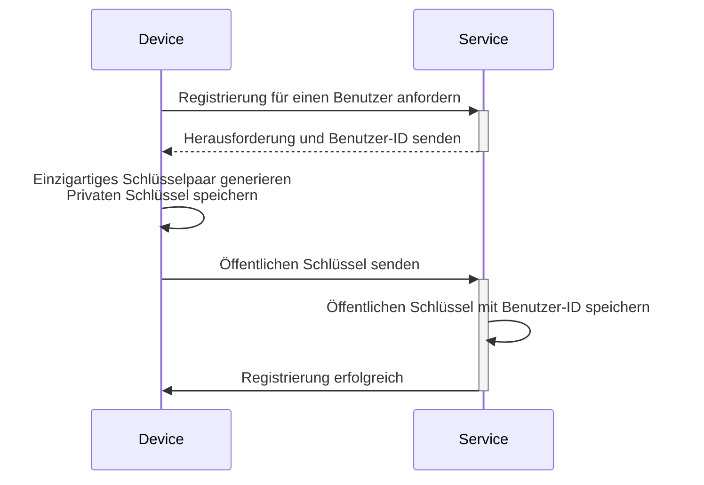
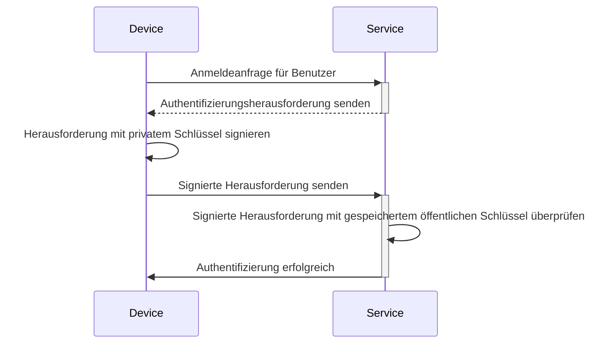

## Was ist ein Passkey?

**Passkey** ist eine auf [FIDO](https://fidoalliance.org/) basierende, sichere und praktische Alternative zu herkömmlichen Passwörtern. Sie verwenden fortschrittliche Kryptografie, um deine Konten vor [Phishing](https://en.wikipedia.org/wiki/Phishing)-Angriffen zu schützen.

- **Einzigartig für jeden Dienst**: Wenn du dich für einen Dienst registrierst, erstellt dein Gerät einen einzigartigen Passkey, der mit der Domain dieses speziellen Dienstes verknüpft ist.
- **Gerätegebunden:** Passkeys sind in der Regel mit einem Gerät verknüpft, wie einem Telefon, Laptop, biometrischen Identifikator oder Hardware-Sicherheitsschlüsseln.
- **Öffentlich-privates Schlüsselpaar:** Das Gerät behält den privaten Schlüssel, während der öffentliche Schlüssel mit dem Dienst geteilt wird. Diese kryptografischen Schlüsselpaaren werden Passkeys genannt. (Zitat von [FIDO](https://fidoalliance.org/how-fido-works/))
- **Mehrere Authentifizierungsmethoden:** Du kannst einen Fingerabdruck-Scan, Gesichtserkennung, Geräte-PIN, QR-Code-Scan oder Sicherheitsschlüssel verwenden, um dich mit einem Passkey zu authentifizieren.
- **Geräteübergreifende Synchronisierung**: Passkeys können über sichere Cloud-Speicher (z. B. Apples iCloud-Schlüsselbund oder Google Password Manager) auf verschiedenen Geräten synchronisiert werden, sodass du dich von jedem unterstützten Gerät aus anmelden kannst.

## Wie sieht der Passkey-Workflow aus?

Hier ist ein Beispiel aus der Praxis, um es besser zu verstehen. Du hast einen Webdienst MyApp, der Passkey-Anmeldung anstelle der passwortbasierten Anmeldung implementieren möchte. Benutzer wählen das aktuelle Gerät mit Fingerabdruck-Scan als Passkey-Authentifizierungsmethode.

**Passkeys** funktionieren, indem sie öffentliche Schlüssel-Kryptografie verwenden, um sichere Anmeldeinformationen bereitzustellen.

- **Passkey-Registrierung**
    - Wenn du dich für einen Dienst registrierst, generiert dein Gerät ein einzigartiges kryptografisches Schlüsselpaar, das mit diesem Dienst verknüpft ist.
    - Der **private Schlüssel** bleibt auf deinem Gerät, während der **öffentliche Schlüssel** mit dem Dienst geteilt wird.

- **Passkey-Authentifizierung**
    - Wenn du versuchst, dich anzumelden, sendet der Dienst eine **Herausforderung** an dein Gerät.
    - Dein Gerät verwendet den **privaten Schlüssel**, um basierend auf der Herausforderung eine kryptografische **Signatur** zu erzeugen.
    - Die **Signatur** wird zurück an den Dienst gesendet, der sie mit dem **öffentlichen Schlüssel** überprüft.
    - Wenn die Signatur gültig ist, ist die Authentifizierung erfolgreich.

Lies <Ref slug="webauthn" />, eine API zur Implementierung von Passkeys, um die Details zu erfahren.

## Wie sieht der Passkey-Endbenutzerfluss aus?

Passkeys bieten Flexibilität mit zwei Arten von Authentifikatoren für den lokalen und Cloud-Gebrauch, und Benutzer können einen oder beide für den Dienst aktivieren.

- **Plattform-Authentifikator (Interner Authentifikator):** An ein bestimmtes Gerätebetriebssystem gebunden (z. B. Telefon, Laptop), verwendet Biometrie oder Gerätepasscode zur Autorisierung. Es ist schnell und bequem.
    - Beispiele: iCloud-Schlüsselbund auf Apple-Geräten (Verifizierung über Touch ID, Face ID oder Gerätepasscode), Windows Hello, Google Password Manager auf Android.
- **Roaming-Authentifikator (Externer Authentifikator):** Tragbare Geräte oder Software, z. B. Sicherheitsschlüssel, Smartphones. Kann auf mehreren Geräten verwendet werden, erfordert jedoch möglicherweise zusätzliche Schritte wie QR-Code-Scan oder NFC/Bluetooth-Pairing.
    - Beispiele: YubiKey und cloudbasierte Konten auf Smartphones. Mobile Authentifikatoren erfordern oft QR-Code-Scans, um sich mit Desktop-Geräten zu verbinden, und geräteübergreifende Authentifizierung muss über Bluetooth, NFC oder USB verbunden werden, um sicherzustellen, dass der Authentifikator in der Nähe ist.

## Wann sollte man Passkeys verwenden?

Passkeys sind ein modernes Authentifizierungsfaktor, der entweder als erster oder zweiter Faktor verwendet werden kann.

- **Passkey-Anmeldung:** Passkeys bieten eine schnellere und sicherere passwortlose Authentifizierungsmethode im Vergleich zu herkömmlichen Passwörtern.
    - Moderne Anwendungen verfügen typischerweise über eine Schaltfläche „Mit Passkey anmelden“ auf der Anmeldeseite, die Benutzer dazu auffordert, diese Option proaktiv zu wählen.
    - Zusätzlich kann die Anmeldeseite automatisch ein Passkey-Anmelde-Pop-up anzeigen, wenn erkannt wird, dass der Benutzer auf dasselbe Gerät und denselben Browser zugreift, auf dem sein Passkey registriert ist.
- **Passkey MFA:** Passkeys können auch als zweiter Faktor für MFA dienen.
    - Wenn ein Benutzer versucht, sich anzumelden, gibt er zuerst seine E-Mail und sein Passwort (oder andere erste Faktoren) ein, danach fordert der Dienst ihn auf, die 2-Schritt-Verifizierung mit einem Passkey abzuschließen.
    - Wenn es bereits Sitzungen im Browser gibt, kann der Dienst Benutzer direkt dazu auffordern, sich mit ihrem Passkey anzumelden, ohne dass sie ihr Passwort erneut eingeben müssen. Dieser Prozess, bekannt als MFA-Abschluss, da Passkey ein hohes Maß an Sicherheit bietet, indem er an das aktuelle Gerät gebunden ist und Benutzer durch Biometrie, PINs oder andere Hardware-Methoden verifiziert.
- **Sicherheitsüberprüfung**: In hochsicheren Umgebungen werden Passkeys häufig verwendet, um die Benutzeridentität doppelt zu überprüfen. Zum Beispiel beim Zugriff auf sensible Finanzinformationen oder bei der Durchführung kritischer Operationen (Bankwesen, Regierung, Unternehmenssystem).

### Warum sind Passkeys die sicherste Authentifizierungsmethode?

Passkeys sind eine der sichersten Möglichkeiten für normale Kunden, sich anzumelden, da sie **öffentliche Schlüssel-Kryptografie** verwenden. Im Gegensatz zu Passwörtern oder Einmalcodes (TOTPs) verlässt dein privater Schlüssel niemals dein Gerät. Selbst wenn ein Angreifer den öffentlichen Schlüssel stiehlt, der frei verfügbar ist, kann er keinen gültigen Anmeldeversuch vortäuschen.

Hier ist ein Vergleich, um zu veranschaulichen, warum Passkeys erheblich sicherer sind:

| Angriffe | Passkeys | Software TOTP (Authenticator) |
| --- | --- | --- |
| **Phishing-Angriffe** | Hoch resistent gegen Phishing, da der private Schlüssel niemals das Gerät verlässt oder manuell irgendwo eingegeben wird, was es schwieriger macht, ihn zu stehlen. | Anfällig für Phishing, da Software TOTP auf deinem Bildschirm angezeigt wird, sodass Angreifer dich dazu verleiten können, ihn auf einer gefälschten Website preiszugeben. |
| **Man-in-the-middle-Angriffe (MitM)** | Starker Schutz gegen MitM, da robuste kryptografische Protokolle die privaten Schlüssel nur auf deinem Gerät halten. | Anfällig für MitM, da die TOTPs von einem MitM-Angreifer abgefangen werden können, der sie dann verwenden könnte, um sich als du anzumelden. |
| **Replay-Angriffe** | Starker Schutz gegen Replay-Angriffe, da jede Passkey-Anfrage einzigartig ist, was es einem Angreifer nutzlos macht, sie zu erfassen und später zu wiederholen. | Möglich für Replay-Angriffe, da TOTP periodisch wechseln, aber wenn sie vor dem Ablauf abgefangen werden, könnten sie für unbefugten Zugriff wiederverwendet werden. |

<SeeAlso slugs={["webauthn", "authentication", "authorization"]} />

<Resources
  urls={[
    "https://fidoalliance.org/passkeys/",
    "https://webauthn.io/"
  ]}
/>