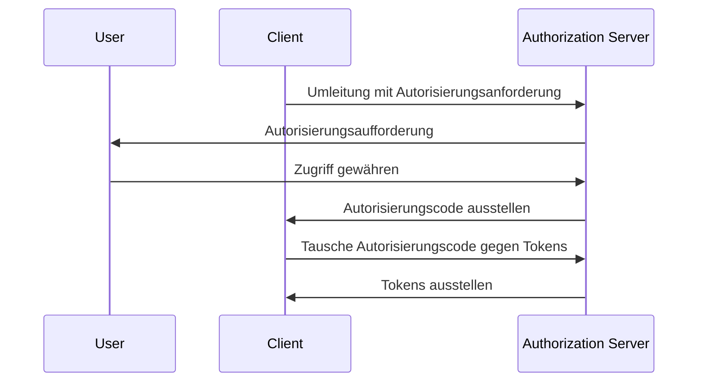

## Was ist Proof Key for Code Exchange (PKCE)?

Proof Key for Code Exchange (PKCE) dient als Sicherheitserweiterung für <Ref slug="authorization-code-flow" /> in <Ref slug="oauth-2.0" />. Es ist darauf ausgelegt, Autorisierungscodes vor Abfangen und Missbrauch zu schützen, insbesondere bei öffentlichen Clients, bei denen das Client-Geheimnis nicht sicher ist.

Ab <Ref slug="oauth-2.1" /> wird PKCE für alle Arten von Clients erzwungen, einschließlich <Ref slug="client" headingId="public-clients" /> und <Ref slug="client" headingId="confidential-clients">vertraulichen (privaten) Clients</Ref>.

## Wie funktioniert PKCE?

PKCE führt einige zusätzliche Schritte in den Autorisierungscode-Flow ein, um sicherzustellen, dass der <Ref slug="client" />, der den Autorisierungscode austauscht, derselbe Client ist, der den Flow initiiert hat.

> [!Note]
> PKCE ist auch anwendbar auf <Ref slug="openid-connect" /> Flows, die auf dem Autorisierungscode-Flow basieren. Zur Vereinfachung konzentrieren wir uns auf die Implementierung von OAuth 2.0.

Lassen Sie uns schnell den Standardfluss für Autorisierungscodes überprüfen, bevor wir in PKCE eintauchen:



Nun sehen wir uns an, wie PKCE den Autorisierungscode-Flow verbessert.

### 1. Vorbereitung der Autorisierungsanforderung

#### 1.1. Client generiert einen Codeüberprüfer

Bevor der <Ref slug="authorization-request" /> initiiert wird, sollte der Client eine zufällige Zeichenfolge namens **Codeüberprüfer** generieren. Die Zeichenfolge sollte eine kryptografisch zufällige, URL-sichere Zeichenfolge mit hoher Entropie und einer Mindestlänge von 43 Zeichen und einer Höchstlänge von 128 Zeichen sein.
  
Hier ist ein Beispiel zum Generieren eines Codeüberprüfers in JavaScript:

```javascript
// `js-base64` ist eine universelle Bibliothek, die sowohl in Node.js als auch in Browsern verwendet werden kann
import { fromUint8Array } from 'js-base64';

// Das zweite Argument `true` zeigt an, dass die Ausgabe URL-sicher sein sollte
const codeVerifier = fromUint8Array(crypto.getRandomValues(new Uint8Array(64)), true);
```

#### 1.2. Client erstellt eine Codeherausforderung

Der Client sollte den **Codeüberprüfer** mit einer kryptografischen Hash-Funktion wie SHA-256 hashen und den Hash in einer URL-sicheren Base64-Zeichenfolge codieren. Die resultierende Zeichenfolge wird als **Codeherausforderung** bezeichnet.

Hier ist ein Beispiel zum Erstellen einer Codeherausforderung in JavaScript:

```javascript
// `js-base64` ist eine universelle Bibliothek, die sowohl in Node.js als auch in Browsern verwendet werden kann
import { fromUint8Array } from 'js-base64';

const encodedCodeVerifier = new TextEncoder().encode(codeVerifier);
const codeChallenge = new Uint8Array(await crypto.subtle.digest('SHA-256', encodedCodeVerifier));

// Das zweite Argument `true` zeigt an, dass die Ausgabe URL-sicher sein sollte
return fromUint8Array(codeChallenge, true);
```

#### 1.3. Client fügt die Codeherausforderung in die Autorisierungsanforderung ein

Wenn der Client die Autorisierungsanforderung initiiert, schließt er die Parameter `code_challenge` und `code_challenge_method` in die Anfrage ein. Der Parameter `code_challenge` enthält die **Codeherausforderung**, die im vorherigen Schritt generiert wurde, und der Parameter `code_challenge_method` gibt den Hash-Algorithmus an, der zur Erstellung der **Codeherausforderung** verwendet wurde (z. B. `S256` für SHA-256).

Die unterstützten `code_challenge_method`-Werte sind `plain` und `S256`, wobei `plain` angibt, dass die **Codeherausforderung** unverändert ohne Hashing gesendet wird. Normalerweise wird `S256` für bessere Sicherheit empfohlen.

Hier ist ein nicht normatives Beispiel für eine Autorisierungsanforderung mit PKCE:

```http
GET /authorize?response_type=code
  &client_id=YOUR_CLIENT_ID
  &redirect_uri=https%3A%2F%2Fclient.example.com%2Fcallback
  &scope=openid%20profile
  &code_challenge=YOUR_CODE_CHALLENGE
  &code_challenge_method=S256
  &state=abc123
  &nonce=123456 HTTP/1.1
```

### 2. Den Autorisierungscode gegen Tokens eintauschen

Der Client sollte den **Codeüberprüfer** für die spätere Verwendung speichern und mit dem Autorisierungsfluss wie gewohnt fortfahren. Sobald der Client den Autorisierungscode erhält, sollte er die <Ref slug="token-request" /> mit dem **Codeüberprüfer** an den Autorisierungsserver senden.

Hier ist ein nicht normatives Beispiel für eine Token-Anfrage mit PKCE:

```http
POST /token HTTP/1.1
Host: your-authorization-server.com
Content-Type: application/x-www-form-urlencoded

grant_type=authorization_code
  &code=YOUR_AUTHORIZATION_CODE
  &redirect_uri=https%3A%2F%2Fclient.example.com%2Fcallback
  &client_id=YOUR_CLIENT_ID
  &code_verifier=YOUR_CODE_VERIFIER
```

Der Autorisierungsserver überprüft die **Codeherausforderung** mit dem **Codeüberprüfer**, um sicherzustellen, dass der Client dieselbe Entität ist, die den Flow initiiert hat. Wenn die Überprüfung fehlschlägt, lehnt der Autorisierungsserver die Token-Anfrage ab.

## Wie PKCE die Sicherheit verbessert

Der primäre Sicherheitsvorteil von PKCE besteht darin, dass es Angriffe durch Abfangen von Autorisierungscodes verhindert, die bei öffentlichen Clients auftreten können. Beispielsweise, wenn ein Angreifer den Autorisierungscode abfängt, können sie diesen nicht gegen Tokens austauschen, ohne den **Codeüberprüfer** zu kennen. PKCE stellt sicher, dass nur der Client, der den Flow initiiert hat, den Token-Austausch abschließen kann.

<SeeAlso slugs={['oauth-2.1', 'authorization-code-flow']} />

<Resources
  urls={[
    "https://blog.logto.io/how-pkce-protects-the-authorization-code-flow-for-native-apps",
    "https://datatracker.ietf.org/doc/html/rfc7636",
  ]}
/>