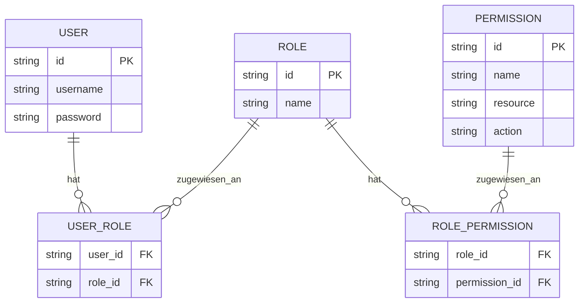
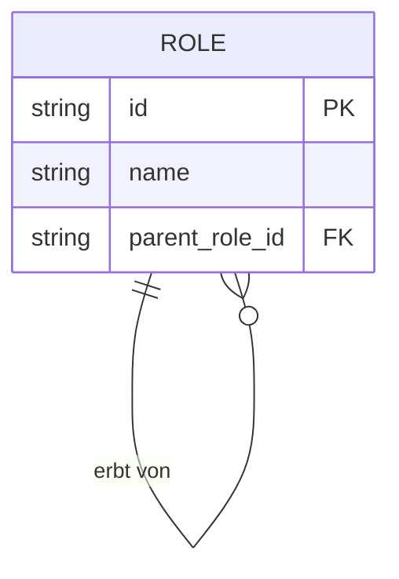
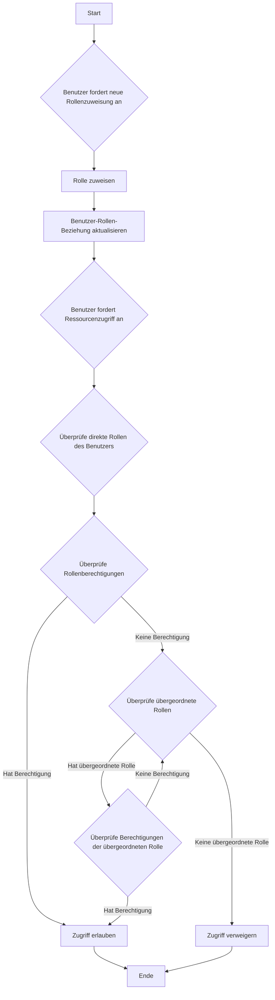
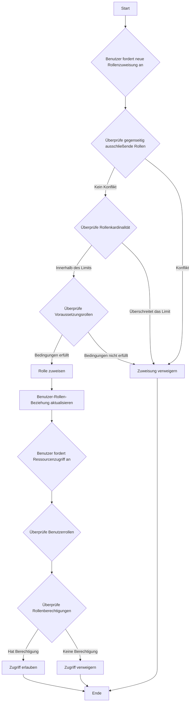

## Was ist rollenbasierte Zugriffskontrolle (RBAC)?

Rollenbasierte Zugriffskontrolle (RBAC) ist ein weit verbreitetes Zugriffskontrollmodell, das das Konzept der "Rollen" einführt, um Benutzer von Berechtigungen zu entkoppeln, was zu einem flexiblen und effizienten Berechtigungsmanagementsystem führt.

Die Kernidee hinter RBAC ist einfach, aber mächtig: Anstatt Berechtigungen direkt Benutzern zuzuweisen, werden Berechtigungen Rollen zugewiesen, die dann den Benutzern zugewiesen werden. Diese indirekte Methode der Berechtigungszuweisung vereinfacht den Prozess der Verwaltung von Zugriffsrechten erheblich.

## Was sind die Schlüsselkonzepte in RBAC?

Das RBAC-Modell dreht sich um vier Hauptelemente:

1. Benutzer: Individuen innerhalb des Systems, typischerweise reale Personen.
2. Rollen: Darstellungen von Jobfunktionen oder Verantwortlichkeiten innerhalb einer Organisation.
3. Berechtigungen: Autorisierungen zur Durchführung spezifischer Operationen auf bestimmten Ressourcen.
4. Sitzungen: Dynamische Umgebungen, in denen Benutzer bestimmte Rollen aktivieren.

Der grundlegende Arbeitsablauf von RBAC kann wie folgt zusammengefasst werden:
1. Definieren von Rollen basierend auf der Organisationsstruktur oder den Geschäftsanforderungen.
2. Zuweisen geeigneter Berechtigungen zu jeder Rolle.
3. Zuweisen einer oder mehrerer Rollen zu Benutzern basierend auf ihren Verantwortlichkeiten.
4. Wenn ein Benutzer versucht, auf eine Ressource zuzugreifen, überprüft das System, ob seine zugewiesenen Rollen die erforderlichen Berechtigungen haben.

## Wie wird RBAC in realen Anwendungen häufig verwendet?

Bei der Verwendung von RBAC in einer typischen Geschäftsanwendung kannst du mit den folgenden drei grundlegenden Fragen beginnen:

1. Welche Ressourcen müssen im System geschützt werden?
2. Welche Operationen müssen auf diesen Ressourcen kontrolliert werden?
3. In realen Szenarien, welche Rollen sind für die Ausführung dieser Ressourcen und Operationen verantwortlich?

Nehmen wir ein E-Commerce-System als Beispiel.

Du kannst zuerst die Ressourcen identifizieren, die geschützt werden müssen:

- Produkt
- Bestellung

Dann kannst du bestimmen, welche Operationen auf diesen Ressourcen kontrolliert werden müssen, d.h. die Berechtigungen für diese Ressourcen definieren:

- Produkt
  - `read:product`
  - `create:product`
  - `delete:product`
- Bestellung
  - `read:order`
  - `create:order`
  - `delete:order`

Mit den obigen Berechtigungen kannst du nun das folgende Berechtigungsmanagementmodell basierend auf den Rollen in realen Szenarien definieren:

- Produktadministrator
  - Produkt
    - `read:product`
    - `create:product`
    - `delete:product`
- Bestelladministrator
  - Bestellung
    - `read:order`
    - `create:order`
    - `delete:order`

Schließlich weise die Rollen den Benutzern basierend auf ihren Verantwortlichkeiten zu:

- Alice: Produktadministrator
- Bob: Bestelladministrator

Wenn ein Benutzer auf eine Ressource zugreift, überprüft das System, ob die dem Benutzer zugewiesenen Rollen die erforderlichen Berechtigungen haben.

Zum Beispiel, wenn Alice versucht, Produktinformationen zu lesen, ruft das System zuerst ihre Rolleninformationen ab und stellt fest, dass sie die Rolle des Produktadministrators hat.

Dann fragt das System die mit dieser Rolle verbundenen Berechtigungen ab, die `read:product`, `create:product` und `delete:product` umfassen.

Das System überprüft dann, ob die erforderliche Berechtigung `read:product` in ihrer Berechtigungsliste vorhanden ist.

Da diese Berechtigung vorhanden ist, erlaubt das System Alice den Zugriff auf die Produktliste. Wenn die erforderliche Berechtigung nicht in der Liste ist, verweigert das System die Zugriffsanforderung.

## Warum du Rollen nicht direkt für die Zugriffskontrolle verwenden solltest

Ein häufiger Fehler bei der Implementierung von RBAC ist die direkte Verwendung von Rollen für die Zugriffskontrolle:

```typescript
// ❌ Problematischer Ansatz
if (user.hasRole('product_admin')) {
  await deleteProduct(productId);
}
```

Obwohl dieser Ansatz einfach erscheint, schafft er Probleme, wenn dein System wächst. Zum Beispiel:
- Wenn das Marketingteam Produktbeschreibungen aktualisieren muss, musst du den Code ändern, um nach Marketingrollen zu suchen.
- Wenn du möchtest, dass bestimmte Produktmanager nur Produkte veröffentlichen, aber nicht löschen können, musst du neue Rollenkontrollen für verwandte Operationen erstellen.
- Wenn ein neues Content-Team teilweise auf Produkte zugreifen muss, musst du erneut deinen Code aktualisieren.

Stattdessen solltest du immer nach spezifischen Berechtigungen suchen:

```typescript
// ✅ Empfohlener Ansatz
if (user.hasPermission('delete:product')) {
  await deleteProduct(productId);
}
```

Dieser berechtigungsbasierte Ansatz bietet mehrere Vorteile:

1. Fein abgestimmte Berechtigungskontrolle: Berechtigungen können genau auf spezifische Ressourcenoperationen abgebildet werden:

- Produkt erstellen: `create:product`
- Produkt aktualisieren: `update:product`
- Produkt löschen: `delete:product`
- Produkt veröffentlichen: `publish:product`

2. Flexible Rollenkonfiguration: Berechtigungen können ohne Codeänderungen frei zu Rollen kombiniert werden:

```typescript
const roles = {
  product_admin: ['create:product', 'update:product', 'delete:product', 'publish:product'],
  content_editor: ['update:product'],
  publisher: ['publish:product']  // Neue Rollen können leicht hinzugefügt werden
};
```

Dieses Design macht dein System anpassungsfähig an das Geschäftswachstum:
- Das Hinzufügen neuer Rollen erfordert nur die Berechtigungskonfiguration
- Die Anpassung von Rollenberechtigungen erfolgt durch Konfiguration
- Neue Funktionen benötigen nur neue Berechtigungseinträge

Denke daran: Rollen sollten nur Container für Berechtigungen sein, nicht die Grundlage für Entscheidungen zur Zugriffskontrolle. Dieses Design ermöglicht es RBAC, den maximalen Wert zu bieten.

## RBAC-Modelle und ihre Entwicklung

### RBAC0: Die Grundlage

RBAC0 ist das grundlegende Modell, das die Kernkonzepte von Benutzern, Rollen, Berechtigungen und Sitzungen definiert. Es dient als Grundlage für alle anderen RBAC-Modelle.

Hauptmerkmale:
- Benutzer-Rollen-Assoziation: Viele-zu-viele-Beziehung
- Rollen-Berechtigungs-Assoziation: Viele-zu-viele-Beziehung



Dieses Diagramm veranschaulicht die grundlegende Struktur von RBAC0 und zeigt die Beziehungen zwischen Benutzern, Rollen und Berechtigungen.

Wichtige Operationen:
1. Zuweisen von Rollen zu Benutzern
2. Zuweisen von Berechtigungen zu Rollen
3. Überprüfen, ob ein Benutzer eine bestimmte Berechtigung hat

Obwohl RBAC0 einen soliden Ausgangspunkt bietet, hat es einige Einschränkungen:
1. Rollenexplosion: Mit zunehmender Systemkomplexität kann die Anzahl der Rollen schnell wachsen.
2. Berechtigungsredundanz: Verschiedene Rollen können ähnliche Berechtigungssätze erfordern, was zu Duplikationen führt.
3. Mangel an Hierarchie: Es kann keine Vererbungsbeziehungen zwischen Rollen darstellen.

### RBAC1: Einführung von Rollenhierarchien

RBAC1 baut auf RBAC0 auf, indem es das Konzept der Rollenvererbung hinzufügt.

```plaintext
RBAC1 = RBAC0 + Rollenvererbung
```

Hauptmerkmale:
- Rollenhierarchie: Rollen können übergeordnete Rollen haben
- Berechtigungsvererbung: Untergeordnete Rollen erben alle Berechtigungen ihrer übergeordneten Rollen



Dieses Diagramm zeigt, wie Rollen in RBAC1 von anderen Rollen erben können.

Wichtige Operationen:



Dieses Flussdiagramm veranschaulicht den Prozess der Rollenzuweisung und Berechtigungsüberprüfung in RBAC1, einschließlich des Aspekts der Rollenvererbung.

RBAC1 bietet mehrere Vorteile:
1. Reduzierte Anzahl von Rollen: Weniger Basisrollen können durch Vererbung erstellt werden
2. Vereinfachtes Berechtigungsmanagement: Einfacher, organisatorische Hierarchien abzubilden

Allerdings hat RBAC1 immer noch einige Einschränkungen:
1. Mangel an Einschränkungsmechanismen: Unfähig, Benutzer daran zu hindern, gleichzeitig potenziell widersprüchliche Rollen zu halten
2. Leistungserwägungen: Berechtigungsüberprüfungen können das Durchlaufen der gesamten Rollenhierarchie erfordern

### RBAC2: Implementierung von Einschränkungen

RBAC2 basiert ebenfalls auf RBAC0, führt jedoch das Konzept der Einschränkungen ein.

```plaintext
RBAC2 = RBAC0 + Einschränkungen
```

Hauptmerkmale:
1. Gegenseitig ausschließende Rollen: Benutzer können nicht gleichzeitig diesen Rollen zugewiesen werden
2. Rollenkardinalität: Begrenzung der Anzahl von Benutzern, die einer bestimmten Rolle zugewiesen werden können
3. Voraussetzungsrollen: Benutzer müssen eine bestimmte Rolle haben, bevor sie einer anderen zugewiesen werden



Dieses Flussdiagramm zeigt den Prozess der Rollenzuweisung und Zugriffskontrolle in RBAC2 unter Einbeziehung der verschiedenen Einschränkungen.

RBAC2 verbessert die Sicherheit, indem es eine übermäßige Konzentration von Berechtigungen verhindert und eine präzisere Zugriffskontrolle ermöglicht. Es erhöht jedoch die Systemkomplexität und kann die Leistung beeinträchtigen, da für jede Rollenzuweisung mehrere Einschränkungsbedingungen überprüft werden müssen.

### RBAC3: Das umfassende Modell

RBAC3 kombiniert die Funktionen von RBAC1 und RBAC2 und bietet sowohl Rollenvererbung als auch Einschränkungsmechanismen:

```plaintext
RBAC3 = RBAC0 + Rollenvererbung + Einschränkungen
```

Dieses umfassende Modell bietet maximale Flexibilität, stellt jedoch auch Herausforderungen bei der Implementierung und Leistungsoptimierung dar.

## Was sind die Vorteile von RBAC (rollenbasierte Zugriffskontrolle)?

1. Vereinfachtes Berechtigungsmanagement: Massenautorisierung durch Rollen reduziert die Komplexität der Verwaltung individueller Benutzerberechtigungen.
2. Erhöhte Sicherheit: Präzisere Kontrolle über Benutzerberechtigungen senkt Sicherheitsrisiken.
3. Reduzierte Verwaltungskosten: Änderungen an Rollenberechtigungen wirken sich automatisch auf alle zugehörigen Benutzer aus.
4. Ausrichtung an der Geschäftslogik: Rollen entsprechen oft organisatorischen Strukturen oder Geschäftsprozessen, was sie leichter verständlich und verwaltbar macht.
5. Unterstützung der Trennung von Aufgaben: Kritische Verantwortlichkeiten können durch Einschränkungen wie gegenseitig ausschließende Rollen getrennt werden.

## Was sind die praktischen Implementierungsüberlegungen?

Bei der Implementierung von RBAC in realen Szenarien sollten Entwickler diese Schlüsselaspekte berücksichtigen:

1. Datenbankdesign: Verwende relationale Datenbanken, um RBAC-Strukturen effektiv zu speichern und abzufragen.
2. Leistungsoptimierung: Implementiere Caching-Strategien und optimiere Berechtigungsüberprüfungen, insbesondere für komplexe RBAC3-Modelle.
3. API- und Frontend-Integration: Entwerfe klare APIs zur Verwaltung von Benutzern, Rollen und Berechtigungen und berücksichtige, wie RBAC in Frontend-Anwendungen verwendet werden kann.
4. Sicherheit und Auditing: Stelle die Sicherheit des RBAC-Systems selbst sicher und implementiere detaillierte Protokollierungs- und Auditfunktionen.
5. Skalierbarkeit: Entwerfe mit Blick auf zukünftige Erweiterungen, wie die Unterstützung komplexerer Berechtigungsregeln oder die Integration mit anderen Systemen.
6. Benutzererfahrung: Entwerfe intuitive Schnittstellen für Systemadministratoren, um die RBAC-Struktur einfach zu konfigurieren und zu pflegen.

<SeeAlso slugs={['abac', 'access-control']} />

<Resources
  urls={[
    "https://blog.logto.io/rbac-and-abac",
    "https://blog.logto.io/mastering-rbac",
    "https://blog.logto.io/organization-and-role-based-access-control",
    "https://docs.logto.io/docs/recipes/rbac/",
    "https://en.wikipedia.org/wiki/Role-based_access_control"
  ]}
/>