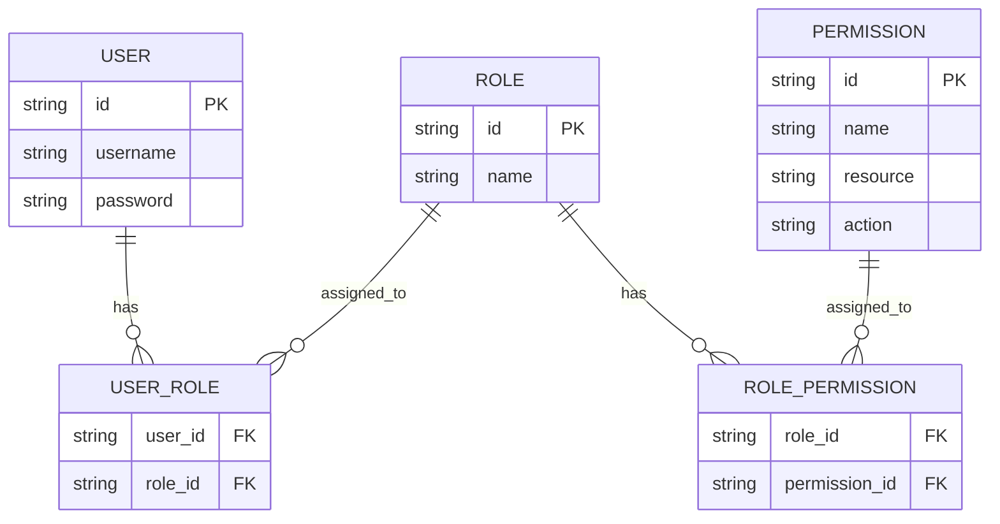
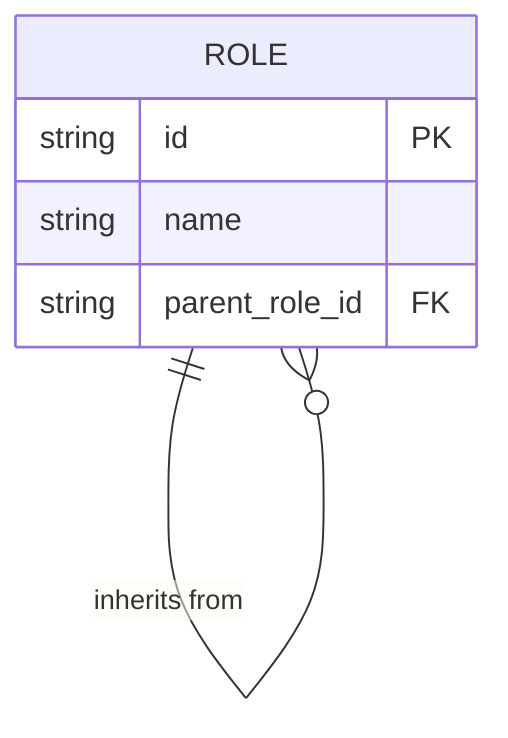
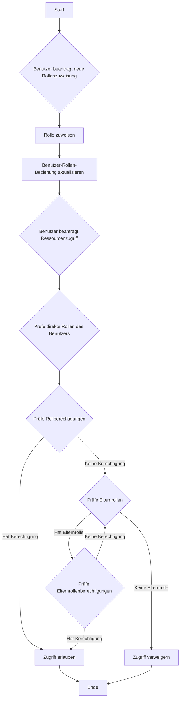
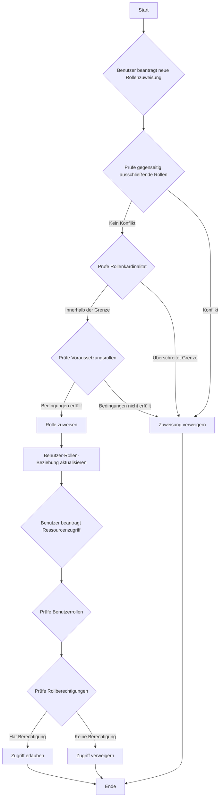

## Was ist rollenbasierte Zugriffskontrolle (RBAC)?

Die rollenbasierte Zugriffskontrolle (RBAC) ist ein weit verbreitetes access control Modell, das das Konzept der "Rollen" einführt, um Benutzer von Berechtigungen zu entkoppeln und ein flexibles und effizientes Berechtigungsmanagementsystem zu schaffen.

Die Kernidee hinter RBAC ist einfach, aber mächtig: Anstatt Berechtigungen direkt Benutzern zuzuweisen, werden Berechtigungen Rollen zugewiesen, die dann Benutzern zugewiesen werden. Diese indirekte Methode der Berechtigungszuweisung vereinfacht den Prozess zur Verwaltung von Zugriffsrechten erheblich.

### Schlüsselkonzepte in RBAC

Das RBAC-Modell dreht sich um vier Hauptelemente:

1. Benutzer: Individuen im System, typischerweise reale Personen.
2. Rollen: Repräsentationen von Jobfunktionen oder Verantwortlichkeiten innerhalb einer Organisation.
3. Berechtigungen: Autorisierungen zur Durchführung spezifischer Operationen auf bestimmten Ressourcen.
4. Sitzungen: Dynamische Umgebungen, in denen Benutzer bestimmte Rollen aktivieren.

Der grundlegende Arbeitsablauf von RBAC kann wie folgt zusammengefasst werden:
1. Definition von Rollen basierend auf der Organisationsstruktur oder den geschäftlichen Anforderungen.
2. Zuweisung entsprechender Berechtigungen zu jeder Rolle.
3. Zuweisung einer oder mehrerer Rollen zu Benutzern basierend auf deren Verantwortlichkeiten.
4. Wenn ein Benutzer versucht, auf eine Ressource zuzugreifen, prüft das System, ob die zugewiesenen Rollen die notwendigen Berechtigungen haben.

### Arten von RBAC

#### RBAC0: Die Grundlage

RBAC0 ist das grundlegende Modell, das die Kernkonzepte von Benutzern, Rollen, Berechtigungen und Sitzungen definiert. Es dient als Grundlage für alle anderen RBAC-Modelle.

Schlüsselfunktionen:
- Benutzer-Rolle-Assoziation: Viele-zu-viele-Beziehung
- Rollen-Berechtigungs-Assoziation: Viele-zu-viele-Beziehung



Dieses Diagramm veranschaulicht die grundlegende Struktur von RBAC0 und zeigt die Beziehungen zwischen Benutzern, Rollen und Berechtigungen.

Schlüsseloperationen:
1. Zuweisung von Rollen zu Benutzern
2. Zuweisung von Berechtigungen zu Rollen
3. Prüfung, ob ein Benutzer eine spezifische Berechtigung hat

Obwohl RBAC0 einen soliden Ausgangspunkt bietet, hat es einige Einschränkungen:
1. Rollenexplosion: Mit zunehmender Systemkomplexität kann die Anzahl der Rollen schnell ansteigen.
2. Berechtigungsredundanz: Verschiedene Rollen können ähnliche Berechtigungssätze erfordern, was zu Duplikaten führen kann.
3. Fehlende Hierarchie: Es kann keine Vererbungsbeziehungen zwischen Rollen darstellen.

#### RBAC1: Einführung von Rollenhierarchien

RBAC1 baut auf RBAC0 auf, indem das Konzept der Rollenvererbung hinzugefügt wird.

```plaintext
RBAC1 = RBAC0 + Rollenvererbung
```

Schlüsselfunktionen:
- Rollenhierarchie: Rollen können Elternrollen haben
- Berechtigungsvererbung: Kindrollen erben alle Berechtigungen von ihren Elternrollen



Dieses Diagramm zeigt, wie Rollen in RBAC1 von anderen Rollen erben können.

Schlüsseloperationen:



Dieses Flussdiagramm veranschaulicht den Prozess der Rollenzuweisung und Berechtigungsprüfung in RBAC1, einschließlich des Aspekts der Rollenvererbung.

RBAC1 bietet mehrere Vorteile:
1. Reduzierte Anzahl von Rollen: Weniger Basisrollen können durch Vererbung geschaffen werden
2. Vereinfachtes Berechtigungsmanagement: Einfacher, organisatorische Hierarchien darzustellen

Jedoch hat RBAC1 auch einige Einschränkungen:
1. Fehlende Einschränkungsmechanismen: Unfähig, Benutzer daran zu hindern, gleichzeitig potenziell konfliktträchtige Rollen zu halten
2. Leistungserwägungen: Berechtigungsprüfungen können das Durchlaufen der gesamten Rollenhierarchie erfordern

#### RBAC2: Implementierung von Einschränkungen

RBAC2 basiert ebenfalls auf RBAC0, führt jedoch das Konzept der Einschränkungen ein.

```plaintext
RBAC2 = RBAC0 + Einschränkungen
```

Schlüsselfunktionen:
1. Gegenseitig ausschließende Rollen: Benutzer können nicht gleichzeitig zu diesen Rollen zugewiesen werden
2. Rollenkardinalität: Begrenzt die Anzahl der Benutzer, die einer bestimmten Rolle zugewiesen werden können
3. Voraussetzungsrollen: Benutzer müssen eine spezifische Rolle haben, bevor sie einer anderen zugewiesen werden



Dieses Flussdiagramm zeigt den Prozess der Rollenzuweisung und Zugriffskontrolle in RBAC2, wobei die verschiedenen Einschränkungen einbezogen werden.

RBAC2 verbessert die Sicherheit, indem es eine übermäßige Konzentration von Berechtigungen verhindert und ermöglicht eine präzisere Zugriffskontrolle. Es erhöht jedoch die Systemkomplexität und kann die Leistung beeinträchtigen, da mehrere Einschränkungsbedingungen für jede Rollenzuweisung geprüft werden müssen.

### RBAC3: Das umfassende Modell

RBAC3 kombiniert die Merkmale von RBAC1 und RBAC2 und bietet sowohl Rollenerbschaft als auch Einschränkungsmechanismen:

```plaintext
RBAC3 = RBAC0 + Rollenvererbung + Einschränkungen
```

Dieses umfassende Modell bietet maximale Flexibilität, stellt jedoch auch Herausforderungen bei der Implementierung und Leistungsoptimierung dar.

## Welche Vorteile bietet RBAC (rollenbasierte Zugriffskontrolle)?

1. Vereinfachtes Berechtigungsmanagement: Gruppenweise Autorisierung durch Rollen reduziert die Komplexität bei der Verwaltung individueller Benutzerberechtigungen.
2. Erhöhte Sicherheit: Präzisere Kontrolle über Benutzerberechtigungen reduziert Sicherheitsrisiken.
3. Reduzierte Verwaltungskosten: Änderungen von Rollenberechtigungen wirken sich automatisch auf alle zugeordneten Benutzer aus.
4. Abstimmung mit der Geschäftslogik: Rollen entsprechen häufig organisatorischen Strukturen oder Geschäftsprozessen, was sie leichter verständlich und verwaltbar macht.
5. Unterstützung der Trennung von Pflichten: Kritische Verantwortlichkeiten können durch Einschränkungen wie gegenseitig ausschließende Rollen getrennt werden.

## Welche praxisbezogenen Implementierungsüberlegungen gibt es?

Bei der Implementierung von RBAC in realen Szenarien sollten Entwickler diese wesentlichen Aspekte berücksichtigen:

1. Datenbankdesign: Verwendung relationaler Datenbanken zur effektiven Speicherung und Abfrage von RBAC-Strukturen.
2. Leistungsoptimierung: Implementierung von Caching-Strategien und Optimierung von Berechtigungsprüfungen, insbesondere für komplexe RBAC3-Modelle.
3. API- und Frontend-Integration: Gestaltung klarer APIs für die Verwaltung von Benutzern, Rollen und Berechtigungen sowie Überlegung zur Anwendung von RBAC in Frontend-Anwendungen.
4. Sicherheit und Auditing: Sicherstellung der Sicherheit des RBAC-Systems selbst und Implementierung detaillierter Protokollierungs- und Auditierungsfunktionen.
5. Skalierbarkeit: Design mit Blick auf zukünftige Erweiterungen, wie Unterstützung komplexerer Berechtigungsregeln oder Integration mit anderen Systemen.
6. Benutzererfahrung: Gestaltung intuitiver Schnittstellen für Systemadministratoren zur einfachen Konfiguration und Pflege der RBAC-Struktur.

<SeeAlso slugs={['abac', 'access-control']} />

<Resources
  urls={[
    "https://blog.logto.io/rbac-and-abac",
    "https://blog.logto.io/mastering-rbac",
    "https://blog.logto.io/organization-and-role-based-access-control",
    "https://docs.logto.io/docs/recipes/rbac/",
    "https://en.wikipedia.org/wiki/Role-based_access_control"
  ]}
/>
