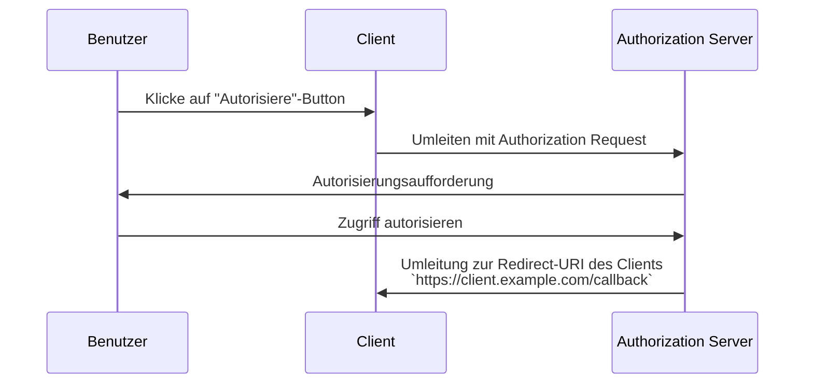

## Was ist eine Redirect-URI?

Eine Redirect-URI, auch bekannt als Callback-URL oder Redirect-URL, ist eine URI, die angibt, wohin der <Ref slug="authorization-server" /> den Benutzer-Agent nach Abschluss der <Ref slug="authorization-request" /> umleiten soll.

> Universal Resource Identifier (URI) werden oft mit URL (Uniform Resource Locator) verwechselt. Für weitere Informationen siehe [Unveiling URI, URL, and URN](https://blog.logto.io/unveiling-uri-url-and-urn).

Schauen wir uns ein Beispiel einer Authorization Request (Autorisierungsanforderung) an, die eine Redirect-URI enthält:

```http
GET /authorize?response_type=code
  &client_id=YOUR_CLIENT_ID
  &redirect_uri=https%3A%2F%2Fclient.example.com%2Fcallback
  &scope=openid%20profile%20email
  &state=abc123
  &nonce=123456 HTTP/1.1
```

In diesem Beispiel ist der rohe Wert des `redirect_uri` Parameters `https%3A%2F%2Fclient.example.com%2Fcallback`, welcher URL-codiert ist. Der tatsächliche Wert ist `https://client.example.com/callback`.

## Wie funktioniert eine Redirect-URI?

> Im Kontext von <Ref slug="openid-connect" /> gilt der Ablauf von OAuth 2.0’s <Ref slug="authorization-request" /> und <Ref slug="authorization-server" /> ähnlich. Die Redirect-URI fungiert in gleicher Weise wie in OAuth 2.0, sowohl für <Ref slug="authentication-request" /> als auch für <Ref slug="openid-connect" headingId="openid-provider-op" />.

Angenommen, der <Ref slug="client" /> initiiert die Authorization Request (Autorisierungsanforderung) von der URL `https://client.example.com`. Nachdem der Benutzer den Autorisierungsprozess abgeschlossen hat, leitet der Authorization Server den Benutzer-Agent (Browser) zurück zu `https://client.example.com/callback`.



Es ist klar, dass die Redirect-URI entscheidend ist, damit der Authorization Server den Benutzer-Agent zurückleiten kann, wenn der Autorisierungsprozess abgeschlossen ist. Darüber hinaus wird die Redirect-URI auch verwendet, um den Autorisierungscode oder Tokens zu empfangen, abhängig vom Flow.

Hier ist ein nicht-normatives Beispiel, wie die tatsächliche Umleitung in einem <Ref slug="authorization-code-flow" /> aussehen könnte:

```http
HTTP/1.1 302 Found
Location: https://client.example.com/callback?code=AUTHORIZATION_CODE&state=abc123
```

Beachten Sie, dass die URL-Parameter `code` und `state`, die vom Authorization Server hinzugefügt werden, in der Redirect-URI enthalten sind. Der Client muss die `code`- und `state`-Parameter aus der URL extrahieren, um den Autorisierungsprozess fortzusetzen.

## Warum brauchen wir eine Redirect-URI?

Wie wir im obigen Beispiel sehen können, muss der Authorization Server wissen, wohin er nach einer erfolgreichen Authorization Request (Autorisierungsanforderung) umleiten soll. Dies ist besonders nützlich, wenn es mehrere Clients gibt (z. B. <Ref slug="single-sign-on" />), und jeder Client eine andere Redirect-URI hat.

Mit dem <Ref slug="authorization-code-flow" /> wird die Redirect-URI auch verwendet, um den Autorisierungscode zurück an den Client zu übergeben, anstatt den Front-Channel (Browser) zu verwenden, um die Tokens vor potenziellen Angriffen zu schützen.

Es war möglich, den [Resource Owner Password Credentials (ROPC) grant](https://datatracker.ietf.org/doc/html/rfc6749#section-4.3) zu verwenden, um Tokens für den Benutzer ohne eine Redirect-URI zu erhalten. Allerdings ist es in <Ref slug="oauth-2.1" /> aufgrund von Sicherheitsbedenken veraltet.

## Sicherheitsüberlegungen

Die Redirect-URI ist ein kritischer Parameter und ein häufiges Ziel für Angreifer. Hier sind einige Sicherheitsüberlegungen, die zu beachten sind:

- **Weiße Liste für Redirect-URIs**: Der Client sollte nur Redirect-URIs akzeptieren, die beim Authorization Server registriert sind. Dies verhindert, dass Angreifer Benutzer auf bösartige Websites umleiten.
- **Verwende HTTPS**: Verwende immer HTTPS für die Redirect-URI, um die Kommunikation zwischen dem Client und dem Authorization Server zu sichern.
- **Genaue Übereinstimmung**: Die Redirect-URI sollte genau mit der registrierten URI übereinstimmen. Authorization Server können strikte Übereinstimmungsregeln durchsetzen, die breite Muster nicht zulassen.
- **State-Parameter**: Verwende den `state`-Parameter, um <Ref slug="csrf" />-Angriffe zu verhindern. Der Client sollte den `state`-Parameter validieren, um sicherzustellen, dass er mit dem in der Authorization Request (Autorisierungsanforderung) gesendeten Wert übereinstimmt.

<SeeAlso slugs={["csrf", "oauth-2.1", "authorization-code-flow"]} />

<Resources
  urls={[
    "https://blog.logto.io/oauth-2-1",
    "https://blog.logto.io/csrf",
    "https://blog.logto.io/redirect-uri-in-authorization-code-flow",
  ]}
/>