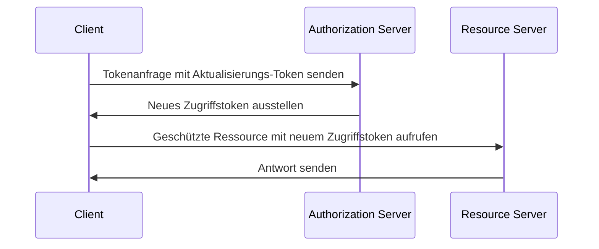

## Was ist ein Aktualisierungs-Token (Refresh token)?

Ein Aktualisierungs-Token (Refresh token) ist eine langlebige Berechtigung, in der Regel eine zufällige Zeichenfolge, die verwendet wird, um neue <Ref slug="access-token">Zugriffstokens (access tokens)</Ref> zu erhalten, ohne dass der Benutzer sich erneut authentifizieren muss. Im Kontext von OAuth 2.0 und OpenID Connect (OIDC) können <Ref slug="authorization-server">Autorisierungs-Server (authorization servers)</Ref> Aktualisierungs-Tokens (refresh tokens) an Clients (Anwendungen) ausstellen, wenn der Client <Ref slug="offline-access" /> anfordert.

Während das [OAuth 2.0 RFC](https://datatracker.ietf.org/doc/html/rfc6749#section-1.5) den allgemeinen Lebenszyklus eines Aktualisierungs-Tokens definiert, können sich die Implementierungsdetails zwischen Autorisierungs-Servern und Clients unterscheiden. Wir werden diese in den folgenden Abschnitten näher untersuchen.

## Wie funktioniert ein Aktualisierungs-Token (Refresh token)?

Ein Aktualisierungs-Token wird typischerweise zusammen mit einem Zugriffstoken ausgegeben, wenn der Client <Ref slug="offline-access" /> anfordert. Es ist branchenüblich, den `offline_access`-Bereich im <Ref slug="authorization-request" /> einzuschließen, während <Ref slug="openid-connect" /> den `offline_access`-Bereich offiziell für diesen Zweck definiert (verfügbar im <Ref slug="authentication-request" />).

Hier ist ein nicht-normatives Beispiel für eine Autorisierungsanfrage, die den `offline_access`-Bereich enthält:

```http
GET /authorize?response_type=code
  &client_id=YOUR_CLIENT_ID
  &redirect_uri=https%3A%2F%2Fclient.example.com%2Fcallback
  &scope=openid%20profile%20email%20offline_access
  &state=abc123
  &nonce=123456 HTTP/1.1
```

Sobald der Client das Aktualisierungs-Token erhält, kann er es verwenden, um neue Zugriffstokens anzufordern, wenn das aktuelle Zugriffstoken abläuft. Hier ist ein vereinfachtes Beispiel mit einem Aktualisierungs-Token:



Wie das Sequenzdiagramm veranschaulicht, muss die Nutzung eines Aktualisierungs-Tokens sowohl vom Client als auch vom Autorisierungs-Server unterstützt werden:

- Der Client sollte das Aktualisierungs-Token sicher speichern und es in der <Ref slug="token-request" /> verwenden, um ein neues Zugriffstoken zu erhalten.
- Der Autorisierungs-Server sollte das Aktualisierungs-Token validieren und ein neues Zugriffstoken ausstellen, wenn der Client ein gültiges Aktualisierungs-Token vorlegt.

Das Aktualisierungs-Token sollte nicht mit dem <Ref slug="resource-server">Ressourcen-Server (resource server)</Ref> geteilt werden. Zugriffstokens sind die einzigen Tokens, die der Ressourcen-Server für die Autorisierung prüfen sollte.

Hier ist ein nicht-normatives Beispiel für eine Tokenanfrage mit einem Aktualisierungs-Token:

```http
POST /token HTTP/1.1
Host: your-authorization-server.com
Content-Type: application/x-www-form-urlencoded

grant_type=refresh_token
  &refresh_token=YOUR_REFRESH_TOKEN
  &client_id=YOUR_CLIENT_ID
  &client_secret=YOUR_CLIENT_SECRET
  &scope=openid%20profile%20email
```

## Sicherheitsüberlegungen ||security-considerations||

Da Aktualisierungs-Tokens langlebig sind (z. B. Tage, Wochen) und verwendet werden können, um neue Zugriffstokens ohne Benutzerinteraktion zu erhalten, stellen sie ein höheres Sicherheitsrisiko dar als Zugriffstokens (z. B. Minuten, Stunden). Der Einsatz von Aktualisierungs-Tokens sollte sorgfältig überlegt und implementiert werden, um potenzielle Sicherheitsbedrohungen zu mindern. Hier sind einige bewährte Praktiken:

### Sichere Speicherung

Speichere Aktualisierungs-Tokens sicher auf der Client-Seite, um unbefugten Zugriff zu verhindern. Mögliche Speichermechanismen sind:

- **HTTP-only Cookies**: Speichere Tokens in HTTP-only Cookies, um zu verhindern, dass clientseitiges JavaScript darauf zugreift.
- **Verschlüsselter Speicher**: Verwende sichere Speicher wie Keychain (iOS) oder KeyStore (Android) auf mobilen Geräten oder verschlüsselte Datenbanken in Webanwendungen.

### Aktualisierungs-Token-Rotation ||refresh-token-rotation||

Obwohl Aktualisierungs-Tokens langlebig sein können, kann eine regelmäßige Rotation oder basierend auf bestimmten Bedingungen (z. B. nach einem erfolgreichen Tokenaustausch) das Risiko eines unbefugten Zugriffs erheblich verringern. Die genaue Rotationsstrategie kann je nach den Sicherheitsanforderungen der Anwendung und den Fähigkeiten des Autorisierungs-Servers variieren.

Hier sind zwei gängige Rotationsstrategien für Tokens:

- **Zeitbasierte Rotation**: Drehe Aktualisierungs-Tokens nach einem bestimmten Zeitraum (z. B. alle 7 Tage).
- **Ereignisbasierte Rotation**: Drehe Aktualisierungs-Tokens nach bestimmten Ereignissen (z. B. erfolgreicher Tokenaustausch, Passwortänderung).

Wenn ein Aktualisierungs-Token gedreht wird, sollte das vorherige Aktualisierungs-Token ungültig gemacht werden, um dessen Wiederverwendung zu verhindern. Diese Strategien werden oft mit der Sitzungs-TTL (time-to-live) kombiniert, um sicherzustellen, dass der Benutzer nach einer bestimmten Zeitspanne, unabhängig von der Gültigkeit des Aktualisierungs-Tokens, sich erneut authentifizieren muss.

### Sender-gebundene Aktualisierungs-Tokens ||sender-constrained-refresh-tokens||

Sender-gebundene Aktualisierungs-Tokens sind ein Sicherheitsmechanismus, um das Aktualisierungs-Token an den Client, der es angefordert hat, zu binden, falls der Client kein <Ref slug="client" headingId="confidential-clients">vertraulicher Client (confidential client)</Ref> ist. Übliche Methoden sind [DPoP](https://datatracker.ietf.org/doc/html/rfc9449) und [mTLS](https://datatracker.ietf.org/doc/html/rfc8705).

### Client-Typ

Es ist eine gute Praxis, die Verwendung von Aktualisierungs-Tokens auf <Ref slug="client" headingId="confidential-clients">vertrauliche (private) Clients</Ref> zu beschränken.

- Öffentliche Clients (z. B. Single-Page-Anwendungen) legen den Quellcode auf der Client-Seite offen, was es Angreifern erleichtert, Aktualisierungs-Tokens zu extrahieren und zu missbrauchen. In der Regel werden sicherere Mechanismen wie <Ref slug="pkce" /> und Aktualisierungs-Token-Rotation für öffentliche Clients verwendet, wenn Aktualisierungs-Tokens notwendig sind.
- Vertrauliche Clients hingegen laufen in einer sicheren Serverumgebung, in der der Quellcode und die Umgebung nicht auf der Client-Seite offengelegt werden. In solchen Umgebungen können Aktualisierungs-Tokens sicherer verwendet werden.

### Token-Widerruf

Da Aktualisierungs-Tokens in der Regel <Ref slug="opaque-token">opake Tokens (opaque tokens)</Ref> sind (d. h. keine Bedeutung für den Client haben) und vom Autorisierungs-Server validiert werden müssen, kann der Autorisierungs-Server leicht Token-Widerrufsmechanismen implementieren, um Aktualisierungs-Tokens bei Bedarf ungültig zu machen. Dies kann in Szenarien wie Benutzerabmeldung, Kontokompromittierung oder Token-Missbrauch nützlich sein.

<SeeAlso slugs={["access-token", "id-token", "jwt", "opaque-token"]} />

<Resources urls={[
  "https://blog.logto.io/understanding-refresh-token-rotation",
  "https://blog.logto.io/understanding-tokens-in-oidc",
  {
    url: "https://openid.net/specs/openid-connect-core-1_0.html#OfflineAccess",
    result: {
      ogTitle: "Offline Access in OpenID Connect Core 1.0",
    }
  },
  {
    url: "https://datatracker.ietf.org/doc/html/rfc6749#section-1.5",
    result: {
      ogTitle: "Refresh token in OAuth 2.0",
      ogDescription: "Refresh tokens are credentials used to obtain access tokens."
    },
  },
]} />
