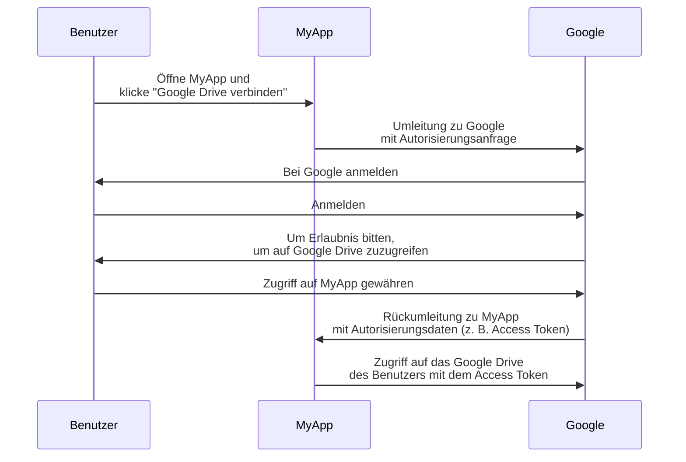

## Was ist ein Ressourcenbesitzer (Resource owner)?

Im Kontext von <Ref slug="oauth-2.0" /> ist ein Ressourcenbesitzer (Resource owner) eine Identität (typischerweise ein Benutzer), die in der Lage ist, den Zugriff auf eine geschützte Ressource (z. B. Daten, Dateien oder Dienste) zu gewähren.

Zum Beispiel hast du eine Webanwendung MyApp, die auf das Google Drive des Benutzers zugreifen möchte. Hier ist ein typischer OAuth 2.0 Ablauf:

In diesem Ablauf ist der **Benutzer** der **Ressourcenbesitzer (Resource owner)**, der MyApp den Zugriff auf sein Google Drive gewährt, während **MyApp** der <Ref slug="client" /> ist, der auf die geschützten Ressourcen zugreifen möchte, und **Google** sowohl der <Ref slug="authorization-server" /> als auch der <Ref slug="resource-server" /> ist.

Wie der Name schon sagt, besitzt der Ressourcenbesitzer (Resource owner) einige Ressourcen in einem <Ref slug="resource-server" /> und kann Clients im Kontext von <Ref slug="oauth-2.0" /> den Zugriff auf diese Ressourcen in seinem Namen gewähren.

## Warum ist der Ressourcenbesitzer (Resource owner) wichtig?

Während eines <Ref slug="authorization" />-Prozesses ist der Ressourcenbesitzer (Resource owner) unverzichtbar, da er derjenige ist, der den Zugriff auf seine Ressourcen ausdrücklich gewährt oder verweigert. Die Zustimmung des Ressourcenbesitzers (Resource owner) ist aus sowohl technischen als auch compliancebezogenen Gründen obligatorisch:

- **Technisch**: Die Zustimmung des Ressourcenbesitzers (Resource owner) stellt sicher, dass der Client die erforderlichen Berechtigungen hat, um auf die Ressourcen zuzugreifen. Statt eines Alles-oder-nichts-Zugriffs kann der Ressourcenbesitzer (Resource owner) dem Client entsprechend dessen Anfrage teilweise Zugriff gewähren. Andererseits kann der Ressourcenbesitzer (Resource owner) den Zugriff auch jederzeit ausdrücklich widerrufen. Dieser Ansatz bietet eine klare und prüfbare Methode für <Ref slug="access-control" />.
- **Compliance**: Die Zustimmung des Ressourcenbesitzers (Resource owner) ist in vielen Rechtsordnungen eine gesetzliche Anforderung, insbesondere im Umgang mit sensiblen Daten. Zum Beispiel schreibt die Datenschutz-Grundverordnung (DSGVO) vor, dass das Datensubjekt (Ressourcenbesitzer (Resource owner)) ausdrücklich in die Datenverarbeitungsaktivitäten einwilligen muss.

## Ressourcenbesitzer (Resource owner) vs. Ressourcenserver (Resource Server)

<Ref slug="resource-server">Ressourcenserver (Resource Server)</Ref> sind dafür verantwortlich, die **geschützten Ressourcen** zu hosten und bereitzustellen. Sie sind die Gatekeeper, die die Access Tokens überprüfen und die Ressourcen an die Clients ausliefern.

Der Ressourcenbesitzer (Resource owner) hingegen kann je nach den <Ref slug="access-control" />-Richtlinien die vollständige oder teilweise Kontrolle über die geschützten Ressourcen im Ressourcenserver (Resource Server) haben.

<SeeAlso slugs={["resource-server", "oauth-2.0", "resource-indicator", "access-control"]} />

<Resources
  urls={[
    "https://tools.ietf.org/html/rfc6749",
  ]}
/>
