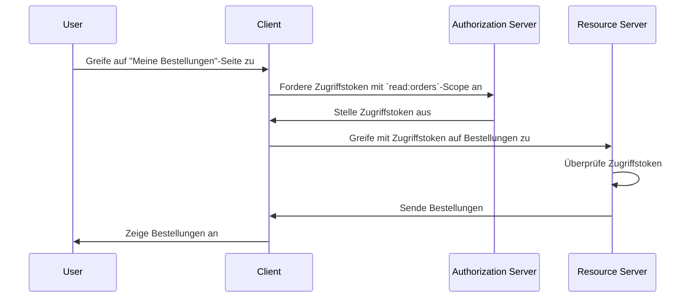

## Was ist ein Ressourcenserver?

Im Kontext von <Ref slug="oauth-2.0" /> ist ein **Ressourcenserver** ein Server, der die **geschützten Ressourcen** hostet, auf die der <Ref slug="client" /> zugreifen möchte. Der Ressourcenserver ist auch verantwortlich für die Überprüfung des <Ref slug="access-token" /> und stellt die geschützten Ressourcen dem Client gemäß den <Ref slug="access-control" />-Richtlinien bereit.

Betrachten wir zum Beispiel eine Webanwendung MyApp, die auf das Google Drive des Nutzers zugreifen möchte. In diesem Szenario:

- **MyApp** ist der Client, der auf die geschützten Ressourcen zugreifen möchte.
- **Google** ist der Ressourcenserver, der das Google Drive des Nutzers hostet.
- **Google** ist auch der <Ref slug="authorization-server" />, der das Zugriffstoken an MyApp ausstellt.

Betrachten wir ein weiteres Beispiel, bei dem eine E-Commerce-Website auf die Bestellhistorie eines Nutzers von einem internen Bestellservice zugreifen möchte. In diesem Fall:

- **E-Commerce-Website** ist der Client, der auf die geschützten Ressourcen zugreifen möchte.
- **Bestellservice** ist der Ressourcenserver, der die Bestellhistorie des Nutzers hostet.
- Wenn die E-Commerce-Website einen OAuth 2.0-Dienst oder einen OpenID-Anbieter integriert, dient dieser Dienst (Anbieter) als Autorisierungsserver.

## Wie funktioniert ein Ressourcenserver?

OAuth 2.0 definiert die Rollen des Ressourcenservers und des Autorisierungsservers separat, um eine klare Trennung der Verantwortlichkeiten zu gewährleisten. Es definiert jedoch keine spezifische Darstellung des Ressourcenservers im Framework, sondern verweist darauf als ein virtuelles Konzept, das die geschützten Ressourcen hostet; der <Ref slug="client" /> muss <Ref slug="scope">Scopes</Ref> für die geschützten Ressourcen angeben, auf die er zugreifen möchte.

Angenommen, der Client möchte auf die Bestellhistorie des Nutzers vom Bestellservice zugreifen. Ein nicht-normatives Beispiel für das Senden einer <Ref slug="token-request" /> zum Zugriff auf die Bestellungen sieht folgendermaßen aus:



In dem oben angezeigten Sequenzdiagramm fordert der Client ein Zugriffstoken mit dem `read:orders`-Scope vom Autorisierungsserver an. Wir nehmen an, dass sich alle Parteien über die Bedeutung des `read:orders`-Scopes einig sind: Er gibt an, dass der Client `Lese`-Aktionen auf den vom Ressourcenserver bereitgestellten `Bestellungen` ausführen möchte. Der Client verwendet dann das Zugriffstoken, um auf die Bestellungen vom Ressourcenserver zuzugreifen.

> [!Hinweis]
> Die Bedeutung und Struktur von Scopes sind nicht durch OAuth 2.0 definiert und sollten vom Client, Autorisierungsserver und Ressourcenserver vereinbart werden.

Der Ressourcenserver ist verantwortlich für die Überprüfung des Zugriffstokens und die Ermittlung, ob der Client die erforderlichen Berechtigungen hat, um die angeforderten Ressourcen gemäß den <Ref slug="access-control" />-Richtlinien zuzugreifen. Abhängig von der Implementierung kann das Zugriffstoken ein <Ref slug="opaque-token" /> oder ein <Ref slug="jwt" /> sein.

## Benennungskonventionen

Es ist flexibel, den Ressourcenserver entsprechend dem Kontext der Anwendung zu benennen. Da OAuth 2.0 keine spezifische Darstellung des Ressourcenservers im <Ref slug="scope" />-Parameter definiert, sind in der Branche mehrere Konventionen zu sehen:

- Auslassen des Ressourcenservernamens und nur die Aktion verwenden: Zum Beispiel `lesen` und `schreiben`.
- `[verb]:[resource]`: Eine gängige Konvention ist die Verwendung der Kombination aus `verb` und `resource`, um die Aktionen anzugeben, die der Client auf der Ressource ausführen kann. Zum Beispiel `read:orders` und `write:profile`. Manchmal werden sie auch umgekehrt als `orders:read` und `profile:write` angegeben.
- `[uri]:[action]`: Eine andere Konvention ist die Verwendung der URI der Ressource und der Aktion, die der Client ausführen kann. Zum Beispiel `https://api.example.com/orders:read` und `https://api.example.com/profile:write`.

## Ressourcenindikatoren

Sehen wir uns ein Beispiel für den Scope-Parameter in einer <Ref slug="authentication-request" /> (dekodiert) an:

```plaintext
openid profile email https://api.example.com/orders:read
```

In diesem Beispiel umfasst der `scope`-Parameter die `openid`, `profile` und `email`-Scopes, die <Ref slug="openid-connect" />-Standardscopes sind, zusammen mit dem `https://api.example.com/orders:read`-Scope, das den Standort des Ressourcenservers und die Berechtigung angibt, die Ressourcen zu lesen.

Es sieht in diesem spezifischen Fall in Ordnung aus, aber da die Anzahl der Ressourcen und Scopes wächst, kann es schwierig werden, die Scopes zu verwalten und zu verstehen. Um dieses Problem zu lösen, führte OAuth 2.0 eine Erweiterung namens <Ref slug="resource-indicator">Ressourcenindikatoren</Ref> (RFC 8707) ein, die es Clients ermöglicht, URIs zu verwenden, um die Ressourcen anzugeben, die sie zugreifen möchten, wodurch Ressourcenserver im Prozess expliziter werden.

Nach dem Hinzufügen eines Ressourcenindikator-Parameters zur Authentifizierungsanfrage (`resource=https://api.example.com/orders`) kann der Scope-Parameter vereinfacht werden zu:

```plaintext
openid profile email read
```

Was sauberer aussieht und leichter zu verwalten ist.

> [!Hinweis]
> Nicht alle Autorisierungsserver (OpenID-Anbieter) unterstützen die Erweiterung der Ressourcenindikatoren. Bitte überprüfe die Dokumentation deines Autorisierungsservers, bevor du sie verwendest.

<SeeAlso slugs={["access-control", "resource-indicator", "resource-owner", "client"]} />

<Resources
  urls={[
    "https://datatracker.ietf.org/doc/html/rfc8707",
  ]}
/>
