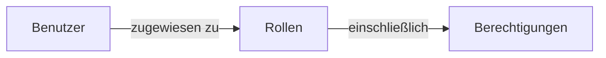

## Rolle

Eine Rolle ist eine der Kernkomponenten in <Ref slug="rbac" />. Sie dient als Container für Berechtigungen, die Benutzern zugewiesen werden können, und fungiert als Vermittler zwischen Benutzern und ihren Zugriffsrechten.



Eine typische Rollenstruktur enthält einen Namen und eine Reihe von Berechtigungen:

```typescript
const role = {
  name: 'order_admin',
  permissions: [
    'read:orders',   // Bestelldetails anzeigen
    'write:orders',  // Bestellungen bearbeiten
    'read:products'  // Produkte anzeigen
  ]
}
```

> [!Note]
> Rollen werden hauptsächlich für das Berechtigungsmanagement verwendet. Für die Implementierung der Zugriffskontrolle wird empfohlen, Berechtigungen direkt zu überprüfen, anstatt Rollen. Siehe <Ref slug="rbac" /> für weitere Informationen.

<SeeAlso slugs={["rbac", "authorization", "access-control"]} />