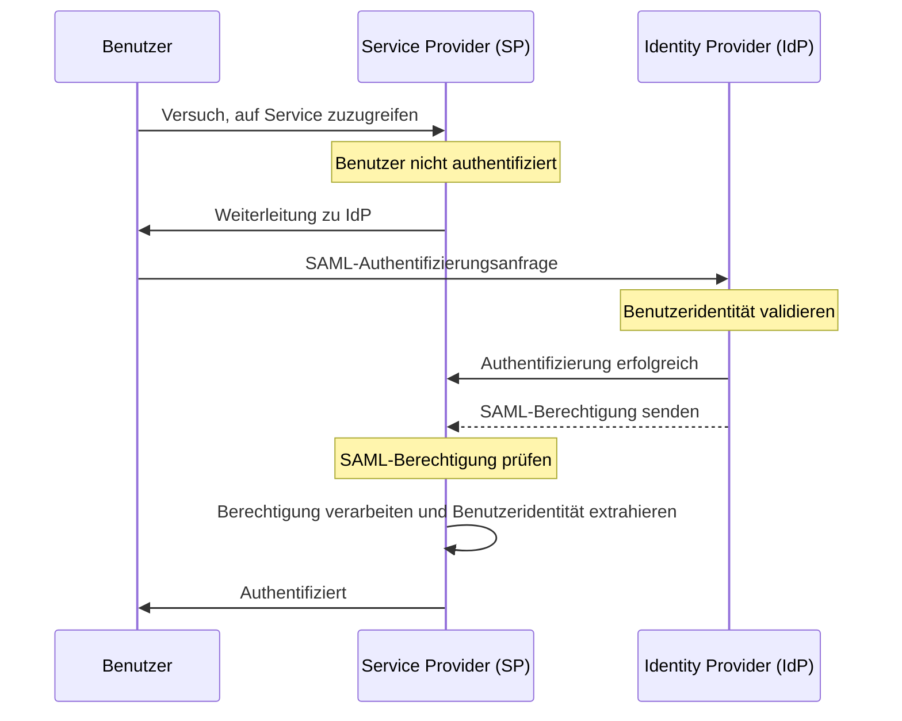

## Was ist SAML?

SAML (meist als SAML 2.0 bezeichnet) ist ein XML-basierter Standard für den Austausch von Authentifizierungs- und Autorisierungsdaten zwischen zwei Parteien: dem <Ref slug="identity-provider" /> und dem <Ref slug="service-provider" />. Es wird häufig für Identity-Föderation und <Ref slug="enterprise-sso" />-Lösungen verwendet.

Wie der Name schon sagt, übermittelt SAML Behauptungen über die Identität und Attribute des Benutzers. Diese Behauptungen sind digital signiert und optional verschlüsselt, um ihre Integrität und Vertraulichkeit zu gewährleisten.

## Wie funktioniert SAML?

Bevor wir in den SAML-Authentifizierungsfluss eintauchen, müssen wir verstehen, wie Identity Providers und Service Providers sich gegenseitig erkennen und vertrauen können. Dieses Vertrauen wird durch den Austausch von Metadaten hergestellt, wobei beide Parteien Informationen übermitteln:

- **Entity ID**: Ein eindeutiger Bezeichner für den Identity Provider oder Service Provider.
- **Public key**: Wird verwendet, um die digitalen Signaturen in SAML-Berechtigungen zu überprüfen.
- **Endpoints**: URLs für verschiedene SAML-Operationen, wie z.B. Authentifizierungsanfragen und -antworten.

Sobald das Vertrauen hergestellt ist, kann der SAML-Authentifizierungsfluss weitergehen:

### RelayState

Im SAML-Fluss wird der `RelayState`-Parameter verwendet, um den Zustand des Benutzers während des Authentifizierungsprozesses beizubehalten. Er fungiert als Referenz zur ursprünglichen Anfrage, die vom Benutzer gestellt wurde, bevor er zum Identity Provider umgeleitet wurde. Der Service Provider kann diesen Parameter verwenden, um den Benutzer nach erfolgreicher Authentifizierung auf die ursprüngliche Seite oder Ressource zurückzuleiten.

RelayState wird auch verwendet, um <Ref slug="csrf" />-Angriffe zu verhindern, indem sichergestellt wird, dass der Benutzer nach der Authentifizierung zur richtigen Seite zurückgeleitet wird.

### SAML-Berechtigungen

SAML-Berechtigungen sind der Kernbestandteil des SAML-Protokolls. Sie enthalten Informationen über die Benutzeridentität, Attribute und den Authentifizierungsstatus. Es gibt drei Arten von SAML-Berechtigungen:

- **Authentication assertion (Authentifizierungsberechtigung)**: Zeigt an, dass der Benutzer vom Identity Provider authentifiziert wurde.
- **Attribute assertion (Attributberechtigung)**: Enthält zusätzliche Informationen über den Benutzer, wie Rollen, Berechtigungen und Profildaten.
- **Authorization decision assertion (Autorisierungsentscheidungsberechtigung)**: Gibt das Zugriffsrecht des Benutzers auf bestimmte Ressourcen an.

## Überlegungen zur Einführung von SAML

SAML hat sich in Unternehmensumgebungen seit seiner Einführung in den frühen 2000er Jahren weit verbreitet. Hier sind einige wichtige Überlegungen, wenn du SAML für deine Anwendungen einführst:

- Komplexität: SAML-Implementierungen können komplex sein, insbesondere im Vergleich zu modernen Frameworks wie <Ref slug="oauth-2.0" /> und <Ref slug="openid-connect" />.
- Transporteffizienz: SAML-Nachrichten können aufgrund der XML-Formatierung groß sein, was die Netzwerkleistung beeinträchtigen kann.
- Sicherheit: SAML-Berechtigungen müssen vor Manipulationen und Abhören geschützt sein. Stelle sicher, dass deine SAML-Implementierung bewährte Praktiken für Verschlüsselung und digitale Signaturen folgt.

Trotz dieser Überlegungen bleibt SAML ein robuster und weit verbreiteter Standard für sichere Identity-Föderation und Single Sign-On-Lösungen in Unternehmensumgebungen. Für neue Anwendungen oder Dienste solltest du jedoch moderne Alternativen wie OAuth 2.0 und OpenID Connect in Betracht ziehen, um einen leichteren und entwicklerfreundlicheren Ansatz für Authentifizierung und Autorisierung zu verfolgen.

<SeeAlso slugs={["enterprise-sso", "oauth-2.0", "openid-connect"]} />

<Resources
  urls={[
    "https://blog.logto.io/saml-security-cheat-sheet",
    "https://blog.logto.io/picking-your-sso-method",
    "https://blog.logto.io/differences-between-saml-and-oidc",
  ]}
/>