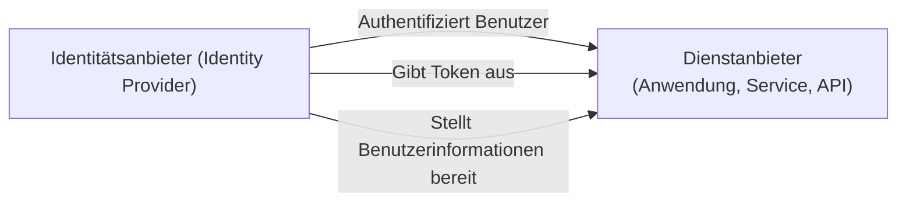

## Was ist ein Dienstanbieter (Service provider, SP)?

Im Bereich des <Ref slug="iam" />, ist ein Dienstanbieter (Service provider, SP) (oder eine **verlassende Partei** im Kontext von <Ref slug="openid-connect" />) eine Anwendung oder ein Dienst, der auf einen <Ref slug="identity-provider" /> für Authentifizierung (authentication) und Autorisierung (authorization) angewiesen ist. Er ist verantwortlich für die Bereitstellung von Diensten für Benutzer und die Durchsetzung von <Ref slug="access-control" /> Richtlinien basierend auf den von dem Identitätsanbieter ausgegebenen Token.

## Standards für Dienstanbieter

Es gibt keinen strikten Standard für Dienstanbieter, da sie jede Art von Anwendung oder Dienst sein können, der Identitätsmanagement benötigt. Dienstanbieter folgen jedoch oft den Standards, die vom Identitätsanbieter, auf den sie sich stützen, festgelegt werden. Zum Beispiel, wenn der Identitätsanbieter <Ref slug="openid-connect" /> unterstützt, wird der Dienstanbieter typischerweise OIDC für Authentifizierung (authentication) und Autorisierung (authorization) verwenden.

## Architektur des Dienstanbieters

Der Begriff "Dienstanbieter" spezifiziert keine bestimmte Architektur oder Implementierung. In der Regel müssen Dienstanbieter beim Identitätsanbieter registriert werden, um Vertrauen aufzubauen und sichere Kommunikation zu ermöglichen. Der Registrierungsprozess umfasst normalerweise den Austausch von Metadaten und Client-Berechtigungsnachweisen.

Zum Beispiel beinhaltet die Dienstanbieter-Metadaten im Kontext von OpenID Connect typischerweise:

- **Client ID**: Eine eindeutige Kennung für den Dienstanbieter.
- **Client secret**: Ein gemeinsames Geheimnis zur Authentifizierung des Dienstanbieters.
- **<Ref slug="redirect-uri">Weiterleitungs-URIs (Redirect URIs)</Ref>**: Die URIs, an die der Identitätsanbieter die Benutzer nach der Authentifizierung (authentication) und Autorisierung (authorization) zurückleitet.

Sobald registriert, kann der Dienstanbieter den <Ref slug="authentication" /> Prozess einleiten, indem er Benutzer an den vom Identitätsanbieter angegebenen Endpunkt weiterleitet.

Wenn Dienstanbieter für nicht-interaktive Anwendungsfälle gebaut werden, werden sie oft als <Ref slug="client">Clients</Ref> bezeichnet, die <Ref slug="machine-to-machine" /> Kommunikation erfordern.

<SeeAlso slugs={["identity-provider", "openid-connect", "oauth-2.0"]} />

<Resources
  urls={[
    "https://blog.logto.io/secure-cloud-apps-with-oauth-and-openid-connect",
    "https://blog.logto.io/incorporate-identity-solution",
    "https://blog.logto.io/centralized-identity-system"
  ]}
/>
