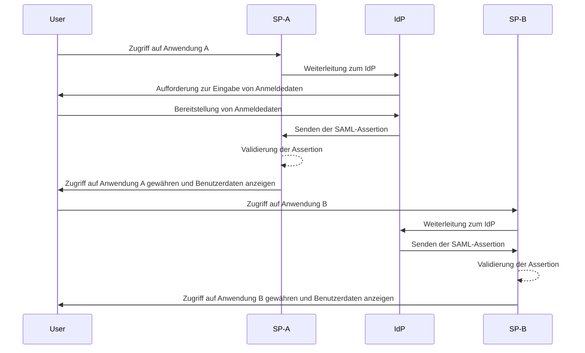
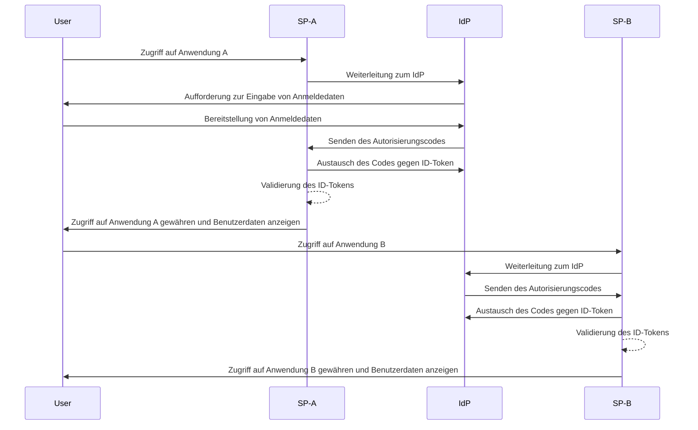

## Was ist Single Sign-on (SSO)?

Single Sign-on (SSO) ist eine <Ref slug="authentication" />-Methode, die es Benutzern ermöglicht, mit einem einzigen Satz von Anmeldedaten auf mehrere Anwendungen oder Dienste zuzugreifen. Anstatt separate Logins für jedes System zu verwalten, authentifizieren sich Benutzer einmal und sind automatisch in alle verbundenen Plattformen eingeloggt.

SSO wird häufig sowohl in persönlichen als auch in geschäftlichen Umgebungen verwendet, insbesondere in Unternehmensumgebungen, in denen Mitarbeiter oder Remote-Arbeiter auf verschiedene SaaS-Anwendungen angewiesen sind, um ihre Arbeit zu erledigen. Durch die Implementierung von SSO können Organisationen die Sicherheit verbessern, das Zugriffsmanagement optimieren und die Produktivität der Benutzer steigern.

Ein bekanntes Beispiel für SSO ist die Google-Dienste-Suite, wie Gmail, Google Drive und Google Kalender. Nach dem Einloggen in ihr Google-Konto können Benutzer problemlos auf all diese Dienste zugreifen, ohne ihre Anmeldedaten erneut eingeben zu müssen.

## Wie funktioniert Single Sign-on?

SSO basiert auf einer Vertrauensbeziehung zwischen einer Anwendung oder einem Dienst, bekannt als <Ref slug="service-provider" />, und einem <Ref slug="identity-provider" />. Der IdP übernimmt die Benutzer-Authentifizierung und teilt die notwendigen Informationen sicher mit dem SP, um den Zugriff zu gewähren. Dieses Vertrauen wird durch einen Prozess namens Föderation etabliert, bei dem sich SP und IdP auf spezifische Standards und Protokolle für den sicheren Austausch von Authentifizierungsdaten einigen.

Wenn ein Benutzer versucht, auf eine SSO-fähige Anwendung zuzugreifen, leitet der SP ihn zur Authentifizierung an den IdP weiter. Der IdP fordert den Benutzer auf, Anmeldedaten bereitzustellen, überprüft seine Identität und erstellt eine authentifizierte Sitzung in seinem System. Diese Sitzung wird typischerweise mit einem Sitzungscookie aufrechterhalten, das sicher unter der Domäne des IdP gespeichert ist.

Sobald der Benutzer authentifiziert ist, generiert der IdP ein Sicherheitstoken oder eine Assertion, die die Benutzerinformationen enthält, die zur Weitergabe an den SP zugestimmt wurden. Dieses Token oder diese Assertion wird sicher an den SP übertragen, der es validiert und dem Benutzer den Zugriff gewährt.

Wenn der Benutzer auf eine andere SSO-fähige Anwendung zugreift, erfolgt der Prozess reibungslos, ohne dass zusätzliche Logins erforderlich sind. Diese Bequemlichkeit wird durch die vom IdP aufrechterhaltene Benutzer-Authentifizierungssitzung ermöglicht, die es dem IdP erlaubt, die Identität des Benutzers automatisch zu überprüfen und ein neues Sicherheitstoken auszustellen, ohne erneut nach Anmeldedaten zu fragen.

Protokolle wie <Ref slug="saml" /> und <Ref slug="openid-connect" /> werden häufig zur Implementierung von SSO verwendet. Diese Standards definieren, wie Authentifizierungsdaten sicher zwischen IdP und SP ausgetauscht werden, um eine zuverlässige und sichere Kommunikation zu gewährleisten und gleichzeitig das nahtlose Benutzererlebnis über Anwendungen hinweg aufrechtzuerhalten.

### SAML-basiertes SSO

Bei SAML-basiertem SSO wird, nachdem der Benutzer vom IdP authentifiziert wurde, eine XML-basierte SAML-Assertion generiert, signiert und sicher an den SP gesendet. Der SP validiert dann die Assertion und gewährt den Zugriff basierend auf der Identität des Benutzers.

### OIDC-basiertes SSO

OIDC hingegen basiert auf <Ref slug="oauth-2.0" /> und bietet einen moderneren Ansatz für SSO. Es verwendet <Ref slug="jwt" />, um Identitätsinformationen zwischen IdP und SP auszutauschen, was eine verbesserte Sicherheit und größere Flexibilität bietet.

## Vorteile von Single Sign-on

1. **Erhöhte Sicherheit**: SSO reduziert das Risiko von passwortbezogenen Sicherheitsverletzungen, indem die Anzahl der Anmeldedaten, die sich Benutzer merken müssen, minimiert wird. Es ermöglicht Organisationen auch, stärkere Authentifizierungsmethoden wie <Ref slug="mfa" /> durchzusetzen, um Benutzerkonten zu schützen.

2. **Verbesserte Benutzererfahrung**: Benutzer können nahtlos auf mehrere Anwendungen zugreifen, ohne sich wiederholt einloggen zu müssen, was die Produktivität steigert und Frustration reduziert. SSO vereinfacht den Anmeldeprozess und bietet eine konsistente Benutzererfahrung über verschiedene Plattformen hinweg.

3. **Zentralisiertes Zugriffsmanagement**: Organisationen können den Benutzerzugriff und die Berechtigungen zentral über den IdP verwalten, um konsistente Sicherheitsrichtlinien und Zugriffskontrollen über alle verbundenen Anwendungen hinweg sicherzustellen. Dies vereinfacht die Prozesse der Benutzerbereitstellung, -entfernung und -prüfung.

## Wann sollte man Single Sign-on verwenden?

1. **Unternehmens- und Organisationsumgebungen**: SSO ist besonders vorteilhaft für Unternehmen, die auf mehrere Anwendungen und Dienste angewiesen sind, um Arbeitsabläufe zu optimieren. Es vereinfacht den Benutzerzugriff und reduziert die Belastung der IT-Teams, einzelne Benutzerkonten zu verwalten. Zum Beispiel Unternehmen, die mehrere SaaS-Anwendungen wie CRM, HR und Kollaborationstools verwenden.
2. **Kundenorientierte Anwendungen**: SSO kann auch die Benutzererfahrung für Kunden verbessern, die auf Online-Dienste oder E-Commerce-Plattformen zugreifen. Zum Beispiel, indem Benutzer sich mit ihren Social-Media-Konten oder E-Mail-Adressen einloggen können, anstatt für jeden Dienst neue Konten zu erstellen.
3. **Multi-Produkt-Dienste**: Unternehmen, die eine Suite von miteinander verbundenen Produkten oder Diensten anbieten, können SSO nutzen, um eine nahtlose Benutzererfahrung über ihre Angebote hinweg zu bieten. Benutzer können zwischen verschiedenen Anwendungen navigieren, ohne sich wiederholt einloggen zu müssen. Zum Beispiel die G Suite von Google. Benutzer können sich einmal in ihrem Chrome-Browser einloggen und auf mehrere Google-Dienste zugreifen, ohne ihre Anmeldedaten erneut eingeben zu müssen.

Der Einsatz von SSO ist nicht auf diese Szenarien beschränkt und kann an verschiedene Anwendungsfälle angepasst werden, basierend auf den spezifischen Bedürfnissen einer Organisation oder Anwendung. Es wird weithin als Best Practice angesehen, um die Sicherheit, Benutzererfahrung und betriebliche Effizienz in modernen digitalen Umgebungen zu verbessern.

<SeeAlso slugs={["enterprise-sso"]} />