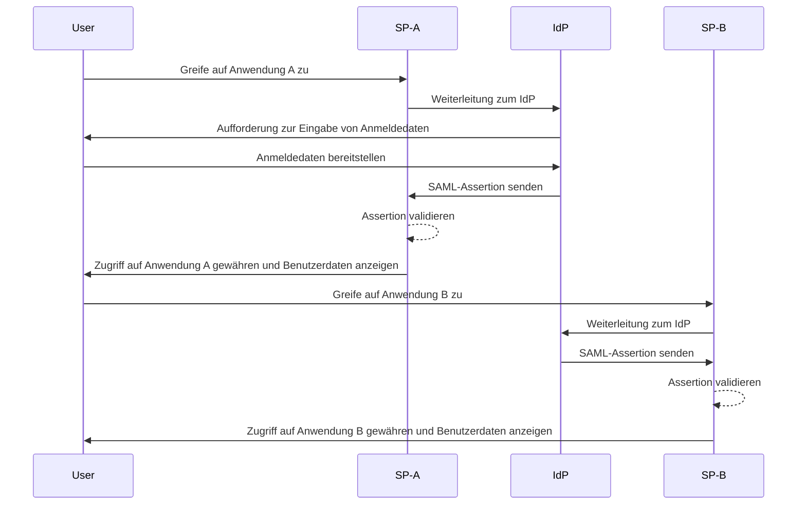
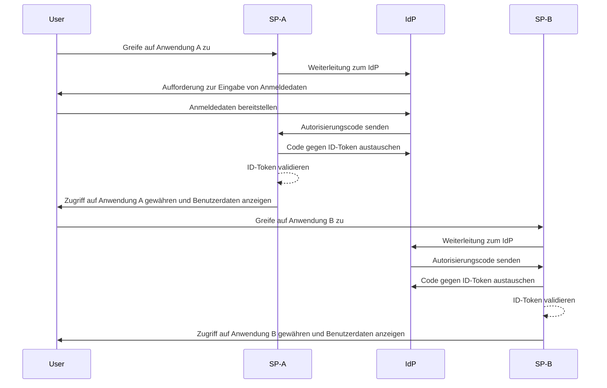

## Was ist Single Sign-on (SSO)?

Single Sign-on (SSO) ist eine <Ref slug="authentication" /> Methode, die es Benutzern ermöglicht, mit einem einzigen Satz von Anmeldedaten auf mehrere Anwendungen oder Dienste zuzugreifen. Anstatt separate Logins für jedes System zu verwalten, authentifizieren sich Benutzer einmal und werden automatisch in alle verbundenen Plattformen eingeloggt.

SSO wird häufig sowohl in privaten als auch geschäftlichen Umgebungen eingesetzt, insbesondere in Unternehmensumgebungen, in denen Mitarbeiter oder Fernarbeiter auf verschiedene SaaS-Anwendungen angewiesen sind, um ihre Arbeit zu erledigen. Durch die Implementierung von SSO können Organisationen die Sicherheit erhöhen, das Zugriffsmanagement optimieren und die Produktivität der Benutzer steigern.

Ein bekanntes Beispiel für SSO ist die Google-Dienstesuite, wie Gmail, Google Drive und Google Kalender. Nach der Anmeldung in ihrem Google-Konto können Benutzer leicht auf all diese Dienste zugreifen, ohne ihre Anmeldedaten erneut eingeben zu müssen.

## Wie funktioniert Single Sign-on?

SSO basiert auf einer Vertrauensbeziehung zwischen einer Anwendung oder einem Dienst, bekannt als <Ref slug="service-provider" />, und einem <Ref slug="identity-provider" />. Der IdP übernimmt die Benutzerauthentifizierung und teilt dem SP die erforderlichen Informationen sicher mit, um den Zugriff zu gewähren. Dieses Vertrauen wird durch einen Prozess namens Federation hergestellt, bei dem sowohl der SP als auch der IdP sich auf bestimmte Standards und Protokolle einigen, um Authentifizierungsdaten sicher auszutauschen.

Wenn ein Benutzer versucht, auf eine SSO-fähige Anwendung zuzugreifen, leitet der SP ihn zur Authentifizierung an den IdP weiter. Der IdP fordert den Benutzer zur Eingabe seiner Anmeldedaten auf, verifiziert seine Identität und erzeugt ein Sicherheitstoken oder eine Assertion, die die Benutzerinformationen enthält. Dieses Token wird an den SP zurückgesendet, der es dann verwendet, um den Zugriff zu gewähren.

Versucht der Benutzer, auf eine andere SSO-fähige Anwendung zuzugreifen, wird der Prozess automatisch wiederholt, ohne dass er sich erneut anmelden muss. Der IdP sendet die erforderlichen Authentifizierungsdaten direkt an den SP, wodurch der Benutzer nahtlos auf die neue Anwendung zugreifen kann.

<Ref slug="saml" /> und <Ref slug="openid-connect" /> sind zwei weit verbreitete Protokolle zur Implementierung von SSO. Diese Standards definieren, wie Authentifizierungsdaten zwischen dem IsP und dem SP ausgetauscht werden, um eine sichere und zuverlässige Kommunikation zu gewährleisten.

### SAML-basiertes SSO

Im SAML-basierten SSO wird, nachdem der Benutzer vom IdP authentifiziert wurde, eine XML-basierte SAML-Assertion erzeugt, signiert und sicher an den SP gesendet. Der SP validiert dann die Assertion und gewährt basierend auf der Identität des Benutzers den Zugriff.

### OIDC-basiertes SSO

OIDC hingegen baut auf <Ref slug="oauth-2.0" /> auf und bietet einen moderneren Ansatz für SSO. Es verwendet <Ref slug="jwt" /> zum Austausch von Identitätsinformationen zwischen dem IdP und SP, was eine erhöhte Sicherheit und größere Flexibilität bietet.

## Vorteile von Single Sign-on

1. **Erhöhte Sicherheit**: SSO reduziert das Risiko von passwortbezogenen Sicherheitsverletzungen, indem es die Anzahl der Anmeldedaten minimiert, die Benutzer sich merken müssen. Es ermöglicht auch Organisationen, stärkere Authentifizierungsmethoden wie <Ref slug="mfa" /> durchzusetzen, um Benutzerkonten zu schützen.

2. **Verbesserte Benutzererfahrung**: Benutzer können nahtlos auf mehrere Anwendungen zugreifen, ohne sich wiederholt anmelden zu müssen, was die Produktivität steigert und Frustrationen verringert. SSO vereinfacht den Anmeldeprozess und bietet eine konsistente Benutzererfahrung über verschiedene Plattformen hinweg.

3. **Zentrales Zugriffsmanagement**: Organisationen können den Benutzerzugriff und die Berechtigungen zentral über den IdP verwalten, was konsistente Sicherheitsrichtlinien und Zugangskontrollen über alle verbundenen Anwendungen hinweg sicherstellt. Dies vereinfacht Prozesse wie Benutzerprovisionierung, -deprovisionierung und Audits.

## Wann sollte man Single Sign-on verwenden

1. **Unternehmens- und organisatorische Umgebungen**: SSO ist besonders vorteilhaft für Unternehmen, die auf mehrere Anwendungen und Dienste angewiesen sind, um Arbeitsabläufe zu optimieren. Es vereinfacht den Benutzerzugang und entlastet die IT-Teams bei der Verwaltung einzelner Benutzerkonten. Zum Beispiel Unternehmen, die mehrere SaaS-Anwendungen wie CRM-, HR- und Kollaborationstools verwenden.
2. **Kundenfokussierte Anwendungen**: SSO kann auch die Benutzererfahrung für Kunden verbessern, die auf Online-Dienste oder E-Commerce-Plattformen zugreifen. Beispielsweise können Benutzer sich mit ihren Social-Media-Konten oder E-Mail-Adressen anmelden, anstatt neue Konten für jeden Dienst zu erstellen.
3. **Multi-Produkt-Dienste**: Unternehmen, die eine Suite von miteinander verbundenen Produkten oder Dienstleistungen anbieten, können SSO nutzen, um eine nahtlose Benutzererfahrung über ihre Angebote hinweg zu bieten. Benutzer können zwischen verschiedenen Anwendungen navigieren, ohne sich wiederholt anmelden zu müssen. Zum Beispiel die G Suite von Google. Benutzer können sich einmal in ihrem Chrome-Browser anmelden und auf mehrere Google-Dienste zugreifen, ohne ihre Anmeldedaten erneut eingeben zu müssen.

Der Einsatz von SSO ist nicht auf diese Szenarien beschränkt und kann an verschiedene Anwendungsfälle angepasst werden, je nach den spezifischen Bedürfnissen einer Organisation oder Anwendung. Es gilt weithin als bewährte Praxis zur Verbesserung von Sicherheit, Benutzererfahrung und betrieblicher Effizienz in modernen digitalen Umgebungen.

<SeeAlso slugs={["enterprise-sso"]} />