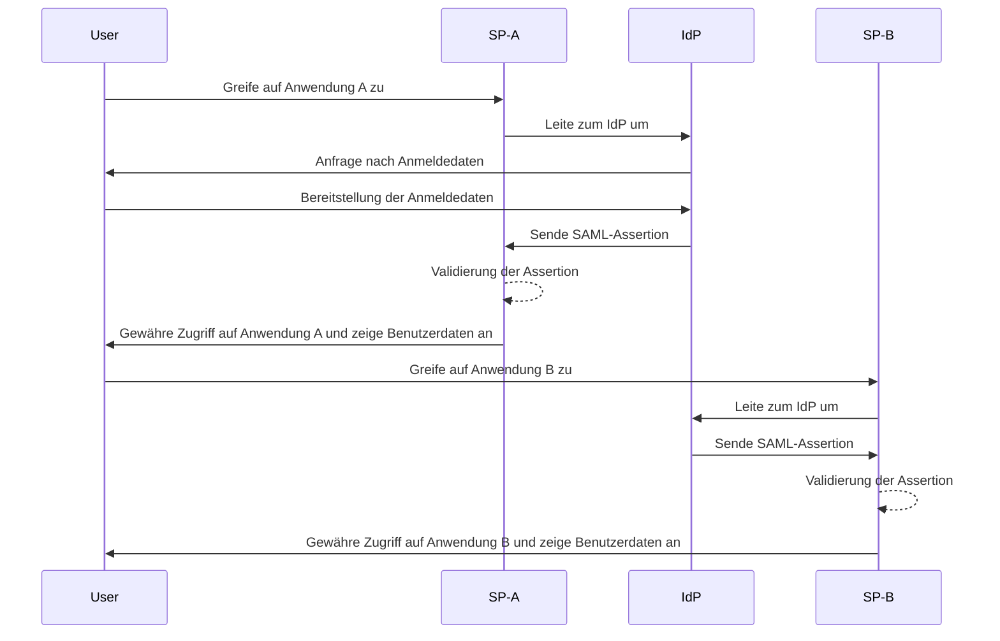
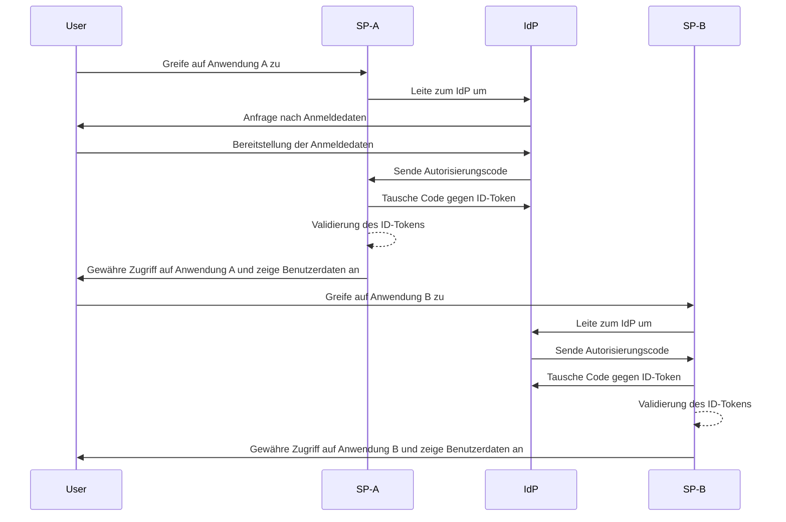

## Was ist Single sign-on (SSO)?

Single sign-on (SSO) ist eine Authentifizierungsmethode, die es Benutzern ermöglicht, mit einem einzigen Satz von Anmeldedaten auf mehrere Anwendungen oder Dienste zuzugreifen. Anstatt separate Logins für jedes System zu verwalten, authentifizieren sich Benutzer einmal und werden automatisch bei allen verbundenen Plattformen angemeldet.

SSO wird häufig sowohl in privaten als auch in geschäftlichen Umgebungen eingesetzt, insbesondere in Unternehmensumgebungen, in denen Mitarbeiter oder Remote-Arbeiter auf verschiedene SaaS-Anwendungen angewiesen sind, um ihre Arbeit zu erledigen. Durch die Implementierung von SSO können Organisationen die Sicherheit erhöhen, das Zugriffsmanagement optimieren und die Produktivität der Benutzer steigern.

Ein bekanntes Beispiel für SSO ist die Dienstesuite von Google, wie Gmail, Google Drive und Google Calendar. Nachdem sie sich in ihrem Google-Konto angemeldet haben, können Benutzer einfach auf all diese Dienste zugreifen, ohne ihre Anmeldedaten erneut eingeben zu müssen.

## Wie funktioniert Single sign-on?

SSO basiert auf einer Vertrauensbeziehung zwischen einer Anwendung oder einem Dienst, bekannt als <Ref slug="service-provider" />, und einem <Ref slug="identity-provider" />. Der IdP übernimmt die Benutzer-Authentifizierung und teilt die erforderlichen Informationen sicher mit dem SP, um den Zugriff zu gewähren. Dieses Vertrauen wird durch einen Prozess namens Föderation hergestellt, bei dem sowohl der SP als auch der IdP sich auf spezifische Standards und Protokolle einigen, um Authentifizierungsdaten sicher auszutauschen.

Wenn ein Benutzer versucht, auf eine SSO-fähige Anwendung zuzugreifen, leitet der SP ihn zur Authentifizierung an den IdP weiter. Der IdP fordert den Benutzer auf, seine Anmeldedaten einzugeben, überprüft seine Identität und generiert ein Sicherheitstoken oder eine Assertion, die die Informationen des Benutzers enthält. Dieses Token wird zurück an den SP gesendet, der es dann verwendet, um Zugriff zu gewähren.

Wenn der Benutzer versucht, auf eine weitere SSO-fähige Anwendung zuzugreifen, wird der Prozess automatisch wiederholt, ohne dass er sich erneut anmelden muss. Der IdP sendet die erforderlichen Authentifizierungsdaten direkt an den SP, wodurch der Benutzer nahtlos auf die neue Anwendung zugreifen kann.

SAML (Security Assertion Markup Language) und OIDC (OpenID Connect) sind zwei weit verbreitete Protokolle zur Implementierung von SSO. Diese Standards definieren, wie Authentifizierungsdaten zwischen dem IsP und dem SP ausgetauscht werden, um eine sichere und zuverlässige Kommunikation zu gewährleisten.

### SAML-basiertes SSO

Beim SAML-basierten SSO, sobald der Benutzer vom IdP authentifiziert wird, wird eine XML-basierte SAML-Assertion generiert, signiert und sicher an den SP gesendet. Der SP validiert dann die Assertion und gewährt Zugriff basierend auf der Identität des Benutzers.

### OIDC-basiertes SSO

OIDC hingegen baut auf OAuth 2.0 auf und bietet einen moderneren Ansatz für SSO. Es verwendet JSON Web Tokens (JWT), um Identitätsinformationen zwischen dem IdP und dem SP auszutauschen und bietet erhöhte Sicherheit und größere Flexibilität.

## Vorteile von Single sign-on

1. **Erhöhte Sicherheit**: SSO reduziert das Risiko von passwortbezogenen Sicherheitsverletzungen, indem die Anzahl der Anmeldedaten, die sich Benutzer merken müssen, minimiert wird. Es ermöglicht Organisationen auch, stärkere Authentifizierungsmethoden wie Multi-Faktor-Authentifizierung (MFA) durchzusetzen, um Benutzerkonten zu schützen.

2. **Verbesserte Benutzererfahrung**: Benutzer können nahtlos auf mehrere Anwendungen zugreifen, ohne sich wiederholt anmelden zu müssen, was die Produktivität steigert und Frustration reduziert. SSO vereinfacht den Anmeldeprozess und bietet ein konsistentes Benutzererlebnis auf verschiedenen Plattformen.

3. **Zentralisiertes Zugriffsmanagement**: Organisationen können den Benutzerzugriff und -berechtigungen zentral über den IdP verwalten, um konsistente Sicherheitsrichtlinien und Zugriffskontrollen über alle verbundenen Anwendungen hinweg sicherzustellen. Dies vereinfacht die Prozesse der Benutzerbereitstellung, der -entfernung und der -prüfung.

## Wann sollte Single sign-on verwendet werden

1. **Unternehmens- und organisatorische Umgebungen**: SSO ist besonders vorteilhaft für Unternehmen, die auf mehrere Anwendungen und Dienste angewiesen sind, um Arbeitsabläufe zu optimieren. Es vereinfacht den Benutzerzugriff und reduziert die Belastung der IT-Teams, einzelne Benutzerkonten zu verwalten. Beispielsweise Unternehmen, die mehrere SaaS-Anwendungen verwenden, wie CRM-, HR- und Kollaborationstools.
2. **Kundenorientierte Anwendungen**: SSO kann auch die Benutzererfahrung für Kunden verbessern, die auf Online-Dienste oder E-Commerce-Plattformen zugreifen. Zum Beispiel, indem Benutzer sich mit ihren Social-Media-Konten oder E-Mail-Adressen anmelden können, anstatt für jeden Dienst neue Konten zu erstellen.
3. **Mehrproduktdienste**: Unternehmen, die eine Suite von verbundenen Produkten oder Diensten anbieten, können SSO nutzen, um ein nahtloses Benutzererlebnis über ihre Angebote hinweg bereitzustellen. Benutzer können zwischen verschiedenen Anwendungen navigieren, ohne sich wiederholt anmelden zu müssen. Ein Beispiel ist G Suite von Google. Benutzer können sich einmal im Chrome-Browser anmelden und auf mehrere Google-Dienste zugreifen, ohne ihre Anmeldedaten erneut eingeben zu müssen.

Der Einsatz von SSO ist nicht auf diese Szenarien beschränkt und kann an verschiedene Anwendungsfälle angepasst werden, die den spezifischen Bedürfnissen einer Organisation oder Anwendung entsprechen. Es wird weithin als Best Practice angesehen, um Sicherheit, Benutzererfahrung und Betriebseffizienz in modernen digitalen Umgebungen zu verbessern.

<SeeAlso slugs={['enterprise-sso']} />