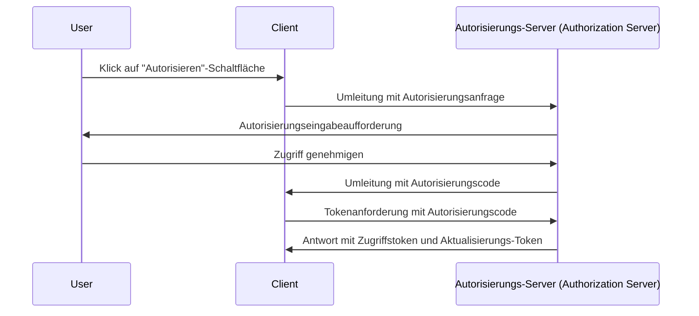
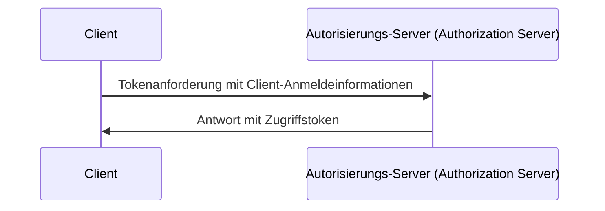

## Was ist eine Tokenanforderung (Token request)?

In <Ref slug="oauth-2.0" /> und <Ref slug="openid-connect" /> ist eine Tokenanforderung (token request) eine Anforderung an den <Ref slug="authorization-server" /> (oder <Ref slug="openid-connect" headingId="openid-provider-op" /> in OIDC), um Anmeldeinformationen (z. B. Autorisierungscode, Aktualisierungs-Token) gegen einen Satz von Tokens auszutauschen. Der Tokensatz umfasst typischerweise einen oder mehrere der folgenden:

- <Ref slug="access-token" />: Ein Token, das den Zugriff auf geschützte Ressourcen gewährt.
- <Ref slug="id-token" />: Ein Token, das Benutzerinformationen enthält (OIDC-spezifisch).
- <Ref slug="refresh-token" />: Ein Token, das verwendet werden kann, um ohne Benutzereingriff ein neues Zugriffstoken zu erhalten.

Abhängig vom verwendeten <Ref slug="oauth-2.0-grant">Grant-Typ</Ref> kann die Anforderung unterschiedliche Parameter enthalten und verschiedene Tokens zurückgeben.

Beispielsweise fordert der <Ref slug="client-credentials-flow" />, dass der <Ref slug="client" /> direkt mit den Client-Anmeldeinformationen ein <Ref slug="access-token" /> anfordert. Hier ist ein nicht normatives Beispiel der Tokenanforderung:

```http
POST /token HTTP/1.1
Host: authorization-server.example.com
Content-Type: application/x-www-form-urlencoded

grant_type=client_credentials
  &client_id=client-id
  &client_secret=client-secret
  &scope=read
```

Wenn die Anforderung erfolgreich ist, antwortet der Autorisierungsserver mit einem Zugriffstoken:

```http
HTTP/1.1 200 OK
Content-Type: application/json

{
  "access_token": "eyJhbGci...zHg",
  "token_type": "Bearer",
  "expires_in": 3600,
  "scope": "read"
}
```

## Wie funktioniert eine Tokenanforderung (token request)?

Wie das obige Beispiel zeigt, ist die Tokenanforderung (token request) selbst unkompliziert. Der Client sendet eine HTTP-Anfrage an den Token-Endpunkt des Autorisierungsservers mit den erforderlichen Parametern. Der Autorisierungsserver validiert die Anforderung, verarbeitet sie und gibt die Tokens in der Antwort zurück.

Je nach verwendetem spezifischen Grant-Typ (Flow) kann die Tokenanforderung jedoch mehr Vorbereitung erfordern.

### Autorisierungscode-Flow (Authorization code flow)

Im <Ref slug="authorization-code-flow" /> erhält der Client zunächst einen Autorisierungscode (authorization code), indem er eine <Ref slug="authorization-request" /> (oder <Ref slug="authentication-request" /> in OIDC) mit dem Autorisierungsserver initiiert. Sobald der Benutzer die Erlaubnis erteilt, tauscht der Client den Autorisierungscode (authorization code) über die Tokenanforderung gegen ein Zugriffstoken und optional ein Aktualisierungs-Token aus.

Hier ist ein vereinfachtes Sequenzdiagramm des Autorisierungscode-Flows:



### Client-Anmeldeinformationen-Flow (Client credentials flow)

Wie das Beispiel im ersten Abschnitt zeigt, ist der <Ref slug="client-credentials-flow" /> viel einfacher. Der Client fordert direkt mit seinen Client-Anmeldeinformationen ein Zugriffstoken (access token) an. Der Autorisierungsserver validiert die Client-Anmeldeinformationen und stellt ein Zugriffstoken aus, wenn erfolgreich.

Hier ist ein nicht normatives Sequenzdiagramm des Client-Anmeldeinformationen-Flows:



### Aktualisierungs-Token (Refresh token)

Bei einigen Grant-Typen kann der Client auch <Ref slug="offline-access" /> anfordern, indem er den Geltungsbereich (scope) `offline_access` in die Autorisierungsanfrage aufnimmt. Wird dies gewährt, stellt der Autorisierungsserver ein Aktualisierungs-Token zusammen mit dem Zugriffstoken aus. Der Client kann das Aktualisierungs-Token verwenden, um über die Tokenanforderung ein neues Zugriffstoken zu erhalten, ohne dass eine Benutzerinteraktion erforderlich ist.

Hier ist ein nicht normatives Beispiel für die Verwendung eines Aktualisierungs-Tokens, um ein neues Zugriffstoken zu erhalten:

```http
POST /token HTTP/1.1
Host: authorization-server.example.com
Content-Type: application/x-www-form-urlencoded

grant_type=refresh_token
  &refresh_token=refresh-token
  &client_id=client-id
  &client_secret=client-secret
```

---

Andere <Ref slug="oauth-2.0-grant">Grant-Typen</Ref> können auch Tokenanforderungen beinhalten, aber das Grundprinzip bleibt dasselbe.

## Wichtige Parameter in einer Tokenanforderung (token request)

Hier sind einige wichtige Parameter, die häufig in einer Tokenanforderung (token request) verwendet werden:

- **`grant_type`**: Der Typ des angeforderten Grants. Häufige Werte sind `authorization_code`, `client_credentials`, `refresh_token` usw.
- **`client_id`**: Die vom Autorisierungsserver ausgegebene Client-Kennung.
- **`client_secret`**: Das vom Autorisierungsserver ausgegebene Client-Geheimnis (für vertrauliche Clients).
- **`code`**: Der vom Autorisierungsserver erhaltene Autorisierungscode (für den Autorisierungscode-Flow).
- **`refresh_token`**: Das vom Autorisierungsserver erhaltene Aktualisierungs-Token (zur Aktualisierung von Zugriffstokens).
- **`scope`**: Die angeforderten <Ref slug="scope">Geltungsbereiche</Ref> (Berechtigungen) für das Zugriffstoken.
- **`redirect_uri`**: Die URI, an die der Autorisierungsserver die Antwort sendet (für den Autorisierungscode-Flow).
- **`code_verifier`**: Der im <Ref slug="pkce" />-Erweiterung verwendete Code-Verifizierer (für den Autorisierungscode-Flow).

Die tatsächlichen Parameter und ihre Werte hängen vom Grant-Typ und den spezifischen Anforderungen der Anwendung ab. Bevor du eine Tokenanforderung machst, solltest du die vollständige Liste der Parameter für den spezifischen Grant-Typ, den du verwendest, überprüfen.

<SeeAlso slugs={["oauth-2.0", "openid-connect", "authorization-request", "authentication-request"]} />