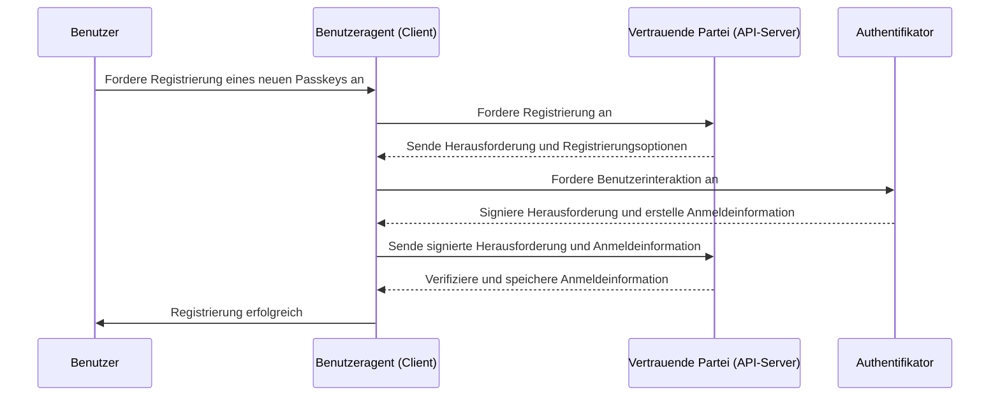
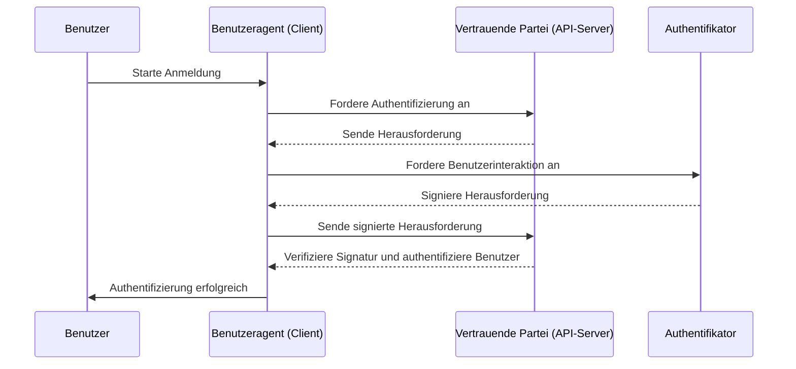

## Was ist WebAuthn?

WebAuthn (Web Authentication API), entwickelt von der [W3C](https://www.w3.org/) und der [FIDO Alliance](https://fidoalliance.org/), ist eine Spezifikation für sichere Web-Authentifizierung unter Verwendung der FIDO2-Standards. WebAuthn bietet eine API, die es Websites ermöglicht, <Ref slug="passkey" /> zu implementieren, die phishing-resistente Anmeldeinformationen sind, die durch öffentliche Schlüssel-Kryptographie gesichert sind. Passkeys können Passwörter sowohl für passwortlose Anmeldungen als auch für <Ref slug="mfa" /> ersetzen.

## Wie sieht der WebAuthn-Workflow aus?

Hier ist ein Beispiel aus der realen Welt, um es besser zu verstehen. Du hast eine Webanwendung MyApp, die die WebAuthn API integrieren möchte, um Passkey für die Multi-Faktor-Authentifizierung zu implementieren.

**Registrierungsphase:** Nach der Anmeldung mit einer E-Mail-Verifizierung und dem Festlegen eines neuen Passworts wird dieser Benutzer aufgefordert, einen Passkey zu erstellen. Sie entscheiden sich, ihr Gerät mit einem Fingerabdruck zu verknüpfen. Dies stellt den Passkey sicher auf ihrem Gerät her.

**Authentifizierungsphase:** Bei der nächsten Anmeldung wird der Benutzer aufgefordert, seinen Passkey zu verifizieren, nachdem er sein Passwort eingegeben hat. Mit nur einem schnellen Fingerabdruck-Scan können sie den Authentifizierungsprozess einfach abschließen.


Um eine detailliertere Erklärung zu bieten, können wir den Prozess in zwei Phasen unterteilen: Registrierung und Authentifizierung. Zuerst ist es wichtig, die vier Schlüsselentitäten zu verstehen, die am WebAuthn-Flow beteiligt sind.

### 4 Schlüsselentitäten

1. **Benutzer:** Die Person, die versucht, auf eine Webanwendung zuzugreifen.
2. **Benutzeragent:** Der Webbrowser, der die WebAuthn API-Aufrufe bearbeitet und den Authentifizierungsprozess zwischen dem Benutzer, der vertrauenden Partei und dem Authentifikator verwaltet.
3. **Vertrauende Partei:** Der Dienst, die Anwendung oder der API-Server, auf den der Benutzer zugreifen möchte.
4. **Authentifikator:** Die Hardware- oder Softwarekomponente, die zur Überprüfung der Identität des Benutzers verwendet wird. Sie kann je nach Plattform- oder Browserfähigkeit verschiedene Formen annehmen, wie Sicherheitsschlüssel (wie Yubikeys), Telefone oder Tablets (verbunden über Bluetooth, NFC oder USB), gerätebasierte Biometrie oder PINs usw.

### WebAuthn-Registrierung

Asymmetrische öffentliche Schlüssel-Kryptographie ist der Kernprozess.

1. **Schlüsselpaar-Generierung:** 
Der Benutzeragent generiert ein öffentlich-privates Schlüsselpaar.
   - **Öffentlicher Schlüssel:** Wird mit der vertrauenden Partei geteilt.
   - **Privater Schlüssel:** Bleibt sicher im Authentifikator des Benutzers gespeichert.
2. **Registrierungsherausforderung:** 
Wenn der Benutzer versucht, einen Passkey zu registrieren, sendet die vertrauende Partei eine Registrierungsherausforderung an den Benutzeragenten.
3. **Benutzerverifizierung:** 
Der Benutzeragent leitet die Herausforderung an den Authentifikator weiter, der den Benutzer zur Verifizierung auffordert (z. B. biometrische Authentifizierung oder ein Hardware-Sicherheitsschlüssel).
4. **Kryptografische Signatur:** 
Der Authentifikator verwendet seinen privaten Schlüssel, um die Herausforderung zu signieren und eine kryptografische Signatur zu erstellen.
5. **Verifizierung und Zugriff:** 
Der Benutzeragent sendet die signierte Herausforderung zurück an die vertrauende Partei, die die Signatur mit dem öffentlichen Schlüssel verifiziert und den Registrierungsprozess abschließt.



### WebAuthn-Authentifizierung

1. **Authentifizierungsherausforderung:**
Wenn der Benutzer versucht, sich anzumelden, sendet die vertrauende Partei eine Authentifizierungsherausforderung an den Benutzeragenten.
2. **Benutzerverifizierung:**
Der Benutzeragent sendet die Herausforderung an den Authentifikator, der den Benutzer zur Verifizierung auffordert (z. B. biometrische Authentifizierung oder ein Hardware-Sicherheitsschlüssel).
3. **Kryptografische Signatur:**
Der Authentifikator verwendet seinen privaten Schlüssel, um die Herausforderung zu signieren und eine kryptografische Signatur zu erstellen.
4. **Verifizierung und Zugriff:**
Der Benutzeragent verifiziert die Signatur mit dem öffentlichen Schlüssel und informiert die vertrauende Partei über eine erfolgreiche Authentifizierung. Der Zugriff wird gewährt, wenn die Verifizierung erfolgreich ist.



## Wie verwendet man WebAuthn?

Die WebAuthn API kann verwendet werden, um Passkey-Anmeldung oder 2-Schritt-Verifizierung zu implementieren. Siehe Passkey-Erfahrung, um mehr Details zu erfahren.

Um die Web Authentication API (WebAuthn) für sichere Authentifizierung zu verwenden, musst du zwei Hauptprozesse handhaben: Registrierung und Authentifizierung. Hier sind einfache Codebeispiele, wie du diese Prozesse mit JavaScript implementieren könntest.

**Registrierung**

Die vertrauende Partei (deine Webanwendung) initiiert den Registrierungsprozess, indem sie die Methode `navigator.credentials.create()` aufruft.

```jsx
// Registrierung
navigator.credentials.create({
  publicKey: {
    rp: {
      name: "Dein Name der vertrauenden Partei",
      id: "deine-vertrauende-partei-id"
    },
    user: {
      id: "benutzer-id",
      displayName: "Benutzername",
      name: "Benutzername"
    },
    challenge: "dein-herausforderungswert",
    timeout: 60000 // 60 Sekunden
  }
}).then(credential => {
  // Speichere die ID der Anmeldeinformation für zukünftige Authentifizierung
  localStorage.setItem("credentialId", credential.id);
}).catch(error => {
  console.error("Registrierungsfehler:", error);
});
```

Die vertrauende Partei initiiert den Authentifizierungsprozess, indem sie die Methode `navigator.credentials.get()` aufruft.

```jsx
// Authentifizierung
navigator.credentials.get({
  publicKey: {
    rp: {
      name: "Dein Name der vertrauenden Partei",
      id: "deine-vertrauende-partei-id"
    },
    challenge: "dein-herausforderungswert",
    timeout: 60000 // 60 Sekunden
  }
}).then(credential => {
  // Verifiziere die ID der Anmeldeinformation und andere Eigenschaften
  if (credential.id === localStorage.getItem("credentialId")) {
    // Authentifizierung erfolgreich
    console.log("Benutzer erfolgreich authentifiziert");
  } else {
    console.error("Ungültige Anmeldeinformation");
  }
}).catch(error => {
  console.error("Authentifizierungsfehler:", error);
});
```

Um die Details zu erfahren, lies die Spezifikationen: https://fidoalliance.org/specifications/download/.

Hinweis: Bei WebAuthn-Aktionen, sei es für die Registrierung oder Authentifizierung, ist die "rp ID" (relying party ID) ein Pflichtfeld. Sie repräsentiert den Domain-Hostname der aktuellen Webseite. Wenn sie nicht mit der aktuellen Domain übereinstimmt, wird der Browser die Anfrage ablehnen. Das bedeutet, dass Passkeys an eine spezifische Domain gebunden sind und es derzeit keine Möglichkeit gibt, bestehende Passkeys auf eine andere Domain zu migrieren. Außerdem können Passkeys nicht über verschiedene Domains hinweg verwendet werden.

## WebAuthn und OpenID Connect (OIDC)

Durch die Kombination der starken Sicherheit von WebAuthn mit dem standardisierten Identitätsprotokoll von OIDC können wir ein sichereres und benutzerfreundlicheres Authentifizierungserlebnis schaffen.

Erfahre, wie es funktioniert:

- **Registrierungsphase:** Benutzer durchlaufen einen standardmäßigen <Ref slug="openid-connect" />-Registrierungsprozess (z. B. E-Mail-Verifizierung und Passworterstellung). WebAuthn generiert ein öffentlich-privates Schlüsselpaar, speichert den öffentlichen Schlüssel beim OIDC <Ref slug="identity-provider" /> und behält den privaten Schlüssel auf dem Gerät des Benutzers.
- **Authentifizierungsphase:** Benutzer greifen auf eine OIDC-geschützte Ressource zu und werden zur Anmeldeseite umgeleitet. Nach Eingabe der grundlegenden Anmeldeinformationen (z. B. E-Mail und Passwort) ruft das System WebAuthn zur Passkey-Authentifizierung auf. Sobald der Passkey verifiziert ist, stellt OIDC ein Access Token oder ID Token für den Benutzerzugriff aus.

## Was ist der Unterschied zwischen WebAuthn und CTAP2?

**WebAuthn** und **CTAP2** sind beide wesentliche Komponenten des FIDO2-Standards, dienen jedoch unterschiedlichen Zwecken:

- **CTAP2 (Client to Authenticator Protocol 2):** Dieses Protokoll definiert, wie ein Gerät, wie ein Sicherheitsschlüssel oder Smartphone, mit einer Webanwendung kommuniziert. Es stellt einen sicheren Kanal zwischen dem **Authentifikator** und dem **Gerät des Benutzers** her und sorgt dafür, dass sensible Authentifizierungsdaten geschützt sind.
- **WebAuthn (Web Authentication API):** Diese API bietet eine standardisierte Möglichkeit für Webanwendungen, mit CTAP2-kompatiblen Authentifikatoren zu interagieren. Sie verwaltet den Authentifizierungsprozess, einschließlich des Austauschs von Authentifizierungsdaten zwischen dem **Gerät des Benutzers** und der **vertrauenden Partei**.

<SeeAlso slugs={["passkey", "mfa", "openid-connect"]} />

<Resources
  urls={[
    "https://fidoalliance.org/specs/fido-v2.0-id-20180227/fido-client-to-authenticator-protocol-v2.0-id-20180227.html",
    "https://blog.logto.io/webauthn-nextjs",
    "https://blog.logto.io/webauthn-base-knowledge"
  ]}
/>