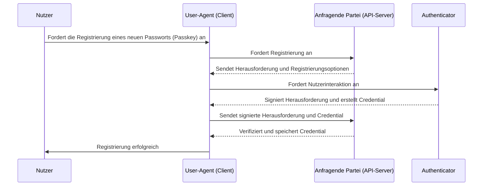
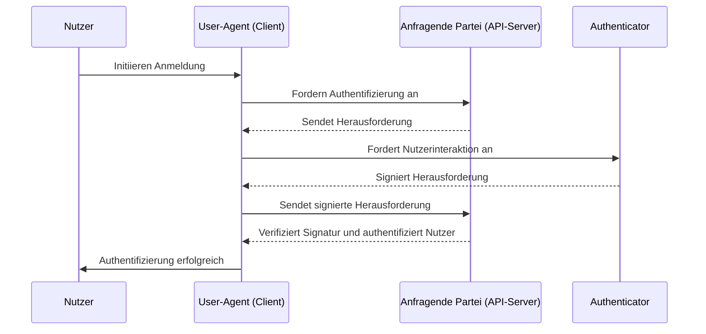

## Was ist WebAuthn?

WebAuthn (Web Authentication API), entwickelt von der [W3C](https://www.w3.org/) und der [FIDO Alliance](https://fidoalliance.org/), ist eine Spezifikation für sichere Web-Authentifizierung unter Verwendung der FIDO2-Standards. WebAuthn bietet eine API, die es Websites ermöglicht, <Ref slug="passkey" /> zu implementieren, die phishing-resistente Credentials sind, gesichert durch Public-Key-Kryptografie. Passwörter (Passkeys) können Passwörter sowohl für passwortlose Logins als auch für Multi-Faktor-Authentifizierung (MFA) ersetzen.

## Wie sieht der WebAuthn-Workflow aus?

Um eine detailliertere Erklärung zu bieten, können wir den Prozess in zwei Phasen unterteilen: Registrierung und Authentifizierung. Zunächst ist es wichtig, die vier Schlüsselentitäten im WebAuthn-Flow zu verstehen.

### 4 Schlüsselentitäten

1. **Nutzer:** Die Person, die versucht, auf eine Webanwendung zuzugreifen.
2. **User-Agent:** Der Webbrowser, der die API-Aufrufe von WebAuthn verarbeitet und den Authentifizierungsprozess zwischen dem Nutzer, der anfragenden Partei und dem Authenticator verwaltet.
3. **Anfragende Partei:** Der Dienst, die Anwendung oder der API-Server, auf den der Nutzer zugreifen möchte.
4. **Authenticator:** Die Hardware- oder Softwarekomponente, die zur Überprüfung der Identität des Nutzers verwendet wird. Er kann je nach Plattform- oder Browserfähigkeiten verschiedene Formen annehmen, wie z. B. Sicherheitsschlüssel (wie Yubikeys), Telefone oder Tablets (verbunden über Bluetooth, NFC oder USB), gerätebasierte Biometrie oder PINs, usw.

### WebAuthn-Registrierung

Asymmetrische Public-Key-Kryptografie ist der Kernprozess.

1. **Schlüsselpaar-Generierung:** 
Der User-Agent generiert ein öffentlich-privates Schlüsselpaar.
   - **Öffentlicher Schlüssel:** Wird mit der anfragenden Partei geteilt.
   - **Privater Schlüssel:** Bleibt sicher im Authenticator des Nutzers gespeichert.
2. **Registrierungsherausforderung:** 
Wenn der Nutzer versucht, ein Passwort (Passkey) zu registrieren, sendet die anfragende Partei eine Registrierungsherausforderung an den User-Agent.
3. **Nutzerverifizierung:** 
Der User-Agent leitet die Herausforderung an den Authenticator weiter, der den Nutzer zur Verifizierung auffordert (z. B. biometrische Authentifizierung oder ein Hardware-Sicherheitsschlüssel).
4. **Kryptographische Signatur:** 
Der Authenticator verwendet seinen privaten Schlüssel, um die Herausforderung zu signieren und eine kryptografische Signatur zu erstellen.
5. **Verifizierung und Zugriff:** 
Der User-Agent sendet die signierte Herausforderung zurück an die anfragende Partei, die die Signatur mit dem öffentlichen Schlüssel verifiziert und den Registrierungsprozess abschließt.



### WebAuthn-Authentifizierung

1. **Authentifizierungsherausforderung:**
Wenn der Nutzer versucht, sich anzumelden, sendet die anfragende Partei eine Authentifizierungsherausforderung an den User-Agent.
2. **Nutzerverifizierung:**
Der User-Agent sendet die Herausforderung an den Authenticator, der den Nutzer zur Verifizierung auffordert (z. B. biometrische Authentifizierung oder ein Hardware-Sicherheitsschlüssel).
3. **Kryptographische Signatur:**
Der Authenticator verwendet seinen privaten Schlüssel, um die Herausforderung zu signieren und eine kryptografische Signatur zu erstellen.
4. **Verifizierung und Zugriff:**
Der User-Agent verifiziert die Signatur mit dem öffentlichen Schlüssel und informiert die anfragende Partei über eine erfolgreiche Authentifizierung. Der Zugriff wird gewährt, wenn die Verifizierung erfolgreich ist.



## Wie verwendet man WebAuthn?

Die WebAuthn-API kann verwendet werden, um Passwort Anmeldungen (Passkey sign-in) oder die 2-Schritt-Verifizierung zu implementieren. Weitere Informationen finden Sie in der Passwörter-Erfahrung.

Um die Web Authentication API (WebAuthn) für sichere Authentifizierung zu nutzen, musst du zwei Hauptprozesse abwickeln: Registrierung und Authentifizierung. Hier sind einfache Code-Beispiele, wie du diese Prozesse mit JavaScript implementieren könntest.

**Registrierung**

Die anfragende Partei (deine Webanwendung) initiiert den Registrierungsprozess, indem sie die Methode `navigator.credentials.create()` aufruft.

```jsx
// Registrierung
navigator.credentials.create({
  publicKey: {
    rp: {
      name: "Dein Relying Party Name",
      id: "deine-relying-party-id"
    },
    user: {
      id: "user-id",
      displayName: "User Name",
      name: "User Name"
    },
    challenge: "dein-challenge-wert",
    timeout: 60000 // 60 Sekunden
  }
}).then(credential => {
  // Speichere die ID des Credentials für zukünftige Authentifizierungen
  localStorage.setItem("credentialId", credential.id);
}).catch(error => {
  console.error("Registrierungsfehler:", error);
});
```

Die anfragende Partei initiiert den Authentifizierungsprozess, indem sie die Methode `navigator.credentials.get()` aufruft.

```jsx
// Authentifizierung
navigator.credentials.get({
  publicKey: {
    rp: {
      name: "Dein Relying Party Name",
      id: "deine-relying-party-id"
    },
    challenge: "dein-challenge-wert",
    timeout: 60000 // 60 Sekunden
  }
}).then(credential => {
  // Überprüfe die ID des Credentials und andere Eigenschaften
  if (credential.id === localStorage.getItem("credentialId")) {
    // Authentifizierung erfolgreich
    console.log("Nutzer erfolgreich authentifiziert");
  } else {
    console.error("Ungültiges Credential");
  }
}).catch(error => {
  console.error("Authentifizierungsfehler:", error);
});
```

Für mehr Details lies die Spezifikation: https://fidoalliance.org/specifications/download/.

Hinweis: In WebAuthn-Aktionen, sei es für Registrierung oder Authentifizierung, ist das "rp ID" (Relying Party ID) ein obligatorisches Feld. Es repräsentiert den Domain-Hostname der aktuellen Webseite. Wenn es nicht mit der aktuellen Domain übereinstimmt, lehnt der Browser die Anfrage ab. Dies bedeutet, dass Passwörter (Passkeys) an eine spezifische Domain gebunden sind und es derzeit keine Möglichkeit gibt, bestehende Passwörter an eine andere Domain zu migrieren. Außerdem können Passwörter nicht über unterschiedliche Domains hinweg verwendet werden.

## Was ist der Unterschied zwischen WebAuthn und CTAP2?

**WebAuthn** und **CTAP2** sind beide essenzielle Komponenten des FIDO2-Standards, aber sie dienen unterschiedlichen Zwecken:

- **CTAP2 (Client to Authenticator Protocol 2):** Dieses Protokoll definiert, wie ein Gerät, wie z. B. ein Sicherheitsschlüssel oder Smartphone, mit einer Webanwendung kommuniziert. Es stellt einen sicheren Kanal zwischen dem **Authenticator** und dem **Gerät des Nutzers** her und sorgt dafür, dass sensible Authentifizierungsdaten geschützt werden.
- **WebAuthn (Web Authentication API):** Diese API bietet eine standardisierte Möglichkeit für Webanwendungen, mit CTAP2-konformen Authenticators zu interagieren. Sie behandelt den Authentifizierungsprozess, einschließlich des Austauschs von Authentifizierungsdaten zwischen dem **Gerät des Nutzers** und der **anfragenden Partei**.

## Begriffe, die man kennen sollte

- <Ref slug="passkey" />
- FIDO
- FIDO2
- CTAP2
- MFA
- Authenticator

<Resources
  urls={[
    "https://fidoalliance.org/specs/fido-v2.0-id-20180227/fido-client-to-authenticator-protocol-v2.0-id-20180227.html",
    "https://blog.logto.io/webauthn-nextjs",
    "https://blog.logto.io/webauthn-base-knowledge"
  ]}
/>