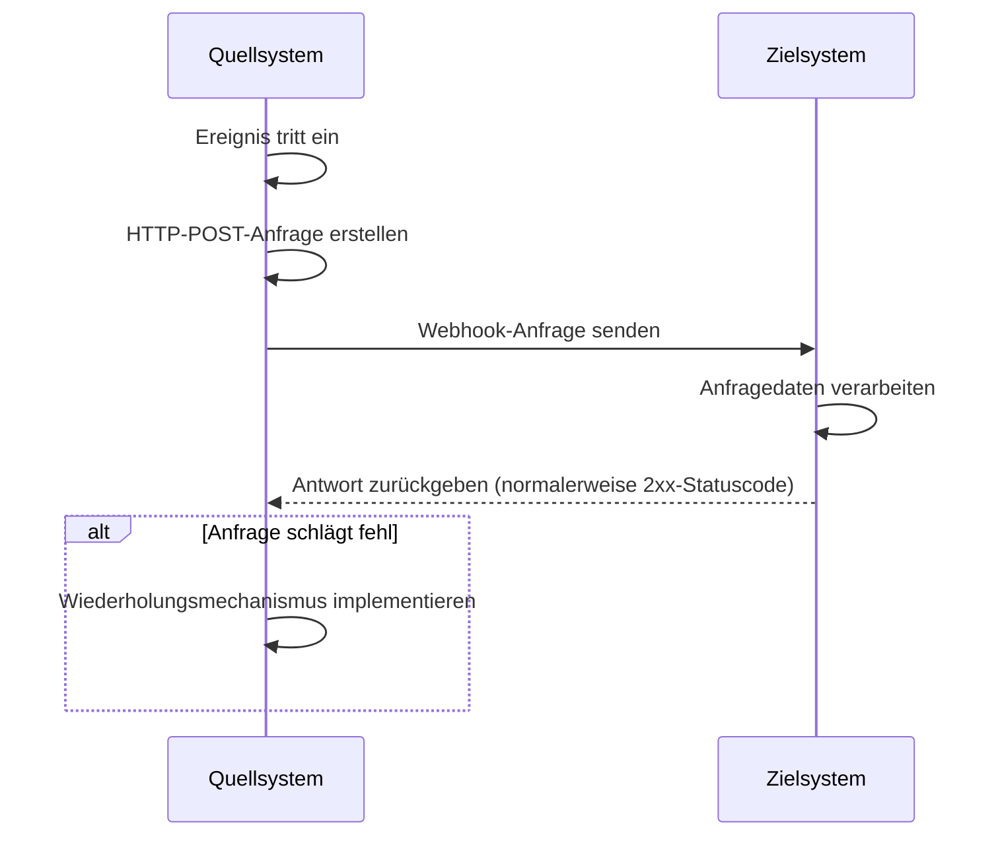
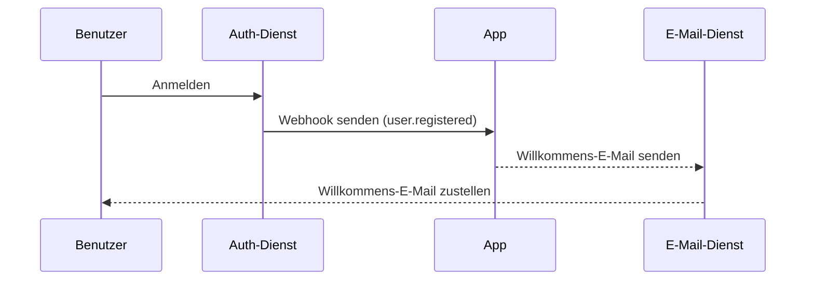

## Was ist ein Webhook?

Ein Webhook ist ein HTTP-Callback-Mechanismus, der es Anwendungen ermöglicht, Echtzeit-Benachrichtigungen an vordefinierte URLs zu senden, wenn bestimmte Ereignisse eintreten. Dieser Mechanismus ermöglicht den automatisierten Datenaustausch und die Echtzeitkommunikation zwischen Systemen.

## Wie funktionieren Webhooks?



1. Ein bestimmtes Ereignis tritt im Quellsystem ein
2. Das Quellsystem erstellt eine HTTP-POST-Anfrage mit den Ereignisdaten
3. Das Quellsystem sendet die Anfrage an die vorkonfigurierte URL des Zielsystems
4. Das Zielsystem empfängt die Anfrage und verarbeitet die Daten
5. Das Zielsystem gibt eine Antwort an das Quellsystem zurück
6. Wenn die Anfrage fehlschlägt, kann das Quellsystem einen Wiederholungsmechanismus implementieren

## Wie funktionieren Webhooks in einem realen Szenario?

Nehmen wir eine Anwendung, die mit einem Auth-Dienst integriert ist, als Beispiel. Wenn sich ein neuer Benutzer anmeldet, sendet die Anwendung eine Willkommens-E-Mail an den Benutzer.

Typischerweise bietet der Auth-Dienst ein `user.registered` Webhook-Ereignis, das ausgelöst wird, wenn ein neuer Benutzer die Registrierung abschließt.

Die Webhook-Ereignisnutzlast enthält die Informationen des Benutzers wie E-Mail und Benutzernamen, die verwendet werden können, um die Willkommens-E-Mail zu senden:

```json
// Hinweis: Die tatsächliche Struktur der Nutzlast hängt vom Auth-Dienst ab.
{
  "event": "user.registered",
  "timestamp": "2024-03-21T08:00:00Z",
  "data": {
    "user_id": "u_1234567890",
    "email": "john@example.com",    // E-Mail-Adresse zum Senden der Willkommens-E-Mail
    "username": "johndoe",          // Benutzername zur Personalisierung der E-Mail
    "registered_at": "2024-03-21T08:00:00Z"
  }
}
```

So funktioniert der Webhook-Fluss:



## Was sind bewährte Praktiken für die Implementierung von Webhooks?

Wenn du der Sender (Produzent) von Webhooks bist, berücksichtige die folgenden Aspekte:

### Webhook-Design

Entwerfe klare und konsistente Webhook-Strukturen:

- Definiere klare Ereignistypen: Zum Beispiel `order.created`, `user.updated`, etc.
- Verwende das Standard-JSON-Format: Stelle sicher, dass die Datenstruktur klar und einfach zu parsen ist.
- Versionskontrolle: Füge Versionsinformationen in die Anfrage-Header oder die Nutzlast ein. Zum Beispiel:

  ```javascript
  // In Anfrage-Headern
  headers: {
    'Content-Type': 'application/json',
    'X-Webhook-Version': '1.0'
  }
  
  // Oder in der Nutzlast
  {
    "version": "1.0",
    "event_type": "order.created",
    "data": {
      // Ereignisdetails
    }
  }
  ```

- Biete ausreichenden Kontext: Füge Zeitstempel hinzu, wann Ereignisse aufgetreten sind, eindeutige Kennungen für verwandte Ressourcen, etc.
- Halte Konsistenz: Verwende konsistente Namenskonventionen und Datenstrukturen für alle Ereignistypen.

### Sendemechanismus

Implementiere einen zuverlässigen Webhook-Sendemechanismus:

- Verwende asynchrone Aufgabenwarteschlangen: Vermeide das Blockieren des Hauptprogramms und verbessere die Systemreaktionsfähigkeit.
- Implementiere Wiederholungsmechanismen: Behandle Netzwerkfehler oder vorübergehende Nichtverfügbarkeit des Empfängers.

### Wiederholungsstrategie

Entwerfe eine geeignete Wiederholungsstrategie:

- Implementiere exponentielles Backoff: Vermeide häufige Wiederholungen, die das System und den Empfänger belasten könnten.
- Setze eine maximale Wiederholungsanzahl: Verhindere unendliche Wiederholungen, die Systemressourcen verbrauchen.
- Biete manuelle Wiederholungsmechanismen: Biete eine Schnittstelle für manuelle Wiederholungen für Webhooks, die letztendlich fehlschlagen.

### Sicherheitsimplementierung

Implementiere einen Signaturmechanismus, um Empfängern zu ermöglichen, die Authentizität von Anfragen zu überprüfen:

```javascript
const crypto = require('crypto');

function generateSignature(payload, secret) {
  return crypto.createHmac('sha256', secret)
    .update(JSON.stringify(payload))
    .digest('hex');
}

function sendWebhookWithSignature(url, payload, secret) {
  const signature = generateSignature(payload, secret);
  return axios.post(url, payload, {
    headers: { 'X-Webhook-Signature': signature }
  });
}
```

### Leistungsoptimierung

Optimiere die Leistung des Webhook-Versands:

- Verwende Verbindungspools: Reduziere den Overhead beim Herstellen von Verbindungen und verbessere die Leistung.
- Implementiere Batch-Verarbeitung: Sende Webhooks in Batches, wenn angemessen, um die Anzahl der Netzwerkinteraktionen zu reduzieren.

### Dokumentation und Testwerkzeuge

Biete Unterstützung für Webhook-Nutzer:

- Detaillierte API-Dokumentation: Füge alle möglichen Ereignistypen, Anfrageformate und Feldbeschreibungen hinzu.
- Biete Testwerkzeuge: Implementiere Webhook-Testendpunkte, um Nutzern zu ermöglichen, den Empfang von Webhook-Benachrichtigungen zu simulieren.
- Beispielcode: Biete Integrationsbeispiele in verschiedenen Programmiersprachen.

## Was sind bewährte Praktiken für die Nutzung von Webhooks?

Wenn du Webhooks als Empfänger (Konsument) nutzt, berücksichtige die folgenden Aspekte:

### Sicherheit

Da Endpunkte zum Empfangen von Webhooks in der Regel öffentlich zugänglich sind, ist Sicherheit ein Hauptanliegen. Achte auf die folgenden Punkte:

- Überprüfe die Authentizität der Anfragen: Implementiere einen Signaturüberprüfungsmechanismus, um sicherzustellen, dass Anfragen von erwarteten Absendern stammen.
  
  ```javascript
  const crypto = require('crypto');

  function verifySignature(payload, signature, secret) {
    const expectedSignature = crypto
      .createHmac('sha256', secret)
      .update(JSON.stringify(payload))
      .digest('hex');
    
    return crypto.timingSafeEqual(
      Buffer.from(signature),
      Buffer.from(expectedSignature)
    );
  }
  ```

- Verwende HTTPS: Stelle sicher, dass dein Webhook-Empfangsendpunkt HTTPS verwendet, um zu verhindern, dass Daten während der Übertragung abgefangen oder manipuliert werden.
- Implementiere IP-Whitelisting: Akzeptiere nur Webhook-Anfragen von vertrauenswürdigen IP-Adressen, um das Risiko von Angriffen zu reduzieren.

### Zuverlässigkeit

Um eine zuverlässige Verarbeitung empfangener Webhooks sicherzustellen:

- Implementiere idempotente Verarbeitung: Entwerfe dein System so, dass es doppelte Webhook-Benachrichtigungen korrekt verarbeitet, da Absender fehlgeschlagene Anfragen möglicherweise wiederholen.
- Antworte schnell: Gib eine Antwort (normalerweise ein 2xx-Statuscode) sofort nach dem Empfang einer Webhook-Anfrage zurück, um zu verhindern, dass der Absender die Anfrage als fehlgeschlagen ansieht und eine Wiederholung auslöst.

### Leistung

Erhalte einen effizienten Systembetrieb:

- Asynchrone Verarbeitung: Führe nach dem Empfang eines Webhooks die tatsächliche Datenverarbeitung im Hintergrund durch, ohne die Antwort zu blockieren.
- Setze Zeitlimits: Setze angemessene Zeitlimits für die Webhook-Verarbeitung, um zu verhindern, dass langlaufende Aufgaben die Systemleistung beeinträchtigen.

### Fehlerbehandlung

Behandle potenzielle Fehlersituationen angemessen:

- Protokollierung: Führe detaillierte Aufzeichnungen über empfangene Webhook-Anfragen und Verarbeitungsverfahren, um die Untersuchung von Problemen zu erleichtern.
- Sanfte Degradierung: Habe geeignete Fehlerbehandlungsmechanismen, wenn du Webhooks nicht verarbeiten kannst, um sicherzustellen, dass andere Teile des Systems nicht betroffen sind.

### Versionskompatibilität

Da sich Webhook-Formate im Laufe der Zeit ändern können:

- Behandle Versionsinformationen: Sei darauf vorbereitet, verschiedene Versionen von Webhook-Formaten zu verarbeiten. Versionsinformationen werden normalerweise in der URL oder den Anfrage-Headern bereitgestellt.
- Abwärtskompatibilität: Stelle bei der Aktualisierung deiner Webhook-Verarbeitungslogik sicher, dass die Unterstützung für ältere Formatversionen weiterhin gewährleistet ist.

### Überwachung

Überwache kontinuierlich den Empfang und die Verarbeitung von Webhooks:

- Richte Alarme ein: Implementiere Echtzeitüberwachung und Alarmierung für abnormale Situationen (wie hohe Fehlerraten oder ungewöhnlichen Verkehr).
- Leistungsmetriken: Verfolge Leistungsmetriken für die Webhook-Verarbeitung, wie Antwortzeit und Erfolgsrate.

<Resources
  urls={[
    "https://docs.logto.io/docs/recipes/webhooks/",
    "https://docs.logto.io/docs/recipes/webhooks/securing-your-webhooks/",
    "https://en.wikipedia.org/wiki/Webhook"
  ]}
/>