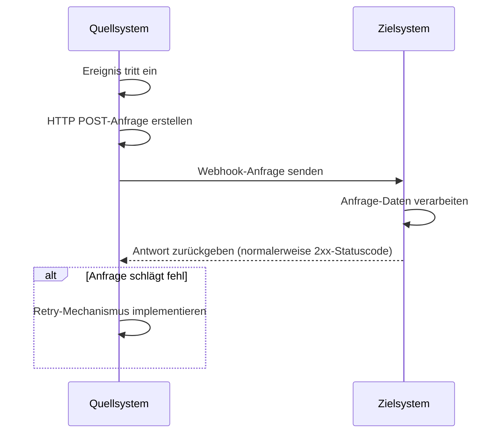
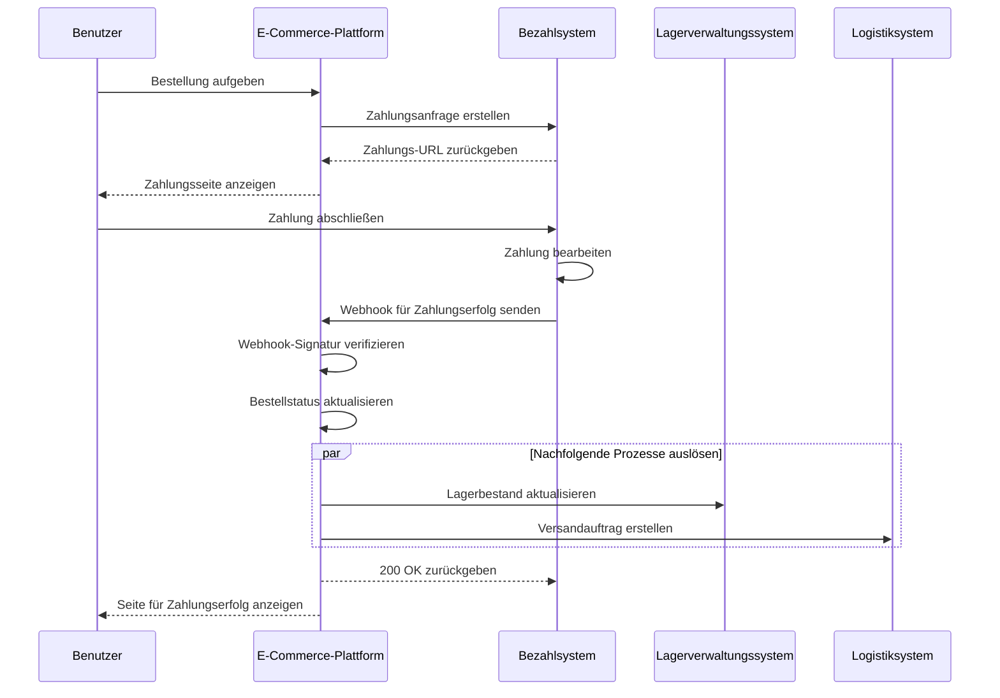

## Was ist ein Webhook?

Ein Webhook ist ein HTTP-Callback-Mechanismus, der es Anwendungen ermöglicht, Echtzeit-Benachrichtigungen an vordefinierte URLs zu senden, wenn bestimmte Ereignisse eintreten. Dieser Mechanismus ermöglicht den automatisierten Datenaustausch und die Echtzeitkommunikation zwischen Systemen.

## Wie funktionieren Webhooks?



1. Ein bestimmtes Ereignis tritt im Quellsystem auf
2. Das Quellsystem erstellt eine HTTP POST-Anfrage mit den Ereignisdaten
3. Das Quellsystem sendet die Anfrage an die vorkonfigurierte URL des Zielsystems
4. Das Zielsystem empfängt die Anfrage und verarbeitet die Daten
5. Das Zielsystem gibt eine Antwort an das Quellsystem zurück
6. Wenn die Anfrage fehlschlägt, kann das Quellsystem einen Retry-Mechanismus implementieren

## Was sind häufige Anwendungsfälle für Webhooks?

1. Bezahlsysteme: Benachrichtigung über Änderungen des Bestellstatus
2. Versionskontrollsysteme: Benachrichtigung über Code-Commits, Merge-Requests und andere Ereignisse
3. CRM-Systeme: Benachrichtigungen bei Aktualisierungen von Kundeninformationen
4. IoT-Geräte: Benachrichtigungen bei Statusänderungen des Geräts
5. Social-Media-Plattformen: Benachrichtigungen über neue Nachrichten und Kommentare

## Wie funktionieren Webhooks in einem realen Szenario?

Betrachten wir ein Szenario, bei dem eine E-Commerce-Plattform mit einem Drittanbieter-Bezahlsystem integriert ist:

### Szenario

Eine E-Commerce-Plattform nutzt ein Drittanbieter-Bezahlsystem, um Zahlungen für Bestellungen zu bearbeiten. Wenn ein Benutzer eine Zahlung abschließt, muss das Bezahlsystem die E-Commerce-Plattform in Echtzeit über den Zahlungsstatus per Webhook benachrichtigen, damit die Plattform den Bestellstatus aktualisieren und nachfolgende Prozesse auslösen kann.

### Webhook Implementierungsablauf



1. Auftragserstellung und Zahlungsanfrage:
   - Der Benutzer gibt eine Bestellung auf der E-Commerce-Plattform auf.
   - Die Plattform sendet eine Zahlungsanfrage an das Bezahlsystem.
   - Das Bezahlsystem gibt eine Zahlungs-URL zurück, die die Plattform dem Benutzer anzeigt.

2. Benutzerzahlung:
   - Der Benutzer schließt die Zahlung auf dem Bezahlsystem ab.

3. Webhook-Auslöser:
   - Das Bezahlsystem erkennt das Ereignis "Zahlung erfolgreich".
   - Es erstellt einen Webhook-Nutzlast mit den Zahlungsdetails.

4. Senden des Webhooks:
   - Das Bezahlsystem sendet eine POST-Anfrage an die vorkonfigurierte URL der E-Commerce-Plattform.

5. Verarbeitung durch den Empfänger:
   - Die E-Commerce-Plattform empfängt den Webhook und verifiziert zunächst die Anfragesignatur, um die Sicherheit zu gewährleisten.
   - Nach der Verifizierung aktualisiert die Plattform den entsprechenden Bestellstatus auf "bezahlt".
   - Die Plattform löst nachfolgende Prozesse aus, wie die Aktualisierung des Lagerbestands und das Erstellen von Versandaufträgen.

6. Antwortverarbeitung:
   - Die E-Commerce-Plattform gibt sofort eine 200 OK-Antwort zurück, sobald sie den Webhook empfängt.
   - Wenn während der Verarbeitung Fehler auftreten, wird die Plattform im Hintergrund erneut versuchen oder eine manuelle Intervention erforderlich sein.

7. Benutzererfahrung:
   - Die E-Commerce-Plattform zeigt dem Benutzer eine Seite für Zahlungserfolg an.

Dieses Beispiel zeigt, wie Webhooks die Echtzeitkommunikation zwischen einem Drittanbieter-Bezahlsystem und einer E-Commerce-Plattform ermöglichen. Über Webhooks kann das Bezahlsystem die E-Commerce-Plattform sofort benachrichtigen, wenn eine Zahlung abgeschlossen ist, was sofortige Bestellstatusaktualisierungen und schnelles Auslösen nachfolgender Geschäftsprozesse ermöglicht. Dies verbessert die Gesamtreaktionsfähigkeit und Effizienz des Systems und bietet letztendlich ein besseres Einkaufserlebnis für die Benutzer.

## Was sind Best Practices für die Implementierung von Webhooks?

Wenn du der Absender (Produzent) von Webhooks bist, berücksichtige bitte die folgenden Aspekte:

### Webhook-Design

Entwickle klare und konsistente Webhook-Strukturen:

- Definiere klare Ereignistypen: Zum Beispiel `order.created`, `user.updated`, etc.
- Verwende das standardmäßige JSON-Format: Stelle sicher, dass die Datenstruktur klar und einfach zu parsen ist.
- Versionskontrolle: Füge Versionsinformationen in den Anfrage-Headern oder im Nutzinhalt ein. Zum Beispiel:

  ```javascript
  // In Anfrage-Headern
  headers: {
    'Content-Type': 'application/json',
    'X-Webhook-Version': '1.0'
  }
  
  // Oder im Nutzinhalt
  {
    "version": "1.0",
    "event_type": "order.created",
    "data": {
      // Ereignisdetails
    }
  }
  ```

- Genügend Kontext bereitstellen: Füge Zeitstempel hinzu, wann Ereignisse auftreten, sowie eindeutige Kennungen für verwandte Ressourcen, etc.
- Konsistenz beibehalten: Verwende konsistente Namenskonventionen und Datenstrukturen für alle Ereignistypen.

### Sendemechanismus

Implementiere einen zuverlässigen Mechanismus zum Senden von Webhooks:

- Verwende asynchrone Task-Queues: Vermeide das Blockieren des Hauptprogramms und verbessere die Reaktionsfähigkeit des Systems.
- Implementiere Retry-Mechanismen: Behandle Netzwerkausfälle oder vorübergehende Nichterreichbarkeit des Empfängers.

### Retry-Strategie

Entwickle eine geeignete Retry-Strategie:

- Implementiere exponentielles Backoff: Vermeide häufige Wiederholungen, die das System und den Empfänger belasten könnten.
- Setze eine maximale Retry-Anzahl: Vermeide unendliche Wiederholungen, die Systemressourcen verbrauchen könnten.
- Biete manuelle Retry-Mechanismen: Biete eine Schnittstelle für manuelle Wiederholungen für Webhooks, die letztendlich fehlschlagen.

### Sicherheitsimplementierung

Implementiere einen Signaturmechanismus, der es Empfängern ermöglicht, die Authentizität von Anfragen zu überprüfen:

```javascript
const crypto = require('crypto');

function generateSignature(payload, secret) {
  return crypto.createHmac('sha256', secret)
    .update(JSON.stringify(payload))
    .digest('hex');
}

function sendWebhookWithSignature(url, payload, secret) {
  const signature = generateSignature(payload, secret);
  return axios.post(url, payload, {
    headers: { 'X-Webhook-Signature': signature }
  });
}
```

### Leistungsoptimierung

Optimiere die Leistung beim Senden von Webhooks:

- Verwende Verbindungspools: Reduziere den Overhead beim Herstellen von Verbindungen und verbessere die Leistung.
- Implementiere Batch-Verarbeitung: Sende Webhooks in Batches, wenn es angemessen ist, um die Anzahl der Netzwerkinteraktionen zu reduzieren.

### Dokumentation und Testwerkzeuge

Biete Unterstützung für Webhook-Benutzer:

- Detaillierte API-Dokumentation: Füge alle möglichen Ereignistypen, Anfrageformate und Feldbeschreibungen hinzu.
- Biete Testwerkzeuge an: Implementiere Webhook-Testendpunkte, um Benutzern das Simulieren des Empfangs von Webhook-Benachrichtigungen zu ermöglichen.
- Beispielcode: Biete Integrationsbeispiele in verschiedenen Programmiersprachen an.

## Was sind Best Practices für die Verwendung von Webhooks?

Wenn du Webhooks als Empfänger (Konsument) verwendest, berücksichtige bitte die folgenden Aspekte:

### Sicherheit

Da Endpunkte zum Empfang von Webhooks allgemein öffentlich zugänglich sind, ist die Sicherheit ein Hauptanliegen. Achte auf folgende Punkte:

- Authentizität der Anfrage überprüfen: Implementiere einen Signaturüberprüfungsmechanismus, um sicherzustellen, dass Anfragen von erwarteten Absendern kommen.
  
  ```javascript
  const crypto = require('crypto');

  function verifySignature(payload, signature, secret) {
    const expectedSignature = crypto
      .createHmac('sha256', secret)
      .update(JSON.stringify(payload))
      .digest('hex');
    
    return crypto.timingSafeEqual(
      Buffer.from(signature),
      Buffer.from(expectedSignature)
    );
  }
  ```

- Verwende HTTPS: Stelle sicher, dass dein Webhook-Empfangsendpunkt HTTPS verwendet, um zu verhindern, dass Daten während der Übertragung abgefangen oder manipuliert werden.
- Implementiere eine IP-Whitelist: Akzeptiere nur Webhook-Anfragen von vertrauenswürdigen IP-Adressen, um das Risiko von Angriffen zu reduzieren.

### Zuverlässigkeit

Um eine zuverlässige Verarbeitung empfangener Webhooks sicherzustellen:

- Implementiere idempotente Verarbeitung: Gestalte dein System so, dass es doppelte Webhook-Benachrichtigungen korrekt verarbeitet, da Absender fehlerhafte Anfragen möglicherweise wiederholen.
- Schnell antworten: Gib sofort eine Antwort (normalerweise einen 2xx-Statuscode) zurück, nachdem du eine Webhook-Anfrage erhalten hast, um zu verhindern, dass der Absender die Anfrage als fehlgeschlagen ansieht und einen Retry auslöst.

### Leistung

Stelle einen effizienten Systembetrieb sicher:

- Asynchrone Verarbeitung: Führe die eigentliche Datenverarbeitung im Hintergrund durch, nachdem du einen Webhook erhalten hast, ohne die Antwort zu blockieren.
- Setze Timeout-Limits: Setze angemessene Timeout-Zeiträume für die Webhook-Verarbeitung, um zu verhindern, dass lang laufende Aufgaben die Systemleistung beeinträchtigen.

### Fehlerbehandlung

Behandle mögliche Fehlersituationen angemessen:

- Logging: Führe detaillierte Aufzeichnungen über empfangene Webhook-Anfragen und Verarbeitungsverfahren, um die Untersuchung von Problemen zu erleichtern.
- Sanfte Degeneration: Implementiere angemessene Fehlerbehandlungsmechanismen, wenn du Webhooks nicht verarbeiten kannst, um sicherzustellen, dass andere Teile des Systems nicht betroffen sind.

### Versionskompatibilität

Da sich Webhook-Formate im Laufe der Zeit ändern können:

- Versionsinformationen verarbeiten: Sei darauf vorbereitet, verschiedene Versionen von Webhook-Formaten zu verarbeiten. In der Regel werden Versionsinformationen in der URL oder in den Anfrage-Headern bereitgestellt.
- Rückwärtskompatibilität: Stelle beim Aktualisieren deiner Webhook-Verarbeitungslogik sicher, dass weiterhin ältere Formatversionen unterstützt werden.

### Monitoring

Überwache kontinuierlich den Empfang und die Verarbeitung von Webhooks:

- Alerts einrichten: Implementiere Echtzeitüberwachung und Benachrichtigungen für ungewöhnliche Situationen (wie hohe Fehlerraten oder ungewöhnlichen Datenverkehr).
- Leistungsmetriken: Verfolge Leistungsmetriken zur Webhook-Verarbeitung, wie Antwortzeiten und Erfolgsraten.

<Resources
  urls={[
    "https://docs.logto.io/docs/recipes/webhooks/",
    "https://docs.logto.io/docs/recipes/webhooks/securing-your-webhooks/",
    "https://en.wikipedia.org/wiki/Webhook"
  ]}
/>