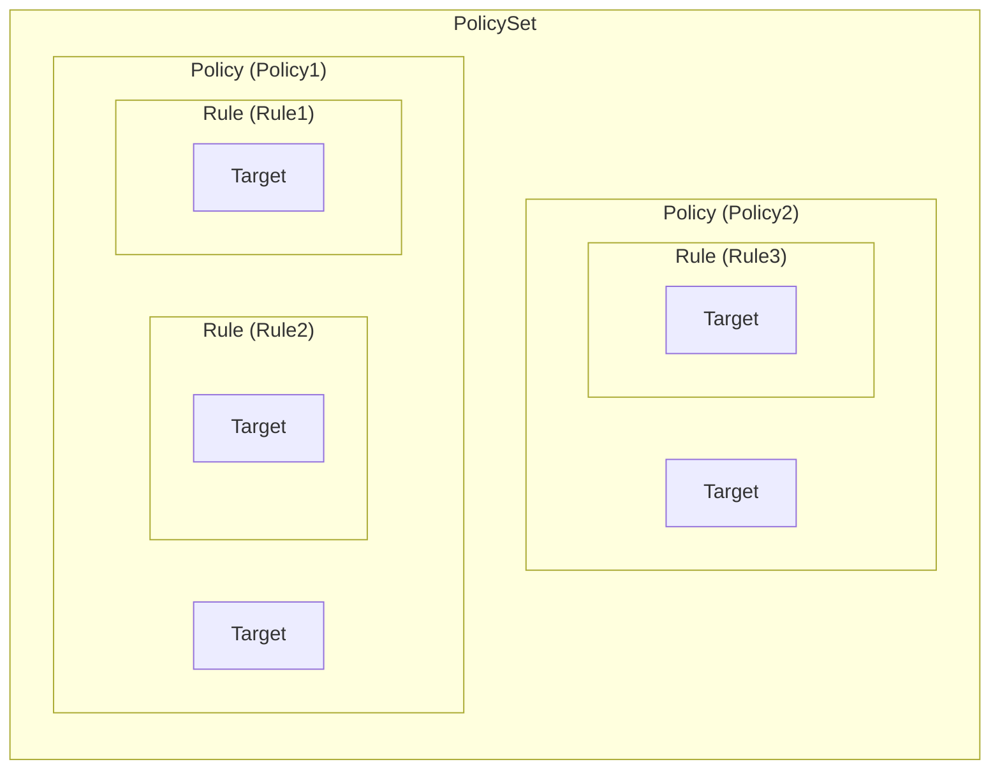
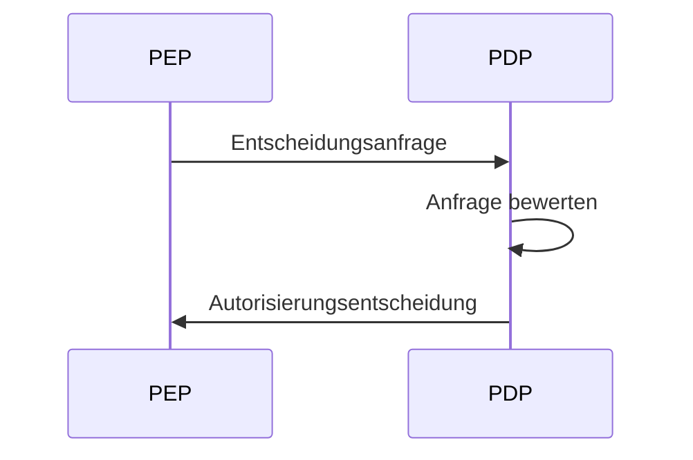
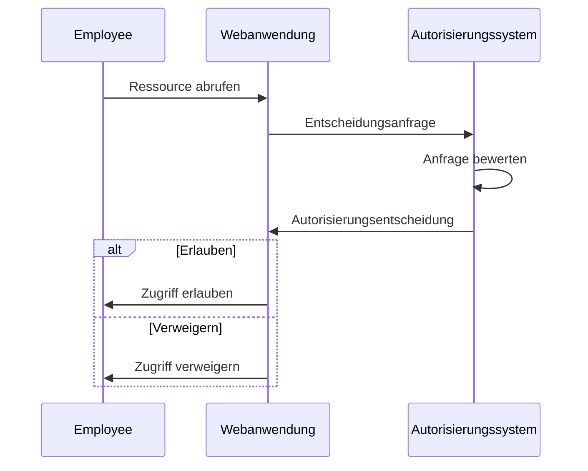
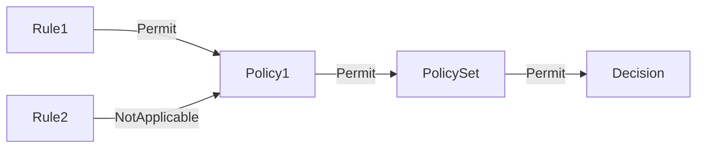
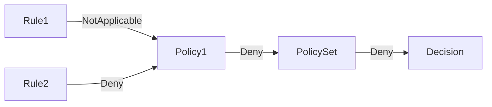

## Was ist XACML?

Wie der Name schon sagt, ist eXtensible Access Control Markup Language (XACML) eine auf XML basierende Sprache, die hauptsächlich für Access Control (Zugriffskontrolle) verwendet wird. Es ist ein Standard, definiert von der Organization for the Advancement of Structured Information Standards (OASIS).

[XACML 3.0](https://docs.oasis-open.org/xacml/3.0/xacml-3.0-core-spec-os-en.html) ist die neueste Version des Standards, die 2013 veröffentlicht wurde. Obwohl es kein bestimmtes Access Control (Zugriffskontroll)-Modell spezifiziert, wird XACML oft zur Implementierung von <Ref slug="abac" /> Richtlinien verwendet. Lassen Sie uns ein einfaches Beispiel ansehen, wie XACML verwendet werden kann, um ABAC-Richtlinien darzustellen:

```xml
<PolicySet PolicySetId="ABAC_Policies" PolicyCombiningAlgId="urn:oasis:names:tc:xacml:3.0:policy-combining-algorithm:deny-overrides">
  <Description>ABAC Policies</Description>
  <Policy PolicyId="Policy1" RuleCombiningAlgId="urn:oasis:names:tc:xacml:3.0:rule-combining-algorithm:deny-overrides">
    <Description>Employees can read data</Description>
    <Target>
      <AnyOf>
        <AllOf>
          <Match MatchId="urn:oasis:names:tc:xacml:1.0:function:string-equal">
            <AttributeValue DataType="http://www.w3.org/2001/XMLSchema#string">read</AttributeValue>
            <AttributeDesignator
              AttributeId="urn:oasis:names:tc:xacml:1.0:action:action-id"
              Category="urn:oasis:names:tc:xacml:3.0:attribute-category:action"
              DataType="http://www.w3.org/2001/XMLSchema#string"
              MustBePresent="true"
            />
          </Match>
        </AllOf>
      </AnyOf>
    </Target>
    <Rule RuleId="Rule1" Effect="Permit">
      <Target>
        <AnyOf>
          <AllOf>
            <Match MatchId="urn:oasis:names:tc:xacml:1.0:function:string-equal">
              <AttributeValue DataType="http://www.w3.org/2001/XMLSchema#string">employee</AttributeValue>
              <AttributeDesignator
                AttributeId="urn:oasis:names:tc:xacml:1.0:subject:subject-id"
                Category="urn:oasis:names:tc:xacml:1.0:subject-category:access-subject"
                DataType="http://www.w3.org/2001/XMLSchema#string"
                MustBePresent="true"
              />
            </Match>
          </AllOf>
        </AnyOf>
      </Target>
    </Rule>
    <Rule RuleId="Rule2" Effect="Deny">
      <Target>
        <AnyOf>
          <AllOf>
            <Match MatchId="urn:oasis:names:tc:xacml:1.0:function:string-equal">
              <AttributeValue DataType="http://www.w3.org/2001/XMLSchema#string">user</AttributeValue>
              <AttributeDesignator
                AttributeId="urn:oasis:names:tc:xacml:1.0:subject:subject-id"
                Category="urn:oasis:names:tc:xacml:1.0:subject-category:access-subject"
                DataType="http://www.w3.org/2001/XMLSchema#string"
                MustBePresent="true"
              />
            </Match>
          </AllOf>
        </AnyOf>
      </Target>
    </Rule>
  </Policy>
  <!-- ...andere Richtlinien... -->
</PolicySet>
```

XACML leistet gute Arbeit bei selbstbeschreibenden Benennungs-Konventionen. Die Sprache ist so konzipiert, dass sie für Menschen lesbar und leicht verständlich ist.

Kurz gesagt, diese Richtlinie besagt, dass Angestellte berechtigt sind, Daten zu lesen, und Benutzern das Lesen von Daten verweigert wird. Lassen Sie uns die Richtlinie anhand der Hauptkomponenten analysieren:

- `<PolicySet>`: Das Wurzelelement des Richtliniensatzes. Ein `PolicySet` kann mehrere `Policy` und `PolicySet`-Elemente enthalten, die eine Hierarchie von Richtlinien bilden.
- `<Policy>`: Eine Richtlinie, die eine oder mehrere Regeln enthält. Jede Richtlinie kann haben:
  - Ein `Target`-Element, das die Bedingungen angibt, unter denen die Richtlinie gilt.
  - Mehrere `Rule`-Elemente, die die Access Control (Zugriffskontroll)-Regeln definieren.
  - Ein `RuleCombiningAlgId`-Attribut, das angibt, wie die Regeln kombiniert werden, um eine Entscheidung zu treffen.
- `<Rule>`: Eine Regel, die die Bedingungen definiert, unter denen der Zugriff gewährt oder verweigert wird. Jede Regel hat:
  - Ein `Target`-Element, das die Bedingungen angibt, unter denen die Regel gilt.
  - Ein `Effect`-Attribut, das angibt, ob die Regel den Zugriff erlaubt oder verweigert.

> [!Note]
> Die verfügbaren Komponenten und Attribute in XACML sind nicht auf die erwähnten beschränkt. Schauen Sie sich die [XACML 3.0 Spezifikation](https://docs.oasis-open.org/xacml/3.0/xacml-3.0-core-spec-os-en.html) für eine vollständige Liste von Elementen und Attributen an.

Eine grafische Darstellung des Verhältnisses zwischen den verschiedenen Hauptkomponenten wird unten gezeigt:



Eine detaillierte Erklärung anderer Elemente und Attribute im Beispiel wird in den kommenden Abschnitten bereitgestellt.

## Wie XACML funktioniert

Zur Vereinfachung nehmen wir an, dass im obigen Richtliniensatz nur eine Richtlinie definiert ist. Um den Richtlinienbewertungsprozess auszulösen, muss eine **Decision Request (Entscheidungsanfrage)** von einem **Policy Enforcement Point (PEP)** an einen **Policy Decision Point (PDP)** gesendet werden. Der PDP bewertet die Anfrage anhand der Richtlinie und gibt eine **Authorization Decision (Autorisierungsentscheidung)** an den PEP zurück.



- PEP: Die Komponente, die die Entscheidungsanfrage an den PDP sendet und die Autorisierungsentscheidung durchsetzt (d.h. <Ref slug="access-control" /> durchführen).
- PDP: Die Komponente, die die Entscheidungsanfrage anhand der Richtlinie bewertet und die Autorisierungsentscheidung zurückgibt.

Lassen Sie uns ein reales Beispiel verwenden, um die Shakespeare-Sprache zu ersetzen. Angenommen, es gibt eine Webanwendung, die es Angestellten ermöglicht, auf bestimmte Ressourcen zuzugreifen, und die Anwendung ist in ein XACML basiertes Autorisierungssystem integriert.

Wenn ein Angestellter versucht, auf eine Ressource zuzugreifen, sendet die Webanwendung (**PEP**) eine **Entscheidungsanfrage** an das Autorisierungssystem (**PDP**). Sobald das Autorisierungssystem die Anfrage anhand der XACML-Richtlinie bewertet hat, gibt es eine **Autorisierungsentscheidung** an die Webanwendung zurück.



## Entscheidungsanfrage

Eine Entscheidungsanfrage in XACML besteht aus den folgenden Hauptkomponenten:

- **Subject (Subjekt)**: Das Objekt, das Zugriff auf eine Ressource anfordert. Es kann ein Benutzer, ein Gerät oder ein anderes Objekt sein.
- **Resource (Ressource)**: Die Ressource, auf die zugegriffen wird. Es kann sich um eine Datei, eine Datenbank, ein API-Endpunkt oder eine andere Ressource handeln.
- **Action (Aktion)**: Die Aktion, die an der Ressource ausgeführt wird. Es kann sich um Lesen, Schreiben, Löschen oder eine andere Aktion handeln.
- **Environment (Umgebung)**: Der Kontext, in dem die Zugriffsanfrage gestellt wird. Es kann Informationen wie Tageszeit, Ort oder andere Kontextinformationen umfassen.

Hier ist ein Beispiel für eine Entscheidungsanfrage in XACML:

```xml
<Request>
  <Attributes Category="urn:oasis:names:tc:xacml:3.0:attribute-category:resource">
    <Attribute AttributeId="urn:oasis:names:tc:xacml:1.0:resource:resource-id" DataType="http://www.w3.org/2001/XMLSchema#string">
      <AttributeValue>http://example.com/data</AttributeValue>
    </Attribute>
  </Attributes>
  <Attributes Category="urn:oasis:names:tc:xacml:3.0:attribute-category:action">
    <Attribute AttributeId="urn:oasis:names:tc:xacml:1.0:action:action-id" DataType="http://www.w3.org/2001/XMLSchema#string">
      <AttributeValue>read</AttributeValue>
    </Attribute>
  </Attributes>
  <Attributes Category="urn:oasis:names:tc:xacml:3.0:attribute-category:subject">
    <Attribute AttributeId="urn:oasis:names:tc:xacml:1.0:subject:subject-id" DataType="http://www.w3.org/2001/XMLSchema#string">
      <AttributeValue>employee</AttributeValue>
    </Attribute>
  </Attributes>
</Request>
```

## Bewertungsprozess

Sobald der PDP den Richtliniensatz abruft, bewertet er die Entscheidungsanfrage wie folgt:

1. **Target matching (Ziel-Abgleich)**: Für jede Richtlinie prüft der PDP, ob die Anfrage der Zielsetzung der Richtlinie entspricht. Wenn die Anfrage dem Ziel entspricht, fährt der PDP mit der Bewertung der Regeln fort.
2. **Rule evaluation (Regelbewertung)**: Der PDP bewertet jede Regel in der Richtlinie. Wenn ein Ziel der Regel mit der Anfrage übereinstimmt, bewertet der PDP die Bedingung der Regel. Wenn die Bedingung `wahr` ist, gibt der PDP die Wirkung der Regel (erlauben oder verweigern) zurück. Wenn die Bedingung `falsch` ist, fährt der PDP mit der Bewertung der nächsten Regel fort.
3. **Rule combining (Regel-Kombination)**: Der PDP kombiniert die Wirkungen aller Regeln in der Richtlinie anhand des `RuleCombiningAlgId`-Attributs der Richtlinie. Die kombinierte Wirkung wird dann als Entscheidung der Richtlinie zurückgegeben.
4. **Policy combining (Richtlinienkombination)**: Wenn der Richtliniensatz mehrere Richtlinien enthält, kombiniert der PDP die Entscheidungen aller Richtlinien anhand des `PolicyCombiningAlgId`-Attributs des Richtliniensatzes. Die kombinierte Entscheidung wird dann als endgültige Autorisierungsentscheidung zurückgegeben.

### Beispiel 1

Zum Beispiel im Beispielrichtliniensatz, nehmen wir an, die Entscheidungsanfrage ist wie oben. Der PDP würde die Anfrage gegen die `Policy1`-Richtlinie wie folgt bewerten:

#### Ziel-Abgleich

Das `Target` der Richtlinie gibt an, dass jedes Subjekt, das eine Aktions-ID von `read` hat, von der Richtlinie bewertet werden sollte. Da die Aktion der Anfrage `read` ist, entspricht die Anfrage dem Ziel der Richtlinie.

#### Regelbewertung

Die Richtlinie enthält zwei Regeln:

1. `Rule1`: Da die Subjekt-ID der Anfrage `employee` ist, bewertet sich die Bedingung der Regel als `wahr` und die Wirkung der Regel ist `Permit`.
2. `Rule2`: Da die Subjekt-ID der Anfrage nicht `user` ist, bewertet sich die Bedingung der Regel als `falsch` und die Wirkung der Regel ist `NotApplicable`.

#### Regel- und Richtlinienkombination

- Da `Policy1` den `deny-overrides` Regel-Kombinationsalgorithmus verwendet, ist die Entscheidungsfindung bei der Richtlinie `Permit`, weil `Rule1` den Zugriff erlaubt und seine Wirkung die `NotApplicable` Wirkung von `Rule2` überschreibt.
- Der Richtliniensatz verwendet ebenfalls den `deny-overrides` Richtlinien-Kombinationsalgorithmus, und die endgültige Entscheidung ist `Permit`, da die Entscheidungsfindung bei der Richtlinie `Permit` ist.

Hier ist eine nicht normierende grafische Darstellung des Bewertungsprozesses:



### Beispiel 2

Betrachten wir nun eine andere Entscheidungsanfrage, bei der alle anderen Attribute gleich sind, aber die Subjekt-ID `user` anstelle von `employee` ist.

#### Ziel-Abgleich

Da die Aktion unverändert ist, entspricht die Anfrage weiterhin dem Ziel der Richtlinie.

#### Regelbewertung

- `Rule1`: Die Subjekt-ID der Anfrage ist nicht `employee`, daher bewertet sich die Bedingung der Regel als `falsch` und die Wirkung der Regel ist `NotApplicable`.
- `Rule2`: Die Subjekt-ID der Anfrage ist `user`, daher bewertet sich die Bedingung der Regel als `wahr` und die Wirkung der Regel ist `Deny`.

#### Regel- und Richtlinienkombination

- Die Entscheidungsfindung bei der Richtlinie ist `Deny`, weil `Rule2` den Zugriff verweigert und seine Wirkung die `NotApplicable` Wirkung von `Rule1` überschreibt.
- Die endgültige Entscheidung ist `Deny`, da der `deny-overrides` Richtlinien-Kombinationsalgorithmus des Richtliniensatzes die restriktivste Entscheidung zurückgibt.

Hier ist eine nicht normierende grafische Darstellung des Bewertungsprozesses:



### Beispiel 3

Betrachten wir schließlich eine Entscheidungsanfrage, bei der die Aktion `write` anstelle von `read` ist. Alle anderen Attribute bleiben wie in Beispiel 1.

#### Ziel-Abgleich

Die Anfrage entspricht nicht mehr dem Ziel der Richtlinie, da die Aktion `write` und nicht `read` ist. Daher wird die Richtlinie nicht bewertet.

#### Regel- und Richtlinienkombination

Da die Richtlinie nicht bewertet wird, ist die endgültige Entscheidung `NotApplicable`.

Hier ist eine nicht normierende grafische Darstellung des Bewertungsprozesses:


## Kombinationsalgorithmen

XACML definiert mehrere Standardkombinationsalgorithmen, die bestimmen, wie die Wirkungen mehrerer Regeln oder Richtlinien kombiniert werden, um eine Entscheidung zu treffen. In den obigen Beispielen haben wir den `deny-overrides` Kombinationsalgorithmus für sowohl Regeln als auch Richtlinien erwähnt.

Wie der Name schon sagt, priorisiert der `deny-overrides` Algorithmus `Deny`-Entscheidungen über `Permit`-Entscheidungen. Hier ist eine vereinfachte Erklärung, wie der `deny-overrides` Algorithmus funktioniert:

- Wenn irgendeine Regel oder Richtlinie den Zugriff verweigert, ist die endgültige Entscheidung `Deny`; 
- wenn keine Regel oder Richtlinie den Zugriff verweigert und MINDESTENS eine Regel oder Richtlinie den Zugriff erlaubt, ist die endgültige Entscheidung `Permit`;
- wenn keine Regel oder Richtlinie den Zugriff verweigert und KEINE Regel oder Richtlinie den Zugriff erlaubt, ist die endgültige Entscheidung `NotApplicable`.

Der tatsächliche Algorithmus ist komplexer und berücksichtigt andere "unbestimmte" Entscheidungen wie `Indeterminate{D}` und `Indeterminate{P}`.

> [!Note]
> Dieser Algorithmus bietet keine "Fallback"-Entscheidung, falls keine Regel oder Richtlinie der Anfrage entspricht. In solchen Fällen ist die Entscheidung `NotApplicable`.

Für eine vollständige Liste von Kombinationsalgorithmen und deren Verhalten entnehmen Sie der [XACML 3.0 Spezifikation](https://docs.oasis-open.org/xacml/3.0/xacml-3.0-core-spec-os-en.html#_Toc325047268).

## Implementierungserwägungen

XACML ist eine leistungsstarke Sprache zur Ausdruck von Attribut-basierten Access Control (Zugriffskontroll)-Richtlinien. Bevor Sie XACML in Ihrem System implementieren, sollten Sie Folgendes berücksichtigen:

- Zugriffskontroll-Design: XACML ist flexibel und ausdrucksstark, erfordert jedoch ein sorgfältiges Design, da es komplexe Richtliniensätze beinhalten kann, die zu unbeabsichtigten Konsequenzen führen können.
- Komplexität: XACML-Richtlinien sind oft komplex und können schwierig zu verwalten sein. Für die meisten Anwendungen können einfachere Zugriffskontrollmodelle wie <Ref slug="rbac" /> geeigneter sein.
- Performance: Die Bewertung von XACML-Richtlinien kann rechnerisch aufwendig sein, insbesondere wenn es sich um große Richtliniensätze handelt. Berücksichtigen Sie die Leistungsauswirkungen der Verwendung von XACML in Ihrem System.

<SeeAlso slugs={['abac', 'rbac', 'access-control', 'authorization']} />

<Resources
  urls={[
    'https://docs.oasis-open.org/xacml/3.0/xacml-3.0-core-spec-os-en.html',
  ]}
/>