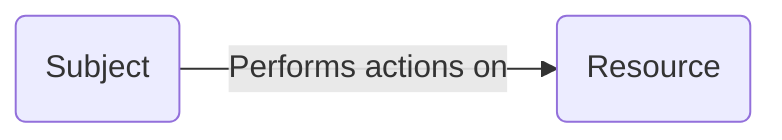
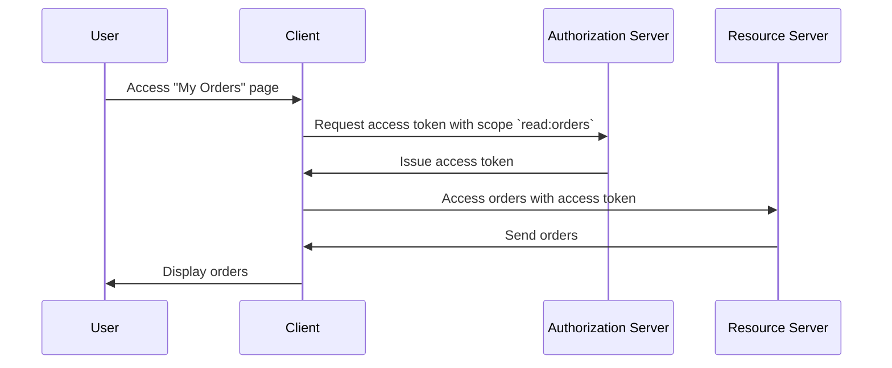

## What is access control?

Access control involves three main components:

- **Subject**: An entity that performs actions on resources. Subjects can be users, services, or devices.
- **Resource**: An entity that is protected by access control. Resources can be files, databases, APIs, or any other digital assets.
- **Action**: An operation that a subject can perform on a resource. Actions can be read, write, execute, or any other operation.

> Access control defines the selective restriction of access to **resources** based on the **subject** and **action**.

Here are some real-world examples of access control:

- A user (subject) **can** read (action) their orders (resource) in an e-commerce system.
- A user (subject) **cannot** delete (action) another user's profile (resource) in a social network.
- A service (subject) **can** write (action) data to a database (resource) in a microservices architecture.

Sometimes, resource is ignored in technical implementations and access control is defined as the restriction of who (subject) can perform what actions. For instance, the basic OAuth 2.0 framework only specifies actions by using scopes (permissions) and doesn't define resources.

The support for access control can vary depending on the <Ref slug="authorization-server" /> or the <Ref slug="identity-provider" />. Some systems may support [Resource Indicators for OAuth 2.0](https://datatracker.ietf.org/doc/html/rfc8707), an extension to OAuth 2.0 that allows clients to specify the resources they want to access.

## Access control models

Deciding restrictions across few subjects and resources is simple, but not scalable. Hence, the industry has developed many access control models to manage it effectively. In the context of <Ref slug="iam" />, the following are some common access control models:

- <Ref slug="rbac" />: A model that assigns permissions to roles, and then assigns roles to subjects. For example, an admin role might have access to all resources, while a user role might have access to limited resources.
- <Ref slug="abac" />: A model that uses attributes (properties) of the subject, resource, and environment to make access control decisions. For example, a user with the attribute "department=engineering" might have access to engineering resources.

There are also other access control models such as [policy-based access control (PBAC)](https://csrc.nist.gov/glossary/term/policy_based_access_control). Each model has its own strengths and weaknesses, and the choice of model depends on your use case and requirements.

## Access control in OAuth 2.0

In the context of OAuth 2.0, access control is typically implemented using <Ref slug="scope">scopes</Ref>. Usually, the value of a scope is a string that combines the resource and the action. For example, `read:orders` or `write:profile`.

> [!Note]
> The term "scopes" are interchangeable with "permissions" in most cases.

It is worth noting that OAuth 2.0 does not define the structure and meaning of scopes. The interpretation of scopes is left to the <Ref slug="resource-server" />, and the issurance of scopes is left to the <Ref slug="authorization-server" />.

For example, a user (subject) needs to access their orders (resource) in an e-commerce system. By leveraging OAuth 2.0, you may define a scope `read:orders` and a web application (client) will request this scope from the authorization server. Here's a simplified flow:

In this flow, depending on the techn architecture, the resource server can be an API service or it can be the client (web application) itself as long as it has the capability to access the resource (orders).

### The resource indicator parameter

Although people often define scopes with resource and action (e.g., `read:orders`, while `orders` is the resource and `read` is the action), the scalability of this approach is limited when the number of resources and actions grows. RFC 8707 introduces the `resource` parameter (i.e. <Ref slug="resource-indicator">resource indicators</Ref>) to OAuth 2.0, which allows clients to specify the resources they want to access.

The RFC specifies that the `resource` parameter should be a URI representing the resource. For instance, instead of simply using `orders`, you could use `https://api.example.com/orders`. This method helps prevent naming conflicts and enhances the precision of resource matching by allowing the use of the actual resource URL.

### Authorization server support

OAuth 2.0 does not define how the authorization server should conduct access control. It leaves the implementation details at the discretion of the authorization server. Thus, the choose of authorization server can greatly affect the access control mechanism. For example, some authorization servers may support resource indicators, while others may not. It is important to decide which access control model to use based on your business requirements, then choose an authorization server that supports that model. If you are not sure about the access control model, <Ref slug="rbac" /> is good enough for most cases.

<SeeAlso slugs={["rbac", "abac", "resource-indicator", "authorization"]} />

<Resources
  urls={[
    "https://blog.logto.io/mastering-rbac",
    "https://blog.logto.io/rbac-and-abac",
    "https://datatracker.ietf.org/doc/html/rfc8707",
    "https://blog.logto.io/organization-and-role-based-access-control",
  ]}
/>
