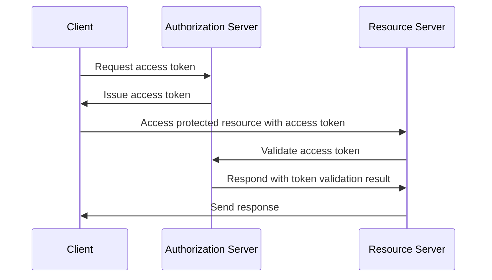
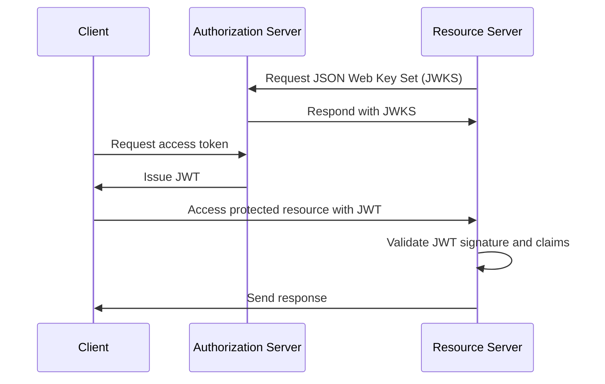
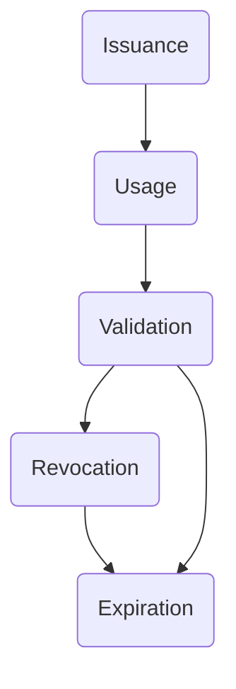

## What is an access token?

An access token is a credential, typically a string of characters, that is used to access protected resources. In the context of OAuth 2.0 and OpenID Connect (OIDC), <Ref slug="authorization-server">authorization servers</Ref> may issue access tokens to clients (applications) after successful authentication and authorization.

Although the RFCs for OAuth 2.0 and OIDC don't specify the implementation details of access tokens, there are two common types of access tokens used in practice:

- <Ref slug="opaque-token" />: A random string that has no meaning ("opaque") to the client. The client presents the token to the resource server, which validates the token with the authorization server.
- <Ref slug="jwt" />: A self-contained token that contains <Ref slug="claim">claims</Ref> (e.g., user ID, expiration time) with a digital signature. The resource server can validate the token without making an additional request to the authorization server.

## How does an access token work?

According to the type of access token, the flow of using an access token can vary.

Here's a simplified example of using an opaque access token:

Here's a simplified example of using a JWT:

The difference between the two types of access tokens is how the resource server validates the token:

- The resource server must make an additional request to the authorization server to validate an opaque token each time it receives a token.
- The resource server can validate a JWT without making an additional request to the authorization server because the token contains all the necessary information and the resource server can cache the public key from the authorization server's JSON Web Key Set (JWKS).

Access tokens are typically short-lived and have an expiration time (e.g., 1 hour). Clients must request a new access token when the current token expires.

## Which token type should I use?

The choice between an opaque token and a JWT depends on the use case and the security requirements of the application. Here's a comparison of the two token types:

|                | Opaque Token                   | JWT                                                           |
|----------------|--------------------------------|---------------------------------------------------------------|
| Format         | Random string                  | Self-contained JSON objects                                   |
| Performance    | Requires an additional request | Faster validation                                             |
| Self-contained | No                             | Yes                                                           |
| Token size     | Smaller                        | Larger                                                        |
| Revocation     | Instant                        | Requires token expiration or authorization server interaction |
| Extensibility  | Limited                        | Custom claims                                                 |
| Stateless      | No                             | Yes                                                           |
| Security       | Requires token validation      | Requires signature validation                                 |
| Standard       | No                             | Yes (RFC 7519)                                                |

For more information choosing between the two token types, see [Opaque token vs JWT](https://blog.logto.io/opaque-token-vs-jwt).

## The roles of the authorization server and the resource server

In most cases, the <Ref slug="authorization-server" /> has the following responsibilities:

- Issues access tokens to clients after successful authentication and authorization. The authorization server may downscope (reduce the scopes to a subset) or reject the token request based on the access control policies (e.g., user consent, <Ref slug="rbac" />, <Ref slug="abac" />).
- Checks if the access token was issued by the authorization server and is not expired or revoked (<Ref slug="token-introspection" />).
- Provides the information about the token (e.g., scopes, expiration time) via token introspection or <Ref slug="userinfo-endpoint" />.

You may notice that the authorization server does not interpret the meaning of the access token. For example, the access token may contain a scope `read:orders`, but the authorization server does not know what the scope means. The resource server is responsible for interpreting the access token and enforcing the <Ref slug="access-control" /> based on the token's scopes. That is to say, the <Ref slug="resource-server" /> usually has the following responsibilities:

- Validates the <Ref slug="claim">cliams</Ref> in the access token (e.g., expiration time, resource indicator, scopes).
- Enforces the access control based on the token's claims (usually scopes).
- Provides the protected resources if the access token is valid.

## Access token lifecycle

The lifecycle of an access token typically involves the following stages:

<SeeAlso slugs={['opaque-token', 'jwt', 'token-introspection', 'userinfo-endpoint', 'access-control']} />

<Resources
  urls={[
    "https://blog.logto.io/opaque-token-vs-jwt",
    "https://blog.logto.io/oauth2-token-introspection",
    "https://blog.logto.io/understanding-tokens-in-oidc",
    {
      url: "https://datatracker.ietf.org/doc/html/rfc6749#section-1.4",
      result: {
        ogTitle: "OAuth 2.0 Access Token",
      },
    },
    "https://datatracker.ietf.org/doc/html/rfc7662",
  ]}
/>
