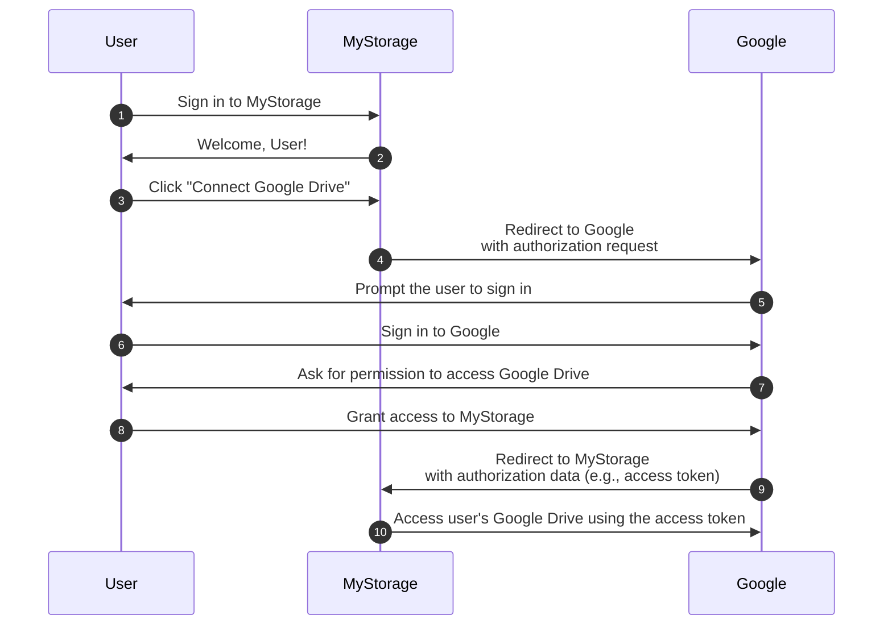

## Auth

This page is a disambiguation for the term "auth". It is often used as an abbreviation for:

- <Ref slug="authentication" />: The process of verifying the identity ownership (e.g., user or service). It answers the question "Which identity do you own?"
- <Ref slug="authorization" />: The process of determining what actions an identity can perform on a resource. It answers the question "What can you do?"

> [!Note]
> Sometimes, authentication and authorization are referred to as "AuthN" and "AuthZ", respectively.

These two concepts are both essential in the <Ref slug="iam" /> realm, but they are fundamentally different. Let's see an example: An web application MyStorage have the capability to upload files and connect to Google Drive. A typical user flow would be:

In this flow, the user performs two authentication steps: one with MyStorage (step 1) and another with Google (step 6); and one authorization step: granting access to Google Drive (step 8).

## Which one do you mean?

When you see the term "auth", it's important to clarify whether it's referring to authentication or authorization; otherwise, you might expect both processes to be covered (just like this website does).

<SeeAlso slugs={["authentication", "authorization", "iam", "oauth-2.0", "openid-connect"]} />
