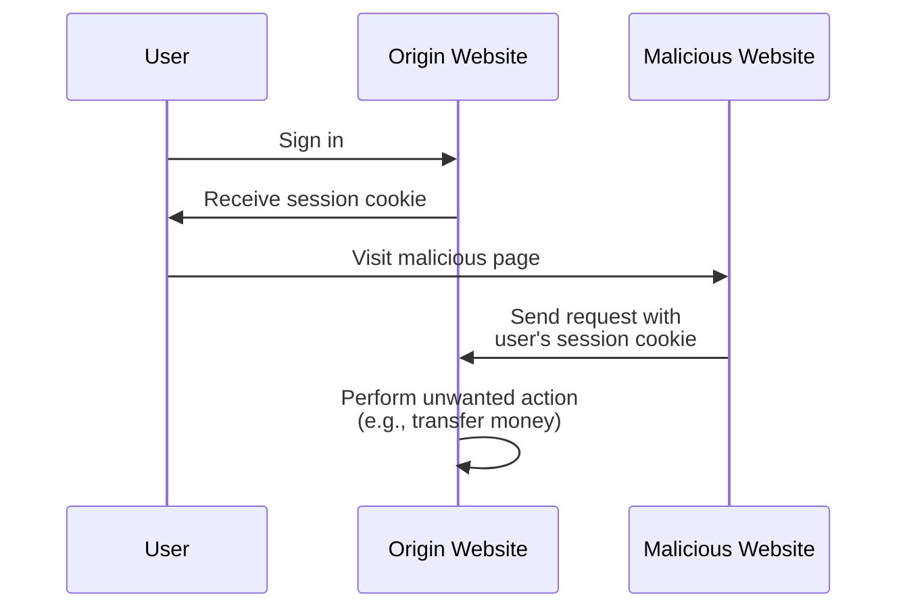

## What is cross-site request forgery (CSRF)?

When developing web applications, CSRF is an often-heard term that brings fear to developers and security professionals. It is a type of attack that deceives (or tricks) authenticated users into executing unwanted actions on a web application without consent.

CSRF is also known as a "one-click attack" or "session riding" because it relies on the user's active session to perform malicious actions.

## How does CSRF work?

The CSRF attack works by exploiting the trust that a web application has in the user's browser. Here's how it typically happens:



You may have some questions about this sequence. Let's explore the reasons behind.

### Why can the malicious website send a request to the origin website?

The Same-Origin Policy (SOP) is a security feature in web browsers that restricts how a document or script loaded from one origin can interact with a resource (e.g., cookies, DOM) from another origin. However, the SOP does not prevent the browser from sending requests to another origin.

Thus, although the malicious website cannot directly read or modify the session cookie, it can still send requests to the origin website using the user's active session.

You may argue that most web applications also use [CORS](https://developer.mozilla.org/en-US/docs/Web/HTTP/CORS) to prevent unauthorized cross-origin requests, but CSRF still has a way to bypass it:

1. Get-based attacks: The malicious website can trick the user into visiting a URL that performs an action on the origin website:

    - A redirect to `https://example.com/transfer?amount=1000&to=attacker`.
    - An image tag that loads `https://example.com/transfer?amount=1000&to=attacker`.

    That's an important reason why GET requests should not have side effects.

2. Form-based attacks: The malicious website can create a hidden form that submits data to the origin website. For example, a POST request to `https://example.com/transfer` with hidden form fields.

### Why does the malicious website have the user's session cookie?

The user's browser automatically sends cookies to the origin website when making requests. This is how the origin website knows that the user is authenticated and can perform actions on their behalf.

In fact, the malicious website doesn't "have" the session cookie; it just exploits the browser's behavior to send the cookie along with the request.

## How to prevent CSRF attacks?

Preventing CSRF attacks requires a multi-layered approach that involves both the server and the client. Here are some common techniques to mitigate CSRF vulnerabilities:

### Use anti-CSRF tokens

Anti-CSRF tokens are random values that are generated by the server and embedded in the web application's forms. When the form is submitted, the server validates the token to ensure that the request is legitimate.

For instance, a hidden input field in an HTML form:

```html
<form action="/transfer" method="post">
  <input type="hidden" name="csrf_token" value="random_token_here" />
  <!-- Other form fields -->
  <button type="submit">Transfer</button>
</form>
```

With this approach, the malicious website cannot forge a request because it doesn't know the anti-CSRF token. The `state` parameter in <Ref slug="redirect-uri" /> is a similar concept.

### Use SameSite cookies

The `SameSite` attribute in cookies can prevent CSRF attacks by restricting when cookies are sent to the server:

| `SameSite` value | Description                                                                          |
|------------------|--------------------------------------------------------------------------------------|
| `Strict`         | Cookies are only sent in a first-party context.                                      |
| `Lax`            | Cookies are sent in a first-party context and with GET requests from external sites. |
| `None`           | Cookies are sent in all contexts. Requires `Secure` attribute.                       |

By setting the `SameSite` attribute to `Strict` or `Lax` with no side effects in your GET requests, you can prevent CSRF attacks.

In addition, the `Secure` attribute should be always set to ensure that the cookie is only sent over HTTPS connections.

### Check the headers

1. **Origin header**: The `Origin` header is sent by the browser to indicate the origin of the request. The server can check this header to ensure that the request is coming from an expected origin.
2. **Referer header**: The `Referer` header contains the URL of the previous page. Although it can be spoofed, it can still be used as an additional layer of protection.

<SeeAlso slugs={["authorization-code-flow", "redirect-uri"]} />

<Resources
  urls={[
    'https://blog.logto.io/csrf',
    "https://cheatsheetseries.owasp.org/cheatsheets/Cross-Site_Request_Forgery_Prevention_Cheat_Sheet.html",
  ]}
/>
