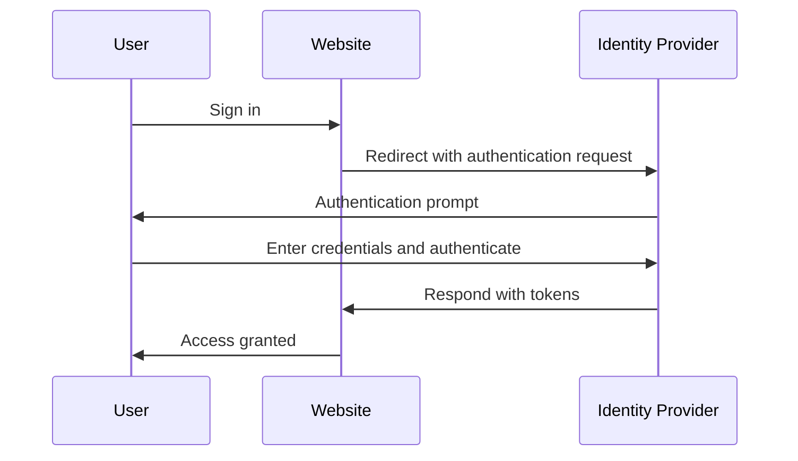

## What is identity and access management (IAM)?

As the definition suggests, identity and access management (IAM) is a broad concept that involves many aspects of managing digital identities and conducting <Ref slug="access-control" />. Let's first break down the terms:

- **Identity**: A digital representation of a user, service, or device. An identity can include attributes such as identifiers, roles, and permissions.
- **Access**: The ability to interact with resources, perform actions, or use services. To summarize, access is about what actions to perform on certain resources.

### Identity management

Identity management is the process of managing, authenticating, and securing digital identities. It involves the following key activities:

- **Identity registration**: Creating new identities for users, services, or devices.
- **Identity authentication**: Verifying the ownership of an identity through various mechanisms such as passwords, biometrics, or multi-factor authentication.
- **Identity security**: Protecting identities from unauthorized access, misuse, or disclosure.

Each topic is vast and can be further divided into subtopics such as password management, identity federation, and identity lifecycle management.

### Access management

Access management (or <Ref slug="access-control" />) is the process of controlling who can perform what actions on certain resources. It involves the following key activities:

- **Access control policies**: Defining rules and policies that dictate who can access which resources and what actions they can perform.
- **Access enforcement**: Enforcing access control policies through mechanisms such as authentication, authorization, and auditing.
- **Access governance**: Monitoring and managing access rights to ensure compliance with regulations and security best practices.

Each activity plays an important role in modern applications and systems to ensure that only authorized identities (users, services, or devices) can access resources based on the defined policies.

## What are the components of IAM?

In application, IAM is implemented using a combination of software, services, and best practices. Two important components of IAM are:

- **<Ref slug="identity-provider" />**: A service that manages user identities and authentication.
- **<Ref slug="service-provider" />**: A service that relies on an identity provider for authentication and authorization. In most cases, it is the application or service you are developing.

A clear separation between the identity provider and service provider will help to decouple IAM from the application logic, making it easier to manage and scale.

## Identity and access management in practice

Let's see an exmaple of how IAM works: when you sign in to a website, the process of verifying who you are and granting you access to the website can be considered as an identity and access management process.

Usually, the IAM process involves two main steps: authentication and authorization:

- <Ref slug="authentication" /> answers the question “Which identity do you own?”
- <Ref slug="authorization" /> answers the question “What can you do?”

> Sometimes, authentication will be interpreted as "Who are you?" However, when discussing digital identities, it is more accurate to demonstrate authentication by "proving ownership of identity".

Moreover, the concept of identity and access management is even large enough to give rise to new concepts, such as WIAM (Workforce IAM) and CIAM (Customer IAM).

While WIAM and CIAM share the same foundation, they have distinct use cases: WIAM is typically used for internal users, while CIAM is used for external customers. Some examples:

- **WIAM**: Your company has a unified identity system for employees, thus every one can use the same account to access company resources, such as software subscriptions, cloud computing services, etc.
- **CIAM**: Your online bookstore requires a user identity system for customers and sellers. The sign-in experience is a critical part of onboarding, as it is located at the top of the conversion funnel.

To learn more about the concept of CIAM and related topics, you can refer to [CIAM 101: Authentication, Identity, SSO](https://blog.logto.io/ciam-101-intro-authn-sso).

### Authentication

Here are some common authentication methods that are used in IAM:

- **Password-based authentication**: The most common method, where users provide a username and password to prove their identity.
- **<Ref slug="passwordless" /> authentication**: A method that allows users to sign in without a password, such as using a one-time code sent to their email or phone. Note that passwordless authentication may also refer to other methods, such as biometric authentication.
- **Social login**: A method that allows users to sign in using their social media accounts, such as Google, Facebook, or Twitter.
- **<Ref slug="passkey" /> (WebAuthn)**: A method that allows users to sign in using a security key, such as a USB key or a smartphone that supports WebAuthn.
- **Biometric authentication**: A method that uses physical characteristics, such as fingerprints, facial recognition, or voice recognition, to verify a user's identity.
- **<Ref slug="machine-to-machine" /> authentication**: A method that allows services or devices to authenticate each other without human intervention, such as using API keys or certificates.

For an additional layer of security, <Ref slug="mfa" /> can be used in combination with these authentication methods. MFA requires users to provide two or more factors to prove their identity, such as something they know (password), something they have (security key or <Ref slug="totp" />), or something they are (biometric data).

### Authorization

With authentication in place, authorization determines what actions an identity can perform. Authorization can be based on various factors, such as the identity's role, group membership, permissions, attributes, policies, etc. There are several common authorization models:

- **<Ref slug="rbac" />**: A model that assigns permissions to roles, and then assigns roles to identities. For example, an employee role might have access to certain resources, while an admin role might have access to all resources.
- **<Ref slug="abac" />**: A model that uses attributes (properties) of the identity, resource, and environment to make access control decisions. For example, an identity with the attribute "department=engineering" might have access to engineering resources.
- **Policy-based access control (PBAC)**: A model that uses policies to define access control rules. Policies can be based on various factors, such as time of day, location, device type, etc.
- **Fine-grained access control**: A model that provides more granular control over access, allowing permissions to be set at the level of individual resources or actions.

## What are the widely used open standards for IAM?

There are several open standards and protocols that are widely used in IAM:

- **<Ref slug="oauth-2.0" />**: A protocol that allows applications to access resources on behalf of a user without sharing the user's credentials. OAuth 2.0 is commonly used for authorization, such as allowing a third-party application to access a user's Google Drive files.
- **<Ref slug="openid-connect" />**: An identity layer built on top of OAuth 2.0 that allows applications to verify the identity of a user and obtain basic profile information about the user. Single sign-on (SSO) is a common use case for OpenID Connect. Combining OAuth 2.0 and OpenID Connect is a common practice for modern IAM.
- **<Ref slug="saml" />**: An XML-based standard for exchanging authentication and authorization data between identity providers and service providers. SAML is commonly used for SSO in enterprise environments.
- **SCIM (System for Cross-domain Identity Management)**: A standard for automating the exchange of user identity information between identity providers and service providers. SCIM is commonly used for user provisioning and deprovisioning in cloud-based applications.

## What are the key design considerations for IAM?

When designing an IAM system, there are several key considerations to keep in mind:

- **Security**: Security is paramount in IAM. Ensure that authentication methods are following best practices, such as using strong password hashing, enforcing MFA, and protecting against common attacks like phishing and brute force.
- **Privacy**: Respect user privacy by collecting only the necessary information and obtaining user consent when needed.
- **Scalability**: Make the IAM system scalable to handle a large number of users and applications. Consider using cloud-based identity providers for scalability.
- **Interoperability**: A benefit of using open standards is that it allows for interoperability between different systems. For example, most popular identity providers like Google, Facebook, and Microsoft support OAuth 2.0 and OpenID Connect.
- **User experience**: The user experience for authentication and authorization greatly impacts user conversion and retention. Balance security with ease of use is an art in IAM.

<SeeAlso slugs={['openid-connect', 'oauth-2.0', 'single-sign-on', 'enterprise-sso']} />

<Resources
  urls={[
    "https://blog.logto.io/ciam-101-intro-authn-sso",
    "https://blog.logto.io/ciam-102-authz-and-rbac"
  ]}
/>
