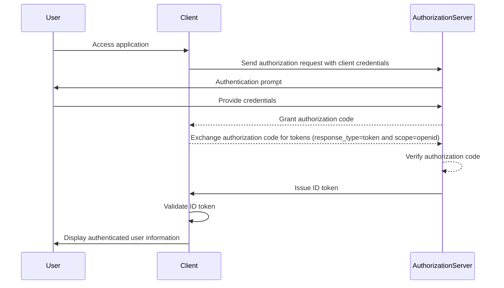

## What is ID token?

An ID token is a specific type of security token that contains information about the authenticated user, delivered to the client application after a successful <Ref slug="authentication" />. ID token is the key feature that distinguishes <Ref slug="openid-connect" /> from <Ref slug="oauth-2.0" />. While OAuth 2.0 focuses solely on authorization, OIDC builds on top of it to add user authentication by introducing the ID token.

In the OIDC authentication process, a client application (relying party) initiates authentication by redirecting the user to an authorization server. After successful authentication, the server responds with an ID token, among other tokens like the <Ref slug="access-token" />. The ID token is typically encoded as a <Ref slug="jwt" /> and includes key claims such as the user’s identifier (sub), the issuer (iss), audience (aud) and other user specific information.

The primary function of the ID token is to verify the user's identity and transmit this information to the client application. This enables the application to authenticate the user without directly handling credentials. As the client only received the ID token after the user has been authenticated by the authorization server, the ID token can be used as a secure way to verify the user's identity.

## How does ID token work?

The client application initiates the authentication process by redirecting the user to the authorization server. The user authenticates with the server, which then issues an ID token along with other tokens like the access token. The ID token is returned to the client application, which can then use it to verify the user's identity.

Since OIDC is a popular and standardized protocol, many libraries and frameworks provide built-in support for handling ID tokens. This makes ID tokens easy to integrate into client applications, and widely used in <Ref slug="single-sign-on" /> and federated identity scenarios.

## Claims in an ID token

An ID token is a JWT that contains a set of <Ref slug="claim" /> about the authenticated user. These claims include both standard JWT claims that are defined in the [JWT specification](https://datatracker.ietf.org/doc/html/rfc7519#section-4), as well as OIDC specific claims that are used to convey user identity information.

JWT standard token claims:

- **iss (Issuer)**: REQUIRED. The issuer claim identifies the issuer of the ID token. This is typically the URL of the authorization server that issued the token.
- **sub (Subject)**: REQUIRED. The subject claim identifies the user that the ID token is about. This is typically a unique identifier for the user.
- **aud (Audience)**: REQUIRED. The audience claim identifies the <Ref slug="audience" /> for the ID token. This is typically the client application that requested the token.
- **exp (Expiration time)**: REQUIRED. The expiration time claim identifies the time at which the token expires. After this time, the token should not be accepted for processing.
- **iat (Issued at)**: REQUIRED. The issued at claim identifies the time at which the token was issued.
- **auth_time (Authentication time)**: OPTIONAL. The authentication time claim identifies the time when the user was authenticated. This claim is only present if the user was authenticated during the current session.
- **nonce**: OPTIONAL. The nonce claim is used to associate a client session with an ID token. It is typically used to prevent replay attacks.

OIDC standard user information claims:

- **name**: The user's full name.
- **given_name**: The user's given name.
- **family_name**: The user's family name.
- **middle_name**: The user's middle name.
- **nickname**: The user's nickname or other short name.
- **preferred_username**: The user's preferred username.
- **profile**: A URL that points to the user's profile page.
- **picture**: A URL that points to the user's profile picture.
- **website**: A URL that points to the user's website.
- **email**: The user's email address.
- **email_verified**: A boolean value indicating whether the user's email address has been verified
- **gender**: The gender of the user.
- **birthdate**: The user's date of birth. Represented as a string in the format YYYY-MM-DD.
- **zoneinfo**: The user's time zone. String from the [IANA Time Zone Database](https://www.iana.org/time-zones).
- **locale**: The user's locale. Represents the user's preferred language and region for formatting dates, times, and numbers.
- **phone_number**: The user's phone number.
- **phone_number_verified**: A boolean value indicating whether the user's phone number has been verified.
- **address**: The user's postal address. The value is a JSON object that contains the user's address information.
- **updated_at**: The time when the user's information was last updated.

These claims provide a standardized way to convey user identity information in the ID token. While the specification only defines a set of standard claims, custom claims can also be included in the ID token to convey additional user-specific information as needed.

## ID token validation

When the client application receives an ID token, it must validate the token to ensure its authenticity and integrity. The validation process typically involves the following steps:

1. **Verify the signature**: The client must verify the signature of the ID token using the public key of the authorization server. This ensures that the token has not been tampered with and was issued by the expected party.
2. **Check the issuer**: The client should verify that the `iss` claim in the ID token matches the URL of the authorization server that issued the token. This helps prevent token substitution attacks.
3. **Check the audience**: The client should verify that the `aud` claim in the ID token matches the client application's `client_id`. This ensures that the token was issued for the client application.
4. **Check the expiration time**: The client should verify that the `exp` claim in the ID token has not passed. If the token has expired, it should not be accepted. Implementations may provide a leeway to account for clock skew.
5. **Check the nonce**: If the client included a `nonce` parameter in the authentication request, it should verify that the `nonce` claim in the ID token matches the value of the `nonce` parameter. This helps prevent replay attacks.

## ID token vs access token

While both ID tokens and access tokens are widely used in OIDC, they serve different purposes and have distinct characteristics:

|              | ID token                                                                               | Access token                                                                                                                 |
| ------------ | -------------------------------------------------------------------------------------- | ---------------------------------------------------------------------------------------------------------------------------- |
| **Purpose**  | Verifies the user's identity and transmits user information to the client application. | Provides access to protected resources on behalf of the user.                                                                |
| **Format**   | Typically a JWT that contains user identity claims.                                    | Can either be a JWT or an <Ref slug="opaque-token" />.                                                                       |
| **Audience** | Intended for the client application that requested the token.                          | Intended for the resource server that hosts the protected resources.                                                         |
| **Lifetime** | Short-lived token that is typically valid for a few minutes. One-time use only.        | Longer-lived token that is valid for a longer period (e.g., hours). Can be reused multiple times within its validity period. |
| **Contents** | Contains user identity information such as name, email, and other user-specific data.  | Contains information about the user's permissions (scopes) to specific resources.                                            |

## Best practices for using ID tokens

When working with ID tokens in OIDC, it is important to follow best practices to ensure the security and integrity of the authentication process. Some key best practices include:

1. **Validate ID tokens**: Always validate the ID token received from the authorization server to ensure its authenticity and integrity. This helps prevent token substitution attacks and unauthorized access.
2. **Use secure channels**: Ensure that ID tokens are transmitted over secure channels (e.g., HTTPS) to prevent interception and tampering.
3. **Protect sensitive information**: Since JWTs are typically encoded but not encrypted, which makes the content transparent. Avoid including sensitive information in the ID token payload to prevent exposure of sensitive data in case of token leakage.
4. **Not for authorization**: ID tokens are meant for user authentication and should not be used for authorization purposes. Use access tokens for authorization to access protected resources.
5. **Single-use**: ID tokens are generally intended for one-time use. Once a client application has validated an ID token, it should not be reused for subsequent requests or session state preservation. To maintain user session state, client applications should employ mechanisms like <Ref slug="refresh-token" /> and token exchange requests. (Refresh tokens are long-lived opaque tokens that can be used to obtain new access tokens and ID tokens when they expire.)

<SeeAlso slugs={["openid-connect", "jwt", "signing-key", "access-token"]} />
