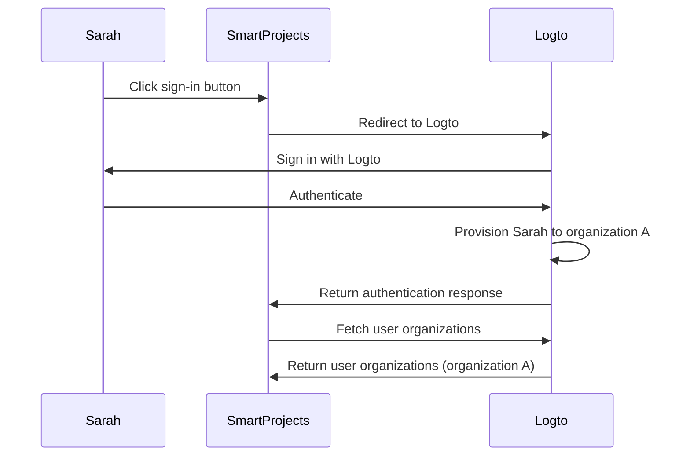
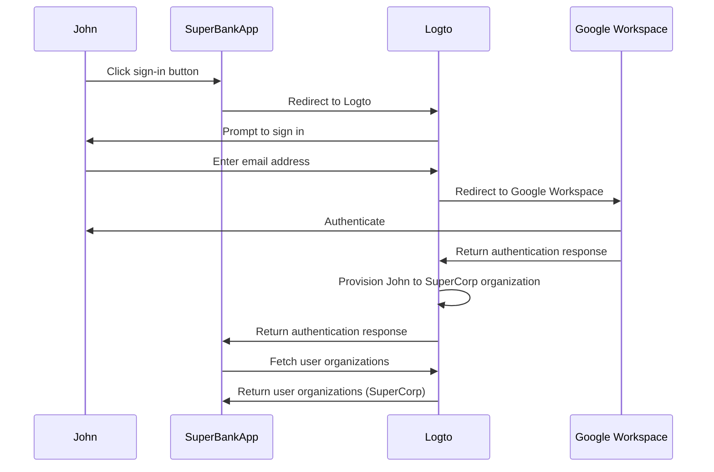

## What is just-in-time provisioning?

Just-in-time (JIT) provisioning is a process used in <Ref slug="iam" /> where user accounts are provisioned according to the user’s identity and the system’s configuration on-the-fly when the user first attempts to sign in.

## What are the use cases for just-in-time provisioning?

These cases are common when building a B2B app that involves multi-tenant architecture, Enterprise SSO, or requiring team onboarding features. Here are some sample scenarios you or your client may encounter.

### Employee onboarding

Imagine one of your clients *SuperFantasy* is experiencing frequent hiring or rapid growth can use JIT provisioning to quickly set up user accounts for new employees. *SuperFantasy* uses Logto for identity and access management and SmartProjects for project management. When a new employee, Sarah, signs in to SmartProjects for the first time, her account is automatically created and configured based on her Logto credentials.

According to the diagram above, when Sarah signs in to SmartProjects for the first time, her account is automatically provisioned to organization A in Logto. This process ensures that Sarah has the necessary access to SmartProjects without requiring manual intervention from the IT team.

### Enterprise customer onboarding

Imagine another client *SuperBank* is a financial institution that provides online banking services to its customers. *SuperBank* uses Logto for identity and access management and SuperBankApp for online banking. *SuperBank* has recently signed a contract with a new enterprise customer, *SuperCorp*, to provide online banking services to its employees.

*SuperCorp* uses Google Workspace for its employee accounts. SuperBankApp needs to ensure that when an employee from *SuperCorp* signs in for the first time, their account is automatically added to the *SuperCorp* organization in Logto.

In the diagram above, when John signs in to SuperBankApp for the first time, his account is automatically provisioned to the SuperCorp organization in Logto according to his Google Workspace identity.

## Is it specific to SAML and Enterprise SSO?

Just-in-time (JIT) provisioning is often associated with <Ref slug="enterprise-sso" /> in SAML authentication, but it is not exclusive to <Ref slug="saml" />. JIT provisioning can also be used with other authentication protocols like <Ref slug="oauth-2.0" /> and <Ref slug="openid-connect" />, and it doesn’t always require an <Ref slug="enterprise-sso" /> set-up.

For instance, email-based JIT provisioning can be used when your <Ref slug="identity-provider" /> supports this feature. In this case, the user’s email address is the only required attribute for provisioning, regardless of the authentication protocol or SSO configuration.

## Does it apply to new or existing users of the app?

Just-in-time (JIT) provisioning generally refers to the first attempt to access an app. However, different products perceive this functionality differently. Some use JIT provisioning just for identity and account creation, while others also include just-in-time account updates, such as re-provisioning and attribute synchronization.

For example, SAML JIT Provisioning allows granting and revoking group memberships as part of provisioning. It can also update provisioned users to keep their attributes in the <Ref slug="service-provider" /> store in sync with the <Ref slug="identity-provider" /> user store attributes.

If you do want to consider the subsequent existing user sign-in scenario, make sure you have a robust provisioning system along with your JIT system. For example:

- **Conflict resolution**: Your system should have a strategy for handling conflicts if an account already exists with different information than what’s provided by the IdP during the JIT process. This may require detailed control of your organization’s policies and IdP configuration.
- **Audit trails**: It's important to maintain logs of both new account creations and updates to existing accounts through JIT processes for security and compliance reasons.
- **Performance**: While JIT provisioning happens quickly, consider the potential impact on sign-in times, especially for existing users if you're updating their information at each sign-in.
- **Data consistency**: Ensure that your JIT provisioning process maintains data consistency, especially when updating existing user accounts.

## What is the difference between JIT and System for Cross-domain Identity Management (SCIM)?

SCIM is an open standard protocol designed to simplify and automate user identity management across different systems and domains. It is commonly used in directory sync scenarios.

The main difference between JIT and SCIM is that JIT often refers to the first attempt to access an app (or new user onboarding), and it is a broad term that describes the process of dynamically provisioning user accounts; while SCIM is a specific protocol for managing user lifecycle across systems and it is not limited to the first sign-in.

Furthermore, JIT lacks a standardized implementation across systems, whereas SCIM is a standardized protocol defined [RFC 7644](https://datatracker.ietf.org/doc/html/rfc7644) for identity management.

Some larger organizations use SCIM for account provisioning, integrating it with their own systems. This can be very complex and vary case by case. For most use cases, JIT provisioning is a simpler and more straightforward approach.

<Resources urls={['https://blog.logto.io/jit-provisioning', 'https://datatracker.ietf.org/doc/html/rfc7644']} />
