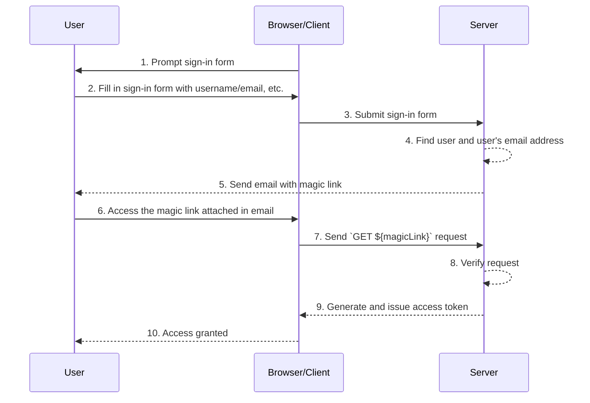

## What are magic links?

A magic link is a one-time-use link sent to the user during the authentication process.

By accessing this link, the user completes the authorization flow required to access the desired resource and is granted appropriate resources’ access. Afterward, the magic link becomes invalid.

## What’s the difference between magic link and one-time password (OTP)?

Let's assume the user uses email to receive a magic link or <Ref slug='otp' />.

In many cases, users use email to receive an OTP to verify login or as an additional verification factor for <Ref slug='mfa' />. What is the difference between using an email magic link and an email OTP?

With OTP, the user needs to check their email, remember the OTP, and then enter it in the login/verification process. This requires the user to repeatedly switch manually between different apps or pages.

Using an email magic link, the user only needs to open the email containing the magic link in their email app and click the link. This provides a simpler user experience.

Furthermore, using a magic link allows for inclusion of information beyond a one-time token in the link, such as session-related information for login. This can improve both security and user experience.

## How does magic link work?

In this sequence diagram, we illustrate how a user signs in and obtains access to the appropriate resources using a magic link.

In this sequence diagram, we assume that the magic link is sent via email. However, there are other possible methods for sending a magic link, such as sending it via text message to a mobile phone. These alternatives will not be covered here since the flows are almost the same.

1. **Prompt sign-in form**
The browser/client initiates the authentication process by prompting the user with a sign-in form.
2. **User fills in the sign-in form**
The user enters their identifier, such as username, email address or phone number, into the sign-in form.
The information provided needs to be sufficient to help the system identify a unique user. For example, in most systems, usernames used for signing in are unique. In such systems, users only need to provide their username to help the system to uniquely identify the account they want to sign in to.
3. **Submit sign-in form**
The browser/client submits the form to the server, containing the user’s information described in step 2.
4. **Find user and email**
The server processes the request by locating the unique user in the database and retrieving the user’s associated email address.
5. **Send email with magic link**
The server sends an email to the user’s email address. This email contains a magic link for authentication.
6. **User accesses the magic link**
The user receives the email and clicks on the magic link provided within it.
7. **Send GET request with magic link**
The browser/client sends a `GET` request to the server, using the magic link URL.
8. **Verify request**
The server verifies the request to ensure the magic link is valid, not used and not expired.
9. **Generate and issue access token**
Once the request is verified, the server generates an access token and issues it to the browser/client.
10. **Grant access**
The browser/client receives the access token and allows the user to access the requested resource.

## What’s the benefit of magic links?

Magic links enhance the security architecture of authentication systems by employing a token-based interaction model. Each link is uniquely encrypted and typically includes an expiration timestamp. Given their ephemeral nature, even if a magic link is intercepted or leaked, its short validity window limits the opportunity for malicious exploitation.

Furthermore, because using magic links requires a user-controlled receiving method, such as a trusted email address or phone number, it provides an additional verification method beyond username and password, offering extra account security. And since magic links eliminate the need to enter credentials, users’ account security is better protected, and the process is more convenient.
