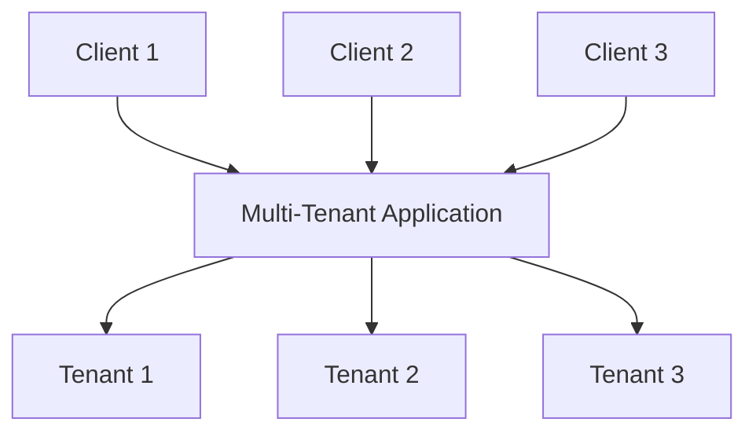
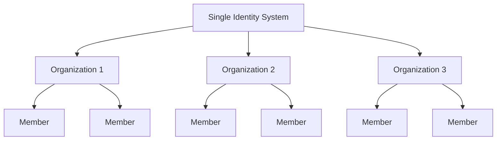

## What is multi-tenancy？

Software multi-tenancy is a software in which a single instance of software runs on a server and serves multiple tenants. Systems designed in such a manner are "shared" (rather than "dedicated" or "isolated").

A tenant is a group of users who share common access with specific privileges to the software instance.

For example, CRM (Customer Relationship Management) systems often use multi-tenant architecture to provide the same service to all clients.

A key principle of multi-tenancy is "sharing." This doesn’t mean that **every** part of the solution is shared; it means that at least **some** components are reused across multiple tenants. Understanding this broader concept can help you better address your clients' needs.

## What are the use cases for multi-tenant products?

Multi-tenant apps are commonly used in software-as-a-service (SaaS) products like productivity tools, collaboration software, and etc. In this setup, each “tenant” usually represents a business customer, with multiple users (typically employees). In different products, it may be referred to as a tenant, workspace, or project, depending on the context. A single business might also have multiple tenants to represent different divisions or organizations.

In more complex cases, like B2B applications beyond SaaS, multi-tenant apps provide a shared platform for various teams, business clients, and partner companies to access your services.

## Why should you employ multi-tenancy in SaaS product

### Scaling with multi-tenancy

For enterprise businesses, multi-tenancy is the key to effectively fulfilling their requirements for availability, resource management, cost management, and data security. On a technical level, adopting a multi-tenant approach streamlines your development processes, minimizes technical challenges, and promotes seamless expansion.

### Creating a unified experience

When examining the roots of SaaS products, it's akin to a building housing various apartments. All tenants share common utilities like water, electricity, and gas, yet they maintain independent control over managing their own space and resources. This approach simplifies property management.

### Ensuring security through tenant isolation

In a multi-tenancy architecture, the term "tenant" is introduced to create boundaries that separate and secure the resources and data of different tenants within a shared instance. This ensures that each tenant's data and operations remain distinct and secure, even if they are utilizing the same underlying resources.

## How to achieve tenant isolation in multi-tenancy architecture?

When discussing multi-tenant applications, it's always necessary to achieve **tenant isolation**. This means keeping the data and resources of different tenants separate and secure within a shared system(for example, a cloud infrastructure or a multi-tenant application). This prevents any unauthorized attempts to access another tenant's resources.

### Tenant isolation aligns with the “shared” concept of multi-tenancy

That is because tenant isolation is not necessarily an infrastructure resource-level construct. In the realm of multi-tenancy and isolation, some view isolation as a strict division between actual infrastructure resources. This usually leads to a model where each tenant has separate databases, computing instances, accounts, or private clouds. In shared resource scenarios, like multi-tenant apps, the way to achieve isolation can be a logical construct.

### Authentication and authorization are not equal to “isolation”

Using authentication and authorization to control access to your SaaS environment is important, but it doesn’t guarantee "isolation". Isolation means keeping different users or data sets separate so that one user’s data or actions can’t interfere with or be accessed by another.

For example, even if you’ve set up authentication and authorization, where users log in and receive a token defining their permissions, this improves security but doesn’t ensure that users are fully isolated from each other. Another context should be introduced to achieve "isolation".

### Use “organization” as a context to represent the SaaS product tenant, for achieving tenant isolation

Authentication and authorization alone won’t prevent a user with the right role from accessing another tenant’s resources. To limit access, we need to add a “tenant” context, like a tenant ID, organization ID, or workspace ID. These identifiers act like walls, doors, and locks, keeping tenants separate.

The term “organization” is commonly used for tenant isolation. Many <Ref slug="identity-provider" /> include an “organization” feature to help isolate tenants while keeping a unified identity system. The user inside the organization is called "member".

## How are identities managed in multi-tenant apps?

The first key question is to think about whether parts of your business or product require separate identity systems. This will guide your system design. Here are two examples:

1. One identity system: A single person can have two identities within the same identity system. For example, Sarah might have a personal email registered and also use a corporate email connected through <Ref slug="enterprise-sso" /> .
2. Multiple identity systems: Users can also have two distinct identities across separate identity systems for completely unrelated products.

In most multi-tenant apps, identities are usually managed in a single pool, while each tenant’s resources are kept separate. 

## Considerations for planning and building multi-tenant apps

1. Focus on your model: B2B or B2C.
2. Who will handle identity management tasks: developers, your client’s admin, or end customers?
3. For B2B, do your clients need to manage their organization’s identities?
4. Identify which permission (<Ref slug="scope" />) and <Ref slug="role" /> need to be defined for the organization and which do not.
5. Does your client require <Ref slug="enterprise-sso" />?
6. Consider adding collaboration features, like invitations.

<Resources
  urls={[
    "https://blog.logto.io/implement-multi-tenancy",
    "https://blog.logto.io/multi-tenant-ultimate-guide",
    "https://blog.logto.io/case-study-multi-tenancy",
    "https://blog.logto.io/multi-tenancy-explained",
    "https://blog.logto.io/are-multi-tenant-apps-equal-saas",
    "https://blog.logto.io/tenancy-models",
    "https://blog.logto.io/do-you-need-multiple-tenants-identity-model",
  ]}
/>
