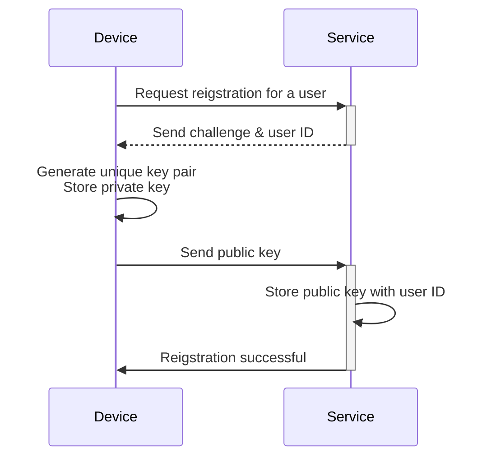
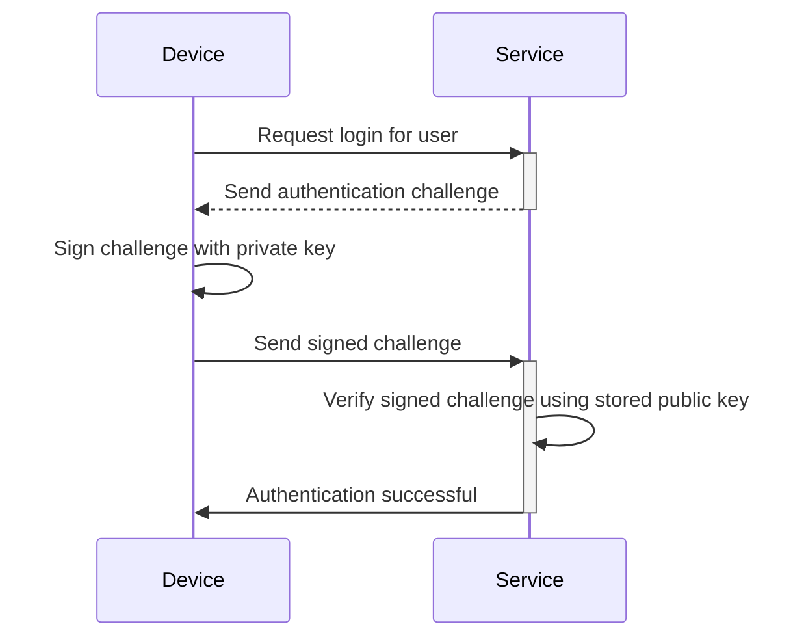

## What is passkey?

**Passkey** is a [FIDO](https://fidoalliance.org/)-based, secure and convenient alternative to traditional passwords. They use advanced cryptography to protect your accounts from [phishing](https://en.wikipedia.org/wiki/Phishing) attacks. 

- **Unique for each service**: When you register for a service, your device creates a unique passkey linked to that specific service’s domain.
- **Device-linked:** Passkeys are typically linked to a device, such as a phone, laptop, biometric identifier, or hardware security keys.
- **Public-Private key pair:** The device keeps the private key, while the public key is shared with the service. These cryptographic key pairs are called passkeys. (Quoted from [FIDO](https://fidoalliance.org/how-fido-works/))
- **Multiple authentication methods:** You can use a fingerprint scan, facial recognition, device PIN, QR code scanning, or security keys to authenticate with a passkey.
- **Cross-device syncing**: Passkeys can be synced across devices using secure cloud storage (e.g., Apple's iCloud Keychain or Google Password Manager), allowing you to sign in from any supported device.

## What does the passkey workflow look like?

Here’s a real-world example to help you understand better. You have a web service MyApp that wants to implement Passkey sign-in instead of password-based sign-in. Users select to current device with fingerprint scanning as Passkey authentication method. 

**Passkeys** work by utilizing public-key cryptography to provide secure credentials. 

- **Passkey registration**
    - When you register for a service, your device generates a unique cryptographic key pair linked to that service.
    - The **private key** remains on your device, while the **public key** is shared with the service.

- **Passkey authentication**
    - When you attempt to sign in, the service sends a **challenge** to your device.
    - Your device uses the **private key** to generate a cryptographic **signature** based on the challenge.
    - The **signature** is sent back to the service, which verifies it using the **public key**.
    - If the signature is valid, authentication is successful.

Read <Ref slug="webauthn" />, an API for implementing passkeys, to learn the details.

## What does the passkey end-user flow look like?

Passkeys offer flexibility with two types of authenticator for both local and cloud use, and users can enable one or both for the service.

- **Platform authenticator (Internal authenticator):** Tied to a specific device OS (e.g., phone, laptop), using biometrics or device passcode to authorize. It’s quick and convenient.
    - Examples: iCloud Keychain on Apple devices (verify via Touch ID, Face ID, or device passcode), Windows Hello, Google Password Manage on Android.
- **Roaming authenticator (External authenticator):** Portable devices or software, e.g., security keys, smartphones. Can be used across multiple devices but may require additional steps like QR code scanning or NFC/Bluetooth pairing.
    - Examples: YubiKey and cloud-based accounts on smartphones. Mobile authenticators often require QR code scanning to link with desktop devices, and cross-device authentication needs to connect via Bluetooth, NFC, or USB to ensure the authenticator is nearby.

## When to use passkey?

Passkeys are a modern authentication factor that can be used as either a first or second factor.

- **Passkey sign-in:** Passkeys offer a faster and more secure passwordless authentication method compared to traditional password.
    - Modern applications typically feature a “Sign in with passkey” button on the sign-in page, prompting users to tap this option proactively.
    - Additionally, the sign-in page can automatically prompt a passkey sign-in pop-up if it recognizes that the user is accessing the same device and browser where their passkey is registered.
- **Passkey MFA:** Passkeys can also serve as a second factor for MFA.
    - When a user attempts to sign in, they first enter their email and password (or other first factors), after which the service prompts them to complete the 2-step verification using a passkey.
    - If there are existing sessions in the browser, the service can directly prompt users to sign in with their passkey without requiring them to enter their password again. This process, known as completing MFA, because passkey is a high-level security by binding to the current device and verifying users through biometrics, PINs, or other hardware methods.
- **Security verification**: In high-security environments, passkey are often used to double-check user identity. For example, when accessing sensitive financial information or performing critical operations (banking, government, corporate system).

### Why are passkeys the most secure authentication method?

Passkeys are one of the most secure ways for common customers to sign in because they use **public-key cryptography**.  Unlike passwords or one-time codes (TOTPs), your private key never leaves your device. Even if an attacker steals the public key which is freely available, they can't forge a valid login attempt.

Here’s a comparison to illustration why passkeys are significantly more secure:

| Attacks | Passkeys | Software TOTP (Authenticator) |
| --- | --- | --- |
| **Phishing attacks** | Highly resistant to phishing, as the private key is never leave the device or entered manually anywhere, making it harder to steal. | Vulnerable to phishing, as Software TOTP is displayed on your screen, so attackers can trick you into revealing on a fake website. |
| **Man-in-the-middle attacks (MitM)** | Strong protection against MitM, as robust cryptographic protocols make the private keys only stay on your device. | Vulnerable to MitM, as the TOTPs can be intercepted by a MitM attacker who could then use them to sign in as you. |
| **Replay attacks** | Strong protection against replay attack, as each passkey request is unique, making it useless for an attacker to capture and replay later. | Possible to replay attack, as TOTP change periodically, but if intercepted before expiring, they could be reused for unauthorized access. |

<SeeAlso slugs={["webauthn", "authentication", "authorization"]} />

<Resources
  urls={[
    "https://fidoalliance.org/passkeys/",
    "https://webauthn.io/"
  ]}
/>
