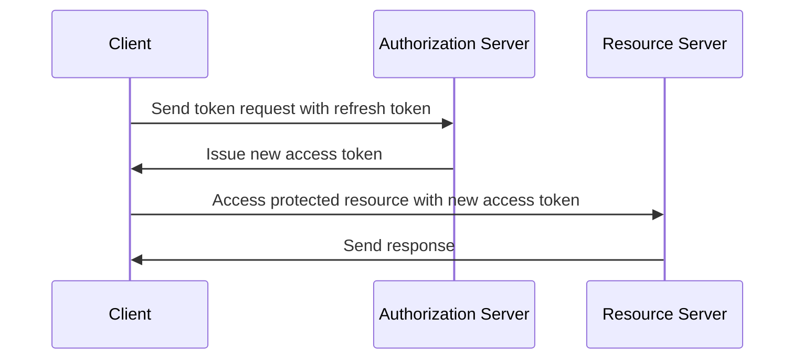

## What is a refresh token?

A refresh token is a long-lived credential, typically a random string, that is used to obtain new <Ref slug="access-token">access tokens</Ref> without requiring the user to re-authenticate. In the context of OAuth 2.0 and OpenID Connect (OIDC), <Ref slug="authorization-server">authorization servers</Ref> may issue refresh tokens to clients (applications) when the client requests <Ref slug="offline-access" />.

While the [OAuth 2.0 RFC](https://datatracker.ietf.org/doc/html/rfc6749#section-1.5) defines the high-level lifecycle of a refresh token, the implementation details may vary across authorization servers and clients. We'll explore them in the subsequent sections.

## How does a refresh token work?

A refresh token is typically issued alongside an access token when the client requests <Ref slug="offline-access" />. The industry norm to request offline access is to include the `offline_access` scope in the <Ref slug="authorization-request" />, while <Ref slug="openid-connect" /> officially defines the `offline_access` scope for this purpose (available in the <Ref slug="authentication-request" />).

Here's a non-normative example of an authorization request that includes the `offline_access` scope:

```http
GET /authorize?response_type=code
  &client_id=YOUR_CLIENT_ID
  &redirect_uri=https%3A%2F%2Fclient.example.com%2Fcallback
  &scope=openid%20profile%20email%20offline_access
  &state=abc123
  &nonce=123456 HTTP/1.1
```

Once the client receives the refresh token, it can use it to request new access tokens when the current access token expires. Here's a simplified example using a refresh token:



As the sequence diagram illustrates, the use of a refresh token needs to be supported by both the client and the authorization server:

- The client should store the refresh token securely and use it in the <Ref slug="token-request" /> to obtain a new access token.
- The authorization server should validate the refresh token and issue a new access token when the client presents a valid refresh token.

The refresh token is not meant to be shared with the <Ref slug="resource-server" />. Access tokens are the only tokens that the resource server should check for authorization.

Here's a non-normative example of a token request using a refresh token:

```http
POST /token HTTP/1.1
Host: your-authorization-server.com
Content-Type: application/x-www-form-urlencoded

grant_type=refresh_token
  &refresh_token=YOUR_REFRESH_TOKEN
  &client_id=YOUR_CLIENT_ID
  &client_secret=YOUR_CLIENT_SECRET
  &scope=openid%20profile%20email
```

## Security considerations

Since refresh tokens are long-lived (e.g., days, weeks) and can be used to obtain new access tokens without user interaction, they pose a higher security risk than access tokens (e.g., minutes, hours). The use of refresh tokens should be carefully considered and implemented to mitigate potential security threats. Here are some best practices to consider:

### Secure storage

Securely store refresh tokens on the client-side to prevent unauthorized access. Such storage mechanisms include:

- **HTTP-only cookies**: Store tokens in HTTP-only cookies to prevent client-side JavaScript from accessing them.
- **Encrypted storage**: Use secure storages like Keychain (iOS) or KeyStore (Android) on mobile devices, or encrypted databases on web applications.

### Refresh token rotation

While refresh tokens can be long-lived, rotating them periodically or based on certain conditions (e.g., after a successful token exchange) can significantly reduce the risk of unauthorized access. The exact rotation strategy may vary based on the application's security requirements and the authorization server's capabilities.

Here are two common token rotation strategies:

- **Time-based rotation**: Rotate refresh tokens after a certain period (e.g., every 7 days).
- **Event-based rotation**: Rotate refresh tokens after specific events (e.g., successful token exchange, password change).

When a refresh token is rotated, the previous refresh token should be invalidated to prevent its reuse. These strategies are often combined with the session TTL (time-to-live) to ensure that after a certain period of time, regardless of the refresh token's validity, the user must re-authenticate.

### Sender-constrained refresh tokens

Sender-constrained refresh tokens are a security mechanism to bind the refresh token to the client that requested it, in case of the client is not a <Ref slug="client" headingId="confidential-clients">confidential client</Ref>. Common methods are [DPoP](https://datatracker.ietf.org/doc/html/rfc9449) and [mTLS](https://datatracker.ietf.org/doc/html/rfc8705).

### Client type

It's a good practice to limit the use of refresh tokens to <Ref slug="client" headingId="confidential-clients">confidential (private) clients</Ref>.

- Public clients (e.g., single-page applications) expose the source code to the client-side, making it easier for attackers to extract and abuse refresh tokens. Usually, more secure mechanisms like <Ref slug="pkce" /> and refresh token rotation are used for public clients if refresh tokens are nessessary to use.
- Confidential clients, on the other hand, run on a secure server environment where the source code and environment are not exposed to the client-side. Refresh tokens can be used more securely in such environments.

### Token revocation

Since refresh tokens are usually <Ref slug="opaque-token">opaque tokens</Ref> (i.e., have no meaning to the client) and must be validated by the authorization server, the authorization server can easily implement token revocation mechanisms to invalidate refresh tokens when necessary. This can be useful in scenarios like user logout, account compromise, or token misuse.

<SeeAlso slugs={["access-token", "id-token", "jwt", "opaque-token"]} />

<Resources urls={[
  "https://blog.logto.io/understanding-refresh-token-rotation",
  "https://blog.logto.io/understanding-tokens-in-oidc",
  {
    url: "https://openid.net/specs/openid-connect-core-1_0.html#OfflineAccess",
    result: {
      ogTitle: "Offline Access in OpenID Connect Core 1.0",
    }
  },
  {
    url: "https://datatracker.ietf.org/doc/html/rfc6749#section-1.5",
    result: {
      ogTitle: "Refresh Token in OAuth 2.0",
      ogDescription: "Refresh tokens are credentials used to obtain access tokens."
    },
  },
]} />
