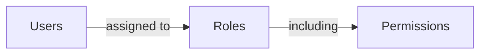

## Role

A role is one of the core components in <Ref slug="rbac" />. It serves as a container for permissions that can be assigned to users, acting as an intermediary between users and their access rights.



A typical role structure contains a name and a set of permissions:

```typescript
const role = {
  name: 'order_admin',
  permissions: [
    'read:orders',   // View order details
    'write:orders',  // Edit orders
    'read:products'  // View products
  ]
}
```

> [!Note]
> Roles are primarily used for permission management. For access control implementation, it's recommended to check permissions directly rather than roles. See <Ref slug="rbac" /> for more information.

<SeeAlso slugs={["rbac", "authorization", "access-control"]} />
