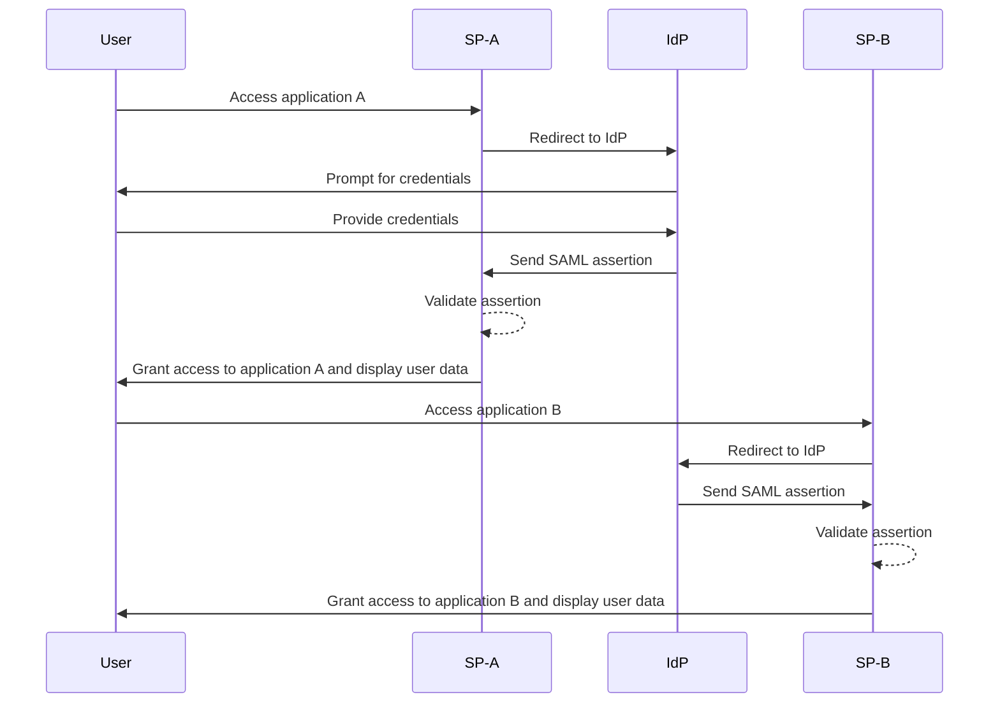
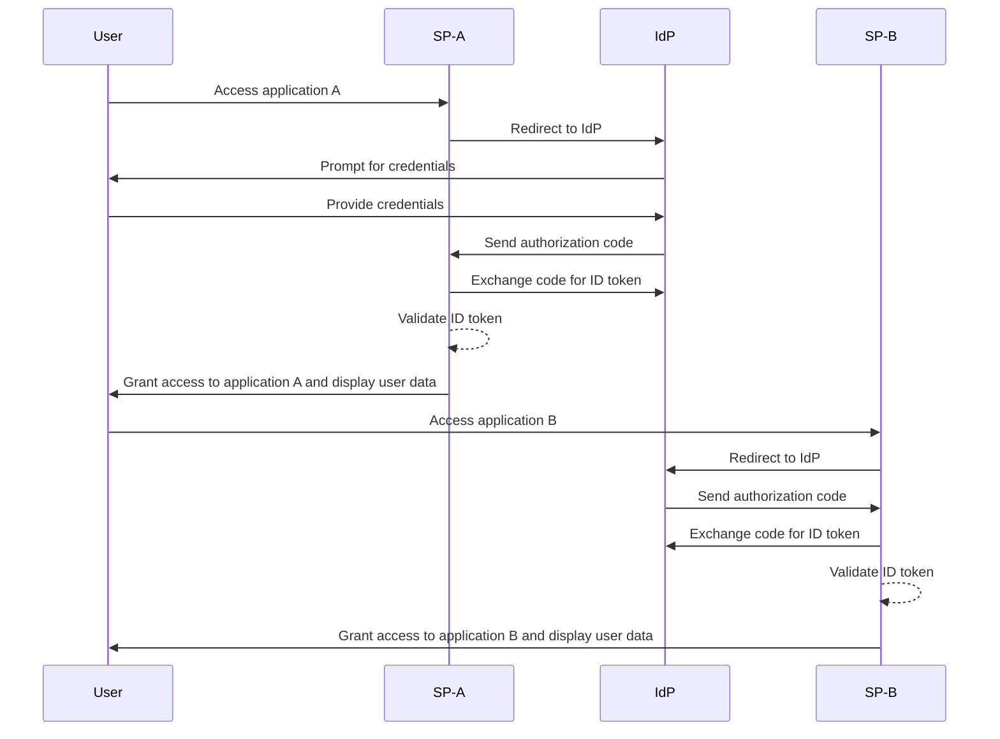

## What is single sign-on (SSO)?

Single sign-on (SSO) is an <Ref slug="authentication" /> method that allows users to access multiple applications or services with a single set of credentials. Instead of managing separate logins for each system, users authenticate once and are automatically signed into all connected platforms.

SSO is commonly used in both personal and business settings, especially in enterprise environments where employees or remote workers depend on various SaaS applications to do their jobs. By implementing SSO, organizations can enhance security, streamline access management, and boost user productivity.

A well-known example of SSO is Google’s suite of services, such as Gmail, Google Drive, and Google Calendar. After signing into their Google account, users can easily access all of these services without re-entering their credentials.

## How does single sign-on work?

SSO relies on a trust relationship between an application or service, known as the <Ref slug="service-provider" />, and an <Ref slug="identity-provider" />. The IdP handles user authentication and securely shares the necessary information with the SP to grant access. This trust is established through a process called federation, where the SP and IdP agree on specific standards and protocols for securely exchanging authentication data.

When a user attempts to access an SSO-enabled application, the SP redirects them to the IdP for authentication. The IdP prompts the user to provide credentials, verifies their identity, and establishes an authenticated session in its system. This session is typically maintained using a session cookie securely stored under the IdP's domain.

Once the user is authenticated, the IdP generates a security token or assertion containing the user information that has been consented to be shared with the SP. This token or assertion is securely transmitted back to the SP, which validates it and grants the user access.

If the user accesses another SSO-enabled application, the process occurs smoothly without requiring additional logins. This convenience is made possible by the user authentication session maintained by the IdP, allowing the IdP to automatically verify the user’s identity and issue a new security token without prompting for credentials again.

Protocols like <Ref slug="saml" /> and <Ref slug="openid-connect" /> are widely used to implement SSO. These standards define how authentication data is securely exchanged between the IdP and SP, ensuring reliable and secure communication while maintaining the user's seamless experience across applications.

### SAML-based SSO

In SAML-based SSO, once the user is authenticated by the IdP, an XML-based SAML assertion is generated, signed, and securely sent to the SP. The SP then validates the assertion and grants access based on the user’s identity.

### OIDC-based SSO

OIDC, in contrast, is built on top of <Ref slug="oauth-2.0" /> and offers a more modern approach to SSO. It uses <Ref slug="jwt" /> to exchange identity information between the IdP and SP, providing enhanced security and greater flexibility.

## Benefits of single sign-on

1. **Enhanced security**: SSO reduces the risk of password-related security breaches by minimizing the number of credentials users need to remember. It also allows organizations to enforce stronger authentication methods, such as <Ref slug="mfa" />, to protect user accounts.

2. **Improved user experience**: Users can access multiple applications seamlessly without the need to repeatedly log in, enhancing productivity and reducing frustration. SSO simplifies the login process and provides a consistent user experience across different platforms.

3. **Centralized access management**: Organizations can centrally manage user access and permissions through the IdP, ensuring consistent security policies and access controls across all connected applications. This simplifies user provisioning, deprovisioning, and auditing processes.

## When to use single sign-on

1. **Enterprise and organizational environments**: SSO is particularly beneficial for businesses that rely on multiple applications and services to streamline workflows. It simplifies user access and reduces the burden on IT teams to manage individual user accounts. For example, companies using multiple SaaS applications, such as CRM, HR, and collaboration tools.
2. **Customer-facing applications**: SSO can also enhance the user experience for customers accessing online services or e-commerce platforms. For instance, allowing users to log in with their social media accounts or email addresses instead of creating new accounts for each service.
3. **Multi-product services**: Companies offering a suite of interconnected products or services can leverage SSO to provide a seamless user experience across their offerings. Users can navigate between different applications without the hassle of repeated logins. For example, G Suite by Google. Users can log in once on their Chrome browser and access multiple Google services without re-entering their credentials.

The use of SSO is not limited to these scenarios and can be adapted to various use cases based on the specific needs of an organization or application. It is widely regarded as a best practice for enhancing security, user experience, and operational efficiency in modern digital environments.

<SeeAlso slugs={["enterprise-sso"]} />
