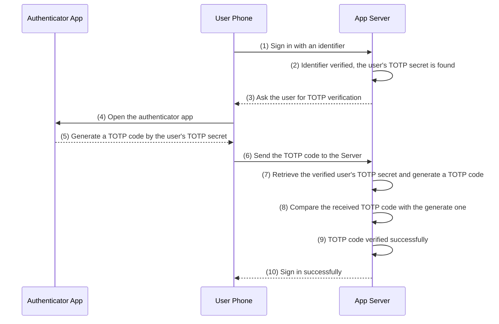

## What is TOTP?

A Time-Based One-Time Password (TOTP) is a temporary, unique code generated by an algorithm that uses the current time as a key factor. Similar to a generic <Ref slug="otp" />, a TOTP is used only once, but it has a fixed lifespan, typically ranging from 30 to 60 seconds. Upon expiration, a new code is generated automatically.

The TOTP standard is defined by the Internet Engineering Task Force (IETF) under [RFC 6238](https://datatracker.ietf.org/doc/html/rfc6238), and it is widely adopted in various two-factor authentication (2FA) and multi-factor authentication (MFA) systems.

## How TOTP works

Take the example of a mobile application that uses TOTP for authentication. The participating parties are:

- **Authenticator App**: A mobile application installed on the user's phone.
- **User Phone**: The user's phone device.
- **App Server**: The server hosting the application.

A diagram of the TOTP authentication process is shown below:

## Key concepts

1. Shared secret: During the initial setup, a shared secret key is generated and stored securely on both the client and server. This key is typically encoded as a QR code which users scan using an authentication app.
2. Time intervals: The current time is divided into fixed intervals, usually of 30 seconds.
3. Algorithm application: The shared secret key and the current timestamp are fed into a hash-based algorithm (often HMAC-SHA1) to produce a unique numeric code.
4. Synchronization: Both the client and server generate the code independently using the same shared secret and current timestamp. The codes match only if both are in sync.
5. Verification: When the user logs in or performs a critical transaction, they enter the TOTP displayed on their authentication app. The server then compares it with its internally generated TOTP for validation.

## Common TOTP clients

Besides the Authenticator App, there are many other TOTP clients that support TOTP, such as:

- Microsoft Authenticator
- Authy
- 1Password
- LastPass Authenticator

## Security considerations

When implementing TOTP:

- Store the shared secret securely using encryption
- Allow for time drift between client and server (typically ±30 seconds)
- Implement rate limiting to prevent brute force attacks
- Provide backup codes for account recovery
- Consider offering multiple 2FA options alongside TOTP

## Best practices

1. **Recovery options**: Always provide backup methods (recovery codes, alternative 2FA methods)
2. **User education**: Explain the importance of securing the authenticator app and backup codes
3. **QR code**: Offer both QR code and manual entry options for the secret key
4. **Time sync**: Implement server-side time drift tolerance
5. **Migration support**: Allow users to migrate their TOTP setup to new devices

## When to use TOTP?

TOTP is particularly useful in scenarios where reliable network connectivity cannot be guaranteed. Unlike other two-factor authentication methods that require the server to send codes via email or SMS (which need an active internet connection), TOTP generates codes locally on the device using time synchronization. This makes it ideal for:

- Traveling situations with limited internet access
- Areas with poor cellular coverage
- Emergency access scenarios
- Offline authentication requirements
- Avoiding SMS/email delivery delays or failures

Additionally, TOTP is more secure than SMS-based authentication since it's not vulnerable to SIM swapping attacks or SMS interception.

<SeeAlso slugs={['otp', 'mfa']} />
