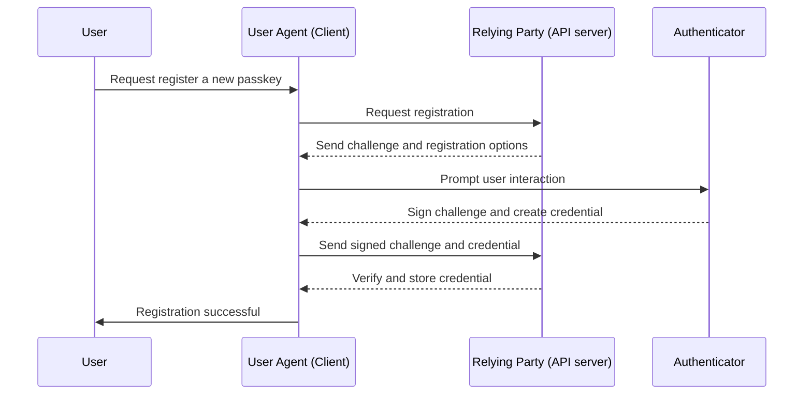
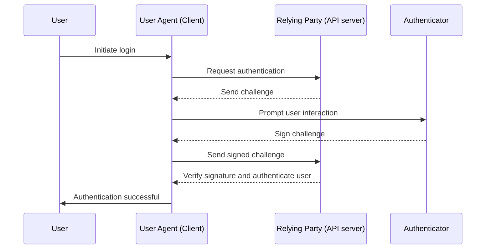

## What is WebAuthn?

WebAuthn (Web Authentication API), developed by the [W3C](https://www.w3.org/) and [FIDO Alliance](https://fidoalliance.org/), is a specification for secure web authentication using FIDO2 standards. WebAuthn provide an API to allow websites to implement <Ref slug="passkey" />, which are phishing-resistant credentials secured by public key cryptography. Passkeys can replace passwords for both passwordless logins and  <Ref slug="mfa" />.

## What does the WebAuthn workflow look like?

Here’s a real-world example to understand better. You have a web application MyApp that wants to integrate then WebAuthn API to implement Passkey for multi-factor authentication. 

**Registration phase:** After signing with an email verification and setting a new password, this user is prompt to create a Passkey. They choose to link their device using a fingerprint. This establishes the Passkey securely on their device.

**Authentication phase:** During next sign-in, the user is asked to verify their Passkey after entering their password. With just a quick fingerprint scan, they can easily complete the authentication process.


To provide a more detailed explanation, we can divide the process into two phases: registration and authentication. First, it’s essential to understand the four key entities involved in the WebAuthn flow.

### 4 key entities

1. **User:** The individual attempting to access a web application.
2. **User agent:** The web browser that handles the WebAuthn API calls, and manages the authentication process between the user, relying party, and authenticator.
3. **Relying party:** The service, application, or API server the user seeks to access.
4. **Authenticator:** The hardware or software component used to verifying the user’s identity. It can take various forms based on the platform or browser capability, such as security keys (like Yubikeys), phones or tablets (connected by Bluetooth, NFC, or USB), device-based biometrics or PINs, etc.

### WebAuthn registration

Asymmetric public-key cryptography is the core process.

1. **Key pair generation**: 
The user agent generates a public-private key pair. 
    - **Public key**: Shared with the relying party.
    - **Private key**: Remains securely stored in the user's authenticator.
2. **Registration challenge**: 
When the user attempts to enroll a passkey, the relying party sends a registration challenge to the user agent.
3. **User verification**: 
The user agent forwards the challenge to the authenticator, which prompts the user for verification (e.g., biometric authentication or a hardware security key).
4. **Cryptographic signature:** 
The authenticator uses its private key to sign the challenge, creating a cryptographic signature.
5. **Verification and access:** 
The user agent sends the signed challenge back to the relying party, which verifies the signature using the public key and completes the registration process.



### WebAuthn authentication

1. **Authentication challenge:**
When the user attempts to sign in, the relying party sends an authentication challenge to the user agent.
2. **User verification:**
The user agent sends the challenge to the authenticator, which prompts the user for verification (e.g., biometric authentication or a hardware security key).
3. **Cryptographic signature:**
The authenticator uses its private key to sign the challenge, creating a cryptographic signature.
4. **Verification and access:**
The user agent verifies the signature using the public key and informs the relying party of a successful authentication. Access is granted if the verification is successful.



## How to use WebAuthn?

WebAuthn API can be used to implement passkey sign-in or 2-step verification. Refer to Passkey experience to learn more details.

To use the Web Authentication API (WebAuthn) for secure authentication, you need to handle two main processes: registration and authentication. Here are simple code examples of how you might implement these processes using JavaScript. 

**Registration**

The relying party (your web application) initiates the registration process by calling the `navigator.credentials.create()` method.

```jsx
// Registration
navigator.credentials.create({
  publicKey: {
    rp: {
      name: "Your Relying Party Name",
      id: "your-relying-party-id"
    },
    user: {
      id: "user-id",
      displayName: "User Name",
      name: "User Name"
    },
    challenge: "your-challenge-value",
    timeout: 60000 // 60 seconds
  }
}).then(credential => {
  // Store the credential's id for future authentication
  localStorage.setItem("credentialId", credential.id);
}).catch(error => {
  console.error("Registration error:", error);
});
```

The relying party initiates the authentication process by calling the `navigator.credentials.get()` method.

```jsx
// Authentication
navigator.credentials.get({
  publicKey: {
    rp: {
      name: "Your Relying Party Name",
      id: "your-relying-party-id"
    },
    challenge: "your-challenge-value",
    timeout: 60000 // 60 seconds
  }
}).then(credential => {
  // Verify the credential's id and other properties
  if (credential.id === localStorage.getItem("credentialId")) {
    // Authentication successful
    console.log("User authenticated successfully");
  } else {
    console.error("Invalid credential");
  }
}).catch(error => {
  console.error("Authentication error:", error);
});
```

To learn the details, read the spes: https://fidoalliance.org/specifications/download/.

Note: In WebAuthn actions, whether for registration or authentication, the "rp ID" (relying party ID) is a mandatory field. It represents the domain hostname of the current web page. If it doesn't match the current domain, the browser will reject the request. This means that passkeys are bound to a specific domain, and there's currently no way to migrate existing passkeys to a different domain. Additionally, passkeys cannot be used across different domains. 

## WebAuth and OpenID Connect (OIDC)

By combining WebAuthn’s strong security with OIDC’s standardized identity protocol, we can crate a more secure and user-friendly authentication experience.

Learn about how it works:

- **Registration phase**: Users complete a standard <Ref slug="openid-connect" /> registration process (e.g., email verification and password creation). WebAuthn generates a public-private key pair, storing the public key with the OIDC <Ref slug="identity-provider" /> and keeping the private key on the user’s device.
- **Authentication phase**: Users access an OIDC-protected resource and is redirected to the sign-in page. After providing basic credentials (e.g., email and password), the system invokes WebAuthn for passkey authentication. Once Passkey verified, OIDC issues an Access Token or ID Token for user access.

## What’s the difference between WebAuthn and CTAP2?

**WebAuthn** and **CTAP2** are both essential components of the FIDO2 standard, but they serve distinct purposes:

- **CTAP2 (Client to Authenticator Protocol 2):** This protocol defines how a device, such as a security key or smartphone, communicates with a web application. It establishes a secure channel between the **authenticator** and the **user's device**, ensuring that sensitive authentication data is protected.
- **WebAuthn (Web Authentication API):** This API provides a standardized way for web applications to interact with CTAP2-compliant authenticators. It handles the authentication process, including the exchange of authentication data between the **user's device** and the **relying party**.

<SeeAlso slugs={["passkey", "mfa", "openid-connect"]} />

<Resources
  urls={[
    "https://fidoalliance.org/specs/fido-v2.0-id-20180227/fido-client-to-authenticator-protocol-v2.0-id-20180227.html",
    "https://blog.logto.io/webauthn-nextjs",
    "https://blog.logto.io/webauthn-base-knowledge"
  ]}
/>
