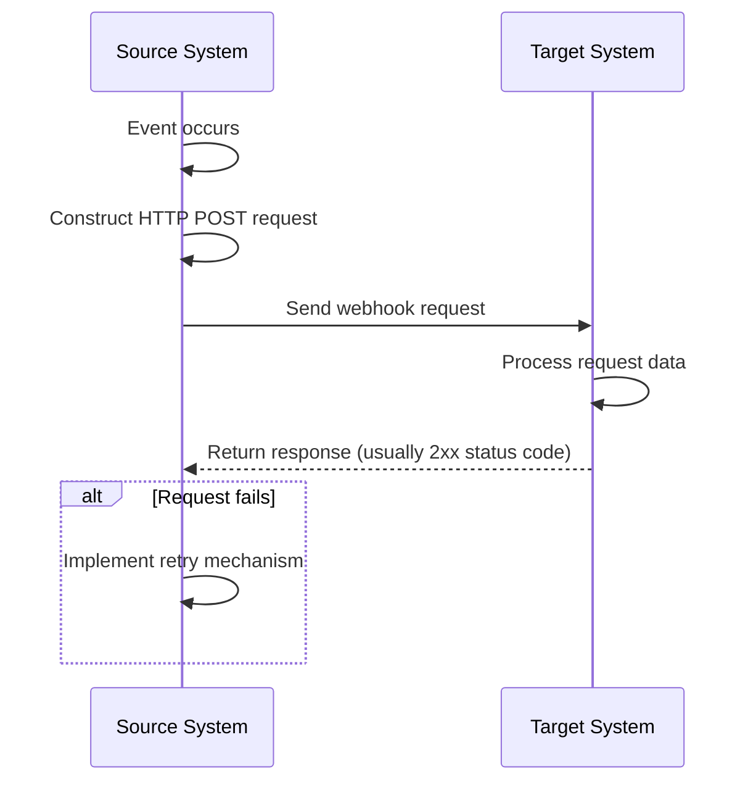
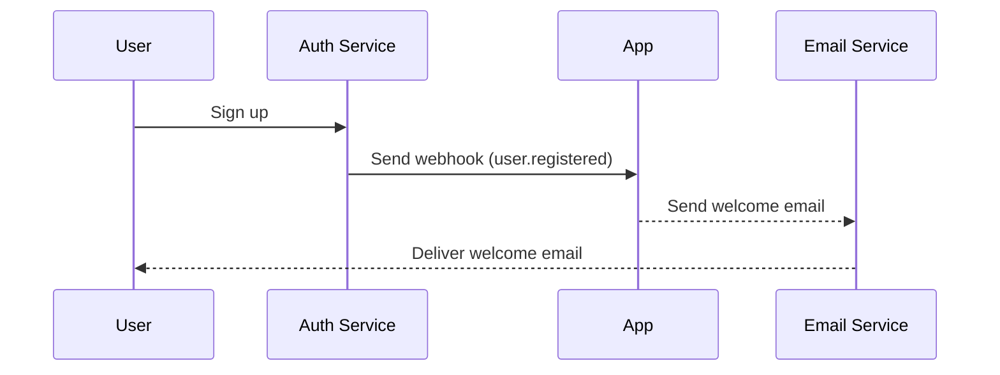

## What is a webhook?

A webhook is an HTTP callback mechanism that allows applications to send real-time notifications to predefined URLs when specific events occur. This mechanism enables automated data exchange and real-time communication between systems.

## How do webhooks work?



1. A specific event occurs in the source system
2. The source system constructs an HTTP POST request containing event data
3. The source system sends the request to the pre-configured target system URL
4. The target system receives the request and processes the data
5. The target system returns a response to the source system
6. If the request fails, the source system may implement a retry mechanism

## How do webhooks work in a real-world scenario?

Let's take an application integrated with an auth service as an example. When a new user signs up, the application will send a welcome email to the user.

Typically, the auth service provides a `user.registered` webhook event that is triggered when a new user completes registration.

The webhook event payload contains the user's information such as email and username, which can be used to send the welcome email:

```json
// Note: the actual payload structure depends on the auth service.
{
  "event": "user.registered",
  "timestamp": "2024-03-21T08:00:00Z",
  "data": {
    "user_id": "u_1234567890",
    "email": "john@example.com",    // Email address for sending welcome email
    "username": "johndoe",          // Username to personalize the email
    "registered_at": "2024-03-21T08:00:00Z"
  }
}
```

Here's how the webhook flow works:



## What are best practices for implementing webhooks?

When you're the sender (producer) of webhooks, consider the following aspects:

### Webhook design

Design clear and consistent webhook structures:

- Define clear event types: For example, `order.created`, `user.updated`, etc.
- Use standard JSON format: Ensure the data structure is clear and easy to parse.
- Version control: Include version information in the request headers or payload. For example:

  ```javascript
  // In request headers
  headers: {
    'Content-Type': 'application/json',
    'X-Webhook-Version': '1.0'
  }
  
  // Or in the payload
  {
    "version": "1.0",
    "event_type": "order.created",
    "data": {
      // Event details
    }
  }
  ```

- Provide sufficient context: Include timestamps of when events occurred, unique identifiers for related resources, etc.
- Maintain consistency: Use consistent naming conventions and data structures across all event types.

### Sending mechanism

Implement a reliable webhook sending mechanism:

- Use asynchronous task queues: Avoid blocking the main program and improve system responsiveness.
- Implement retry mechanisms: Handle network failures or temporary unavailability of the receiver.

### Retry strategy

Design an appropriate retry strategy:

- Implement exponential backoff: Avoid frequent retries that could stress the system and receiver.
- Set a maximum retry count: Prevent infinite retries from consuming system resources.
- Provide manual retry mechanisms: Offer an interface for manual retries for webhooks that ultimately fail.

### Security implementation

Implement a signature mechanism to allow receivers to verify the authenticity of requests:

```javascript
const crypto = require('crypto');

function generateSignature(payload, secret) {
  return crypto.createHmac('sha256', secret)
    .update(JSON.stringify(payload))
    .digest('hex');
}

function sendWebhookWithSignature(url, payload, secret) {
  const signature = generateSignature(payload, secret);
  return axios.post(url, payload, {
    headers: { 'X-Webhook-Signature': signature }
  });
}
```

### Performance optimization

Optimize webhook sending performance:

- Use connection pools: Reduce the overhead of establishing connections and improve performance.
- Implement batch processing: Send webhooks in batches when appropriate to reduce the number of network interactions.

### Documentation and testing tools

Provide support for webhook users:

- Detailed API documentation: Include all possible event types, request formats, and field descriptions.
- Provide testing tools: Implement webhook test endpoints to allow users to simulate receiving webhook notifications.
- Sample code: Provide integration examples in various programming languages.

## What are best practices for using webhooks?

When using webhooks as a receiver (consumer), consider the following aspects:

### Security

Since endpoints for receiving webhooks are generally publicly accessible, security is a primary concern. Pay attention to the following points:

- Verify request authenticity: Implement a signature verification mechanism to ensure requests come from expected senders.
  
  ```javascript
  const crypto = require('crypto');

  function verifySignature(payload, signature, secret) {
    const expectedSignature = crypto
      .createHmac('sha256', secret)
      .update(JSON.stringify(payload))
      .digest('hex');
    
    return crypto.timingSafeEqual(
      Buffer.from(signature),
      Buffer.from(expectedSignature)
    );
  }
  ```

- Use HTTPS: Ensure your webhook receiving endpoint uses HTTPS to prevent data from being intercepted or tampered with during transmission.
- Implement IP whitelisting: Only accept webhook requests from trusted IP addresses to reduce the risk of attacks.

### Reliability

To ensure reliable handling of received webhooks:

- Implement idempotent processing: Design your system to correctly handle duplicate webhook notifications, as senders may retry failed requests.
- Respond quickly: Return a response (usually a 2xx status code) immediately after receiving a webhook request to prevent the sender from considering the request failed and triggering a retry.

### Performance

Maintain efficient system operation:

- Asynchronous processing: After receiving a webhook, perform actual data processing in the background without blocking the response.
- Set timeout limits: Set reasonable timeout periods for webhook processing to prevent long-running tasks from affecting system performance.

### Error handling

Handle potential error situations appropriately:

- Logging: Keep detailed records of received webhook requests and processing procedures to facilitate problem investigation.
- Graceful degradation: Have appropriate error handling mechanisms when unable to process webhooks to ensure other parts of the system are not affected.

### Version compatibility

As webhook formats may change over time:

- Handle version information: Be prepared to handle different versions of webhook formats. Version information is usually provided in the URL or request headers.
- Backward compatibility: When updating your webhook handling logic, ensure continued support for older format versions.

### Monitoring

Continuously monitor the reception and processing of webhooks:

- Set up alerts: Implement real-time monitoring and alerting for abnormal situations (such as high failure rates or unusual traffic).
- Performance metrics: Track performance metrics for webhook processing, such as response time and success rate.

<Resources
  urls={[
    "https://docs.logto.io/docs/recipes/webhooks/",
    "https://docs.logto.io/docs/recipes/webhooks/securing-your-webhooks/",
    "https://en.wikipedia.org/wiki/Webhook"
  ]}
/>
