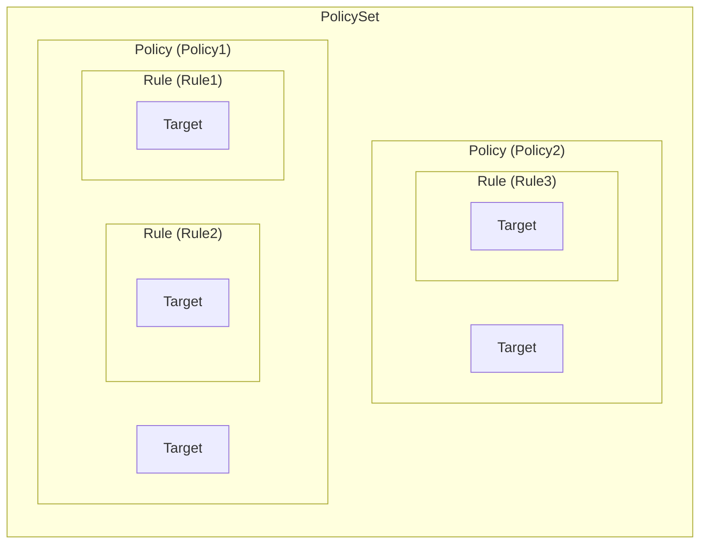
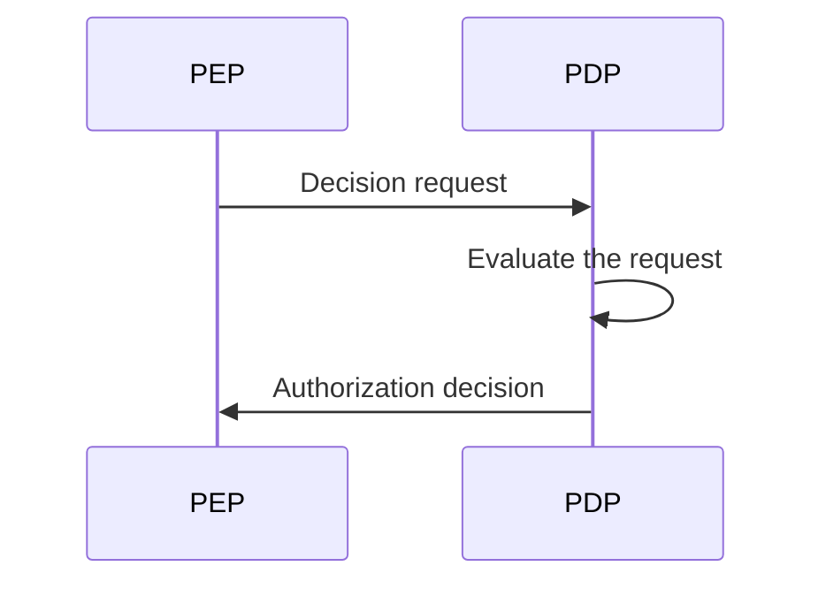
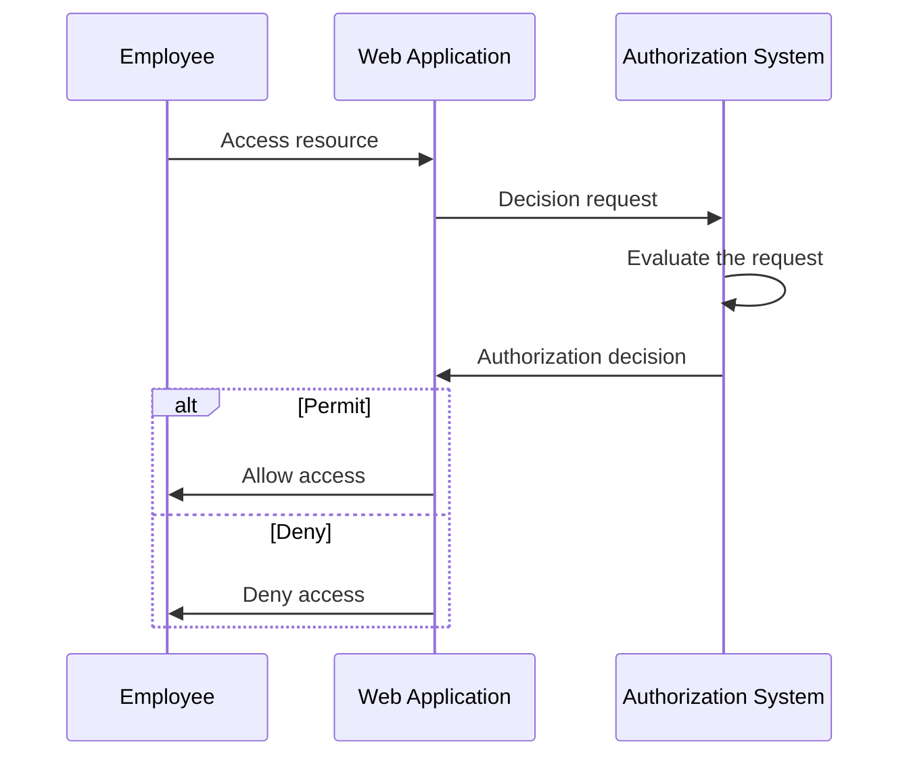
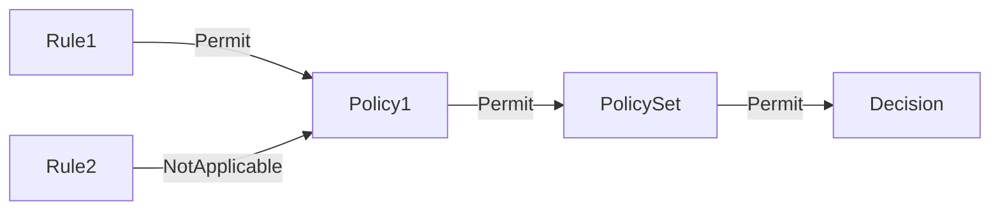
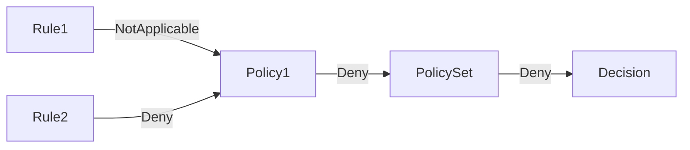

## What is XACML?

As the name suggests, eXtensible Access Control Markup Language (XACML) is an XML-based language that primarily used for access control. It is a standard defined by the Organization for the Advancement of Structured Information Standards (OASIS).

[XACML 3.0](https://docs.oasis-open.org/xacml/3.0/xacml-3.0-core-spec-os-en.html) is the latest version of the standard, which was released in 2013. While it does not specify a particular access control model, XACML is often used to implement <Ref slug="abac" /> policies. Let's see a simple example of how XACML can be used to represent ABAC policies:

```xml
<PolicySet PolicySetId="ABAC_Policies" PolicyCombiningAlgId="urn:oasis:names:tc:xacml:3.0:policy-combining-algorithm:deny-overrides">
  <Description>ABAC Policies</Description>
  <Policy PolicyId="Policy1" RuleCombiningAlgId="urn:oasis:names:tc:xacml:3.0:rule-combining-algorithm:deny-overrides">
    <Description>Employees can read data</Description>
    <Target>
      <AnyOf>
        <AllOf>
          <Match MatchId="urn:oasis:names:tc:xacml:1.0:function:string-equal">
            <AttributeValue DataType="http://www.w3.org/2001/XMLSchema#string">read</AttributeValue>
            <AttributeDesignator
              AttributeId="urn:oasis:names:tc:xacml:1.0:action:action-id"
              Category="urn:oasis:names:tc:xacml:3.0:attribute-category:action"
              DataType="http://www.w3.org/2001/XMLSchema#string"
              MustBePresent="true"
            />
          </Match>
        </AllOf>
      </AnyOf>
    </Target>
    <Rule RuleId="Rule1" Effect="Permit">
      <Target>
        <AnyOf>
          <AllOf>
            <Match MatchId="urn:oasis:names:tc:xacml:1.0:function:string-equal">
              <AttributeValue DataType="http://www.w3.org/2001/XMLSchema#string">employee</AttributeValue>
              <AttributeDesignator
                AttributeId="urn:oasis:names:tc:xacml:1.0:subject:subject-id"
                Category="urn:oasis:names:tc:xacml:1.0:subject-category:access-subject"
                DataType="http://www.w3.org/2001/XMLSchema#string"
                MustBePresent="true"
              />
            </Match>
          </AllOf>
        </AnyOf>
      </Target>
    </Rule>
    <Rule RuleId="Rule2" Effect="Deny">
      <Target>
        <AnyOf>
          <AllOf>
            <Match MatchId="urn:oasis:names:tc:xacml:1.0:function:string-equal">
              <AttributeValue DataType="http://www.w3.org/2001/XMLSchema#string">user</AttributeValue>
              <AttributeDesignator
                AttributeId="urn:oasis:names:tc:xacml:1.0:subject:subject-id"
                Category="urn:oasis:names:tc:xacml:1.0:subject-category:access-subject"
                DataType="http://www.w3.org/2001/XMLSchema#string"
                MustBePresent="true"
              />
            </Match>
          </AllOf>
        </AnyOf>
      </Target>
    </Rule>
  </Policy>
  <!-- ...other policies... -->
</PolicySet>
```

XACML does a good job on self-explanatory naming conventions. The language is designed to be human-readable and easy to understand.

In a nutshell, this policy states that employees are allowed to read data, and users are denied to read data. Let's break down the policy by analyzing the key components:

- `<PolicySet>`: The root element of the policy set. A `PolicySet` can contain multiple `Policy` and `PolicySet` elements, forming a hierarchy of policies.
- `<Policy>`: A policy that contains one or more rules. Each policy can have:
  - A `Target` element that specifies the conditions under which the policy applies.
  - Multiple `Rule` elements that define the access control rules.
  - A `RuleCombiningAlgId` attribute that specifies how the rules are combined to make a decision.
- `<Rule>`: A rule that defines the conditions under which access is granted or denied. Each rule has:
  - A `Target` element that specifies the conditions under which the rule applies.
  - An `Effect` attribute that specifies whether the rule permits or denies access.

> [!Note]
> The available components and attributes in XACML are not limited to the ones we just mentioned. Check out the [XACML 3.0 specification](https://docs.oasis-open.org/xacml/3.0/xacml-3.0-core-spec-os-en.html) for a complete list of elements and attributes.

A graphical representation of the relationship between the different key components is shown below:



A detailed explanation of other elements and attributes in the example will be provided in the upcoming sections.

## How XACML works

For simplicity, let's assume only one policy is defined in the above policy set. To trigger the policy evaluation process, a **decision request** needs to be sent from a **policy enforcement point (PEP)** to a **policy decision point (PDP)**. The PDP evaluates the request against the policy and returns an **authorization decision** to the PEP.



- PEP: The component that sends the decision request to the PDP and enforces the authorization decision (i.e. perform <Ref slug="access-control" />).
- PDP: The component that evaluates the decision request against the policy and returns the authorization decision.

Let's use a real-world example to replace the Shakespearean language. Suppose there is a web application that allows employees to access certain resources, and the application is integrated with an XACML-based authorization system.

When an employee tries to access a resource, the web application (**PEP**) sends a **decision request** to the authorization system (**PDP**). Once the authorization system evaluates the request against the XACML policy, it returns an **authorization decision** to the web application.



## Decision request

A decision request in XACML consists of the following key components:

- **Subject**: The entity requesting access to a resource. It can be a user, device, or any other entity.
- **Resource**: The resource being accessed. It can be a file, database, API endpoint, or any other resource.
- **Action**: The action being performed on the resource. It can be read, write, delete, or any other action.
- **Environment**: The context in which the access request is made. It can include information such as time of day, location, or any other contextual information.

Here is an example of a decision request in XACML:

```xml
<Request>
  <Attributes Category="urn:oasis:names:tc:xacml:3.0:attribute-category:resource">
    <Attribute AttributeId="urn:oasis:names:tc:xacml:1.0:resource:resource-id" DataType="http://www.w3.org/2001/XMLSchema#string">
      <AttributeValue>http://example.com/data</AttributeValue>
    </Attribute>
  </Attributes>
  <Attributes Category="urn:oasis:names:tc:xacml:3.0:attribute-category:action">
    <Attribute AttributeId="urn:oasis:names:tc:xacml:1.0:action:action-id" DataType="http://www.w3.org/2001/XMLSchema#string">
      <AttributeValue>read</AttributeValue>
    </Attribute>
  </Attributes>
  <Attributes Category="urn:oasis:names:tc:xacml:3.0:attribute-category:subject">
    <Attribute AttributeId="urn:oasis:names:tc:xacml:1.0:subject:subject-id" DataType="http://www.w3.org/2001/XMLSchema#string">
      <AttributeValue>employee</AttributeValue>
    </Attribute>
  </Attributes>
</Request>
```

## Evaluation process

Once the PDP retrieves the policy set, it evaluates the decision request as follows:

1. **Target matching**: For each policy, the PDP checks if the request matches the policy's target. If the request matches the target, the PDP proceeds to evaluate the rules.
2. **Rule evaluation**: The PDP evaluates each rule in the policy. If a rule's target matches the request, the PDP evaluates the rule's condition. If the condition evaluates to `true`, the PDP returns the rule's effect (permit or deny). If the condition evaluates to `false`, the PDP continues evaluating the next rule.
3. **Rule combining**: The PDP combines the effects of all the rules in the policy based on the policy's `RuleCombiningAlgId` attribute. The combined effect is then returned as the policy's decision.
4. **Policy combining**: If the policy set contains multiple policies, the PDP combines the decisions of all the policies based on the policy set's `PolicyCombiningAlgId` attribute. The combined decision is then returned as the final authorization decision.

### Example 1

For instance, in the example policy set, let's assume the decision request is as above. The PDP would evaluate the request against the `Policy1` policy as follows:

#### Target matching

The policy's `Target` specifies that any subject that has an action ID of `read` should be evaluated by the policy. Since the request's action is `read`, the request matches the policy's target.

#### Rule evaluation

The policy contains two rules:

1. `Rule1`: Since the request's subject ID is `employee`, the rule's condition evaluates to `true`, and the rule's effect is `Permit`.
2. `Rule2`: Since the request's subject ID is not `user`, the rule's condition evaluates to `false`, and the rule's effect is `NotApplicable`.

#### Rule and policy combining

- Since `Policy1` uses the `deny-overrides` rule-combining algorithm, the policy decision is `Permit` because `Rule1` permits access and its effect overrides the `NotApplicable` effect of `Rule2`.
- The policy set also uses the `deny-overrides` policy-combining algorithm, and the final decision is `Permit` because the policy decision is `Permit`.

Here's a non-normative graphical representation of the evaluation process:



### Example 2

Now, let's consider a different decision request where all other attributes are the same, but the subject ID is `user` instead of `employee`.

#### Target matching

Since action is unchanged, the request still matches the policy's target.

#### Rule evaluation

- `Rule1`: The request's subject ID is not `employee`, so the rule's condition evaluates to `false`, and the rule's effect is `NotApplicable`.
- `Rule2`: The request's subject ID is `user`, so the rule's condition evaluates to `true`, and the rule's effect is `Deny`.

#### Rule and policy combining

- The policy decision is `Deny` because `Rule2` denies access, and its effect overrides the `NotApplicable` effect of `Rule1`.
- The final decision is `Deny` because the policy set's `deny-overrides` policy-combining algorithm returns the most restrictive decision.

Here's a non-normative graphical representation of the evaluation process:



### Example 3

Lastly, let's consider a decision request where the action is `write` instead of `read`. All other attributes remain the same as in example 1.

#### Target matching

The request no longer matches the policy's target because the action is `write`, not `read`. Therefore, the policy is not evaluated.

#### Rule and policy combining

Since the policy is not evaluated, the final decision is `NotApplicable`.

Here's a non-normative graphical representation of the evaluation process:


## Combining algorithms

XACML defines several standard combining algorithms that determine how the effects of multiple rules or policies are combined to make a decision. In the examples above, we mentioned the `deny-overrides` combining algorithm for both rules and policies.

As the name suggests, the `deny-overrides` algorithm prioritizes `Deny` decisions over `Permit` decisions. Here's a simplified explanation of how the `deny-overrides` algorithm works:

- if any rule or policy denies access, the final decision is `Deny`; 
- if no rule or policy denies access, and AT LEAST one rule or policy permits access, the final decision is `Permit`;
- if no rule or policy denies access, and NO rule or policy permits access, the final decision is `NotApplicable`.

The actual algorithm is more complex and takes into account other "indeterminate" decisions such as `Indeterminate{D}` and `Indeterminate{P}`.

> [!Note]
> This algorithm does not provide a "fallback" decision in case no rule or policy matches the request. In such cases, the decision is `NotApplicable`.

For a complete list of combining algorithms and their behavior, refer to the [XACML 3.0 specification](https://docs.oasis-open.org/xacml/3.0/xacml-3.0-core-spec-os-en.html#_Toc325047268).

## Implementation considerations

XACML is a powerful language for expressing attribute-based access control policies. Before implementing XACML in your system, consider the following:

- Access control design: XACML is flexible and expressive, but it requires careful design since it can involve complex policy sets that may lead to unintended consequences.
- Complexity: XACML policies are often complex and can be challenging to manage. For most applications, simpler access control models like <Ref slug="rbac" /> may be more appropriate.
- Performance: Evaluating XACML policies can be computationally expensive, especially when dealing with large policy sets. Consider the performance implications of using XACML in your system.

<SeeAlso slugs={['abac', 'rbac', 'access-control', 'authorization']} />

<Resources
  urls={[
    'https://docs.oasis-open.org/xacml/3.0/xacml-3.0-core-spec-os-en.html',
  ]}
/>
