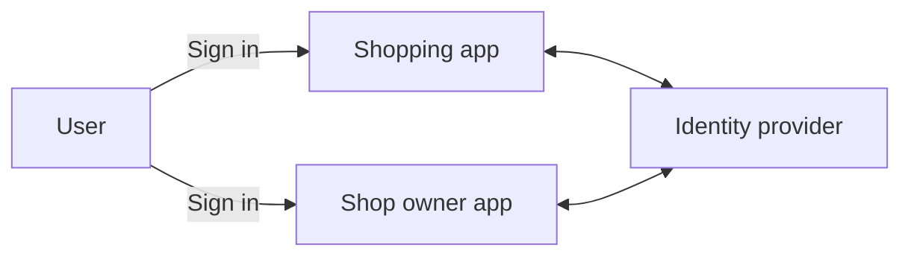
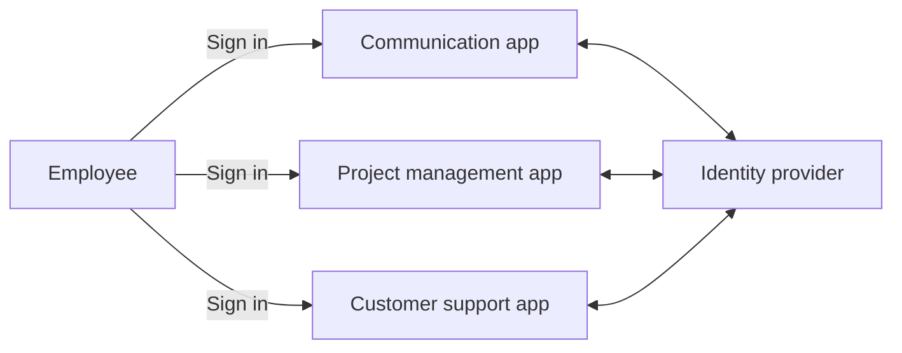
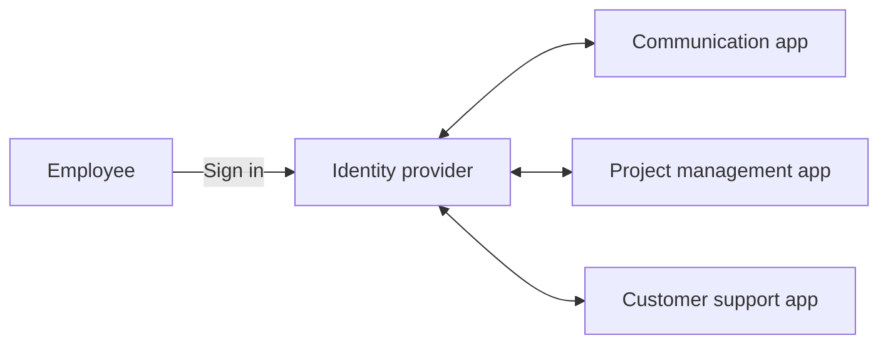
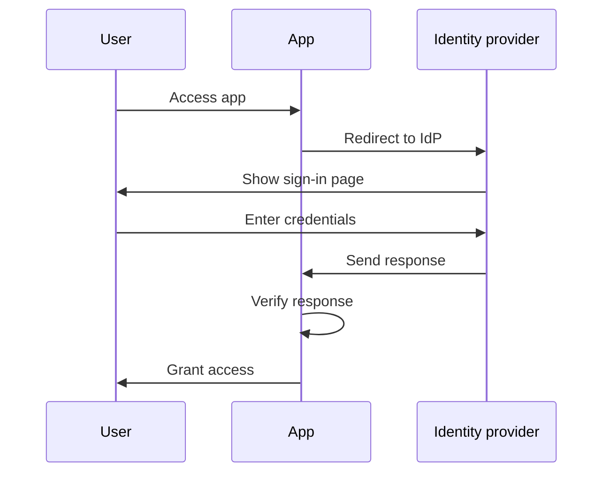
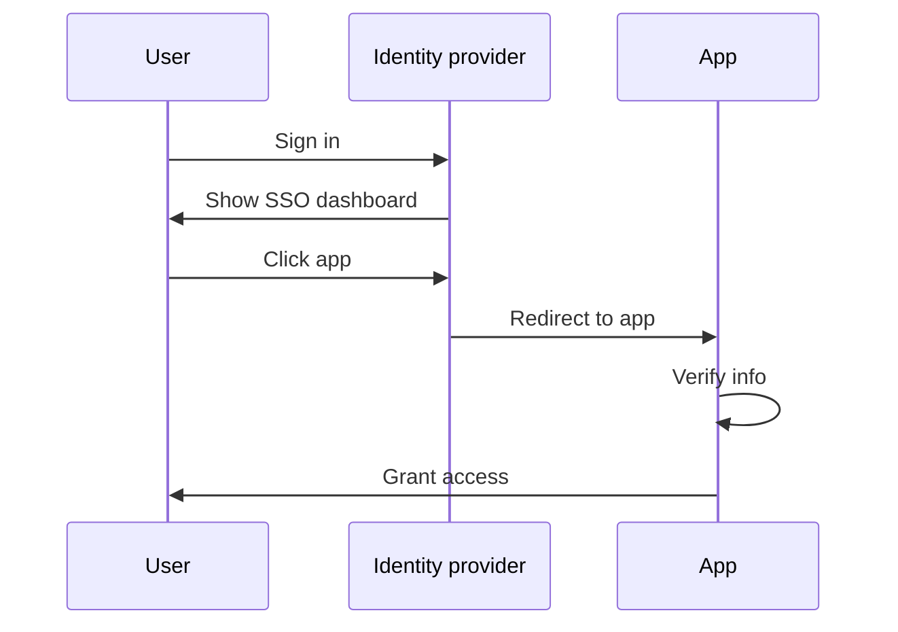
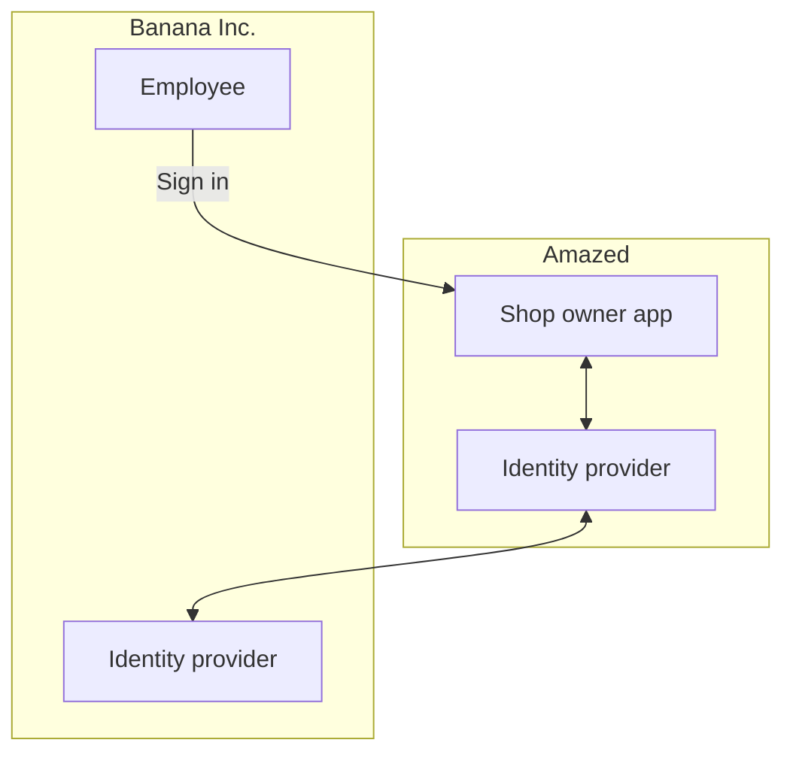

## What is Enterprise SSO?

Before diving into the definition, it's important to clarify the difference between SSO and Enterprise SSO, as this can often cause confusion.

- <Ref slug="single-sign-on" /> is a general term that refers to a user's ability to log in once and access multiple applications or resources without needing to log in again.
- Enterprise SSO is a specific type of SSO designed for employees within an organization.

Still unsure? Let’s look at an example:

An online shopping website called _Amazed_ has two web applications: one for customers and one for shop owners. Customers sign in to the shopping app to buy products, while shop owners sign in to the shop owner app to manage their stores. Both apps use the same identity provider for authentication. As a result, users only need to sign in once to access both apps, providing a Single Sign-On experience.

Internally, _Amazed_ uses multiple applications for team communication, project management, and customer support. To streamline daily workflows, _Amazed_ implements Enterprise SSO for its employees. With Enterprise SSO, employees can access all internal applications with a single login.

Typically, Enterprise SSO solutions also provide a centralized dashboard for employees to access all applications with one click. This dashboard is often called the SSO dashboard.

In short, both scenarios are examples of Single Sign-On. The difference is that the first example is a generic SSO, while the second is Enterprise SSO. These are typical use cases for Customer IAM (Identity and Access Management) and Workforce IAM, respectively.

## How does Enterprise SSO work?

Enterprise SSO works by connecting multiple applications to a centralized identity provider. The connection can be one-way (from the application to the identity provider) or two-way (between the application and the identity provider). Various standards and protocols, such as SAML, OpenID Connect, and OAuth 2.0, are used for these connections.

Regardless of the protocol, the basic workflow is usually similar:

1. The user accesses an application (e.g., communication app) that requires authentication.
2. The application redirects the user to the identity provider for authentication.
3. The user logs in to the identity provider.
4. The identity provider sends an authentication response back to the application.
5. The application verifies the response and grants the user access.

When the user accesses another application (e.g., project management app) connected to the same identity provider, they are automatically logged in without needing to enter their credentials again. In this case, step 3 is skipped, and since steps 2, 4, and 5 occur in the background, the user may not even notice the authentication process.

This process is called Service Provider (SP)-Initiated SSO, where the application (SP) initiates the authentication process.

In another scenario, the identity provider provides a centralized dashboard for users to access all connected applications. A simplified workflow is:

1. The user logs in to the identity provider.
2. The identity provider displays a list of applications that the user can access.
3. The user clicks on an application (e.g., customer support app) to access it.
4. The identity provider redirects the user to the application with authentication information.
5. The application verifies the information and grants the user access.

This process is called Identity Provider (IdP)-Initiated SSO, where the identity provider (IdP) initiates the authentication process.

## Why does Enterprise SSO matter?

### Enterprise SSO in Workforce IAM

#### Centralized management

The primary benefit of Enterprise SSO is not only convenience for employees but also enhanced security and compliance for organizations. Instead of managing multiple credentials for different applications and configuring authentication and authorization separately for each one, organizations can centralize the management of user identities, access control policies, and audit logs.

For example, when an employee leaves the company, the IT department can disable the employee's account in the identity provider, immediately revoking access to all applications. This is crucial for preventing unauthorized access and data breaches, a process known as lifecycle management.

#### Access control

Enterprise SSO solutions often include access control features, such as role-based access control (RBAC) and attribute-based access control (ABAC). These features allow organizations to define detailed access policies based on user roles, attributes, and other contextual information, ensuring that employees have the right level of access to the right resources.

For a detailed comparison between RBAC and ABAC, check out [RBAC and ABAC: The access control models you should know](https://blog.logto.io/rbac-and-abac).

#### Enhanced security

Another benefit is the ability to enforce strong authentication methods, such as multi-factor authentication (MFA), passwordless authentication, and adaptive authentication, across all applications. These methods help protect sensitive data and comply with industry regulations.

For more information on MFA, refer to [Exploring MFA: Looking at authentication from a product perspective](https://blog.logto.io/elaborate-mfa).

### Enterprise SSO in Customer IAM

The term "Enterprise SSO" also appears in Customer IAM solutions. What does it mean in this context? Let’s revisit the _Amazed_ example: Some shop owners are incorporated as businesses. One shop owner, _Banana Inc._, implements Enterprise SSO for its employees. As part of the agreement, _Banana Inc._ requires _Amazed_ to enforce Enterprise SSO for all email addresses from _Banana Inc._ (e.g., `*@banana.com`) when accessing the shop owner app.

In this case, _Amazed_ needs to integrate its identity provider with _Banana Inc._'s identity provider to enable Enterprise SSO for _Banana Inc._ employees. This integration, often done through standard protocols like SAML, OpenID Connect, or OAuth, is commonly referred to as Enterprise SSO connection, Enterprise SSO connector, or SSO federation.

For an in-depth explanation of Customer IAM, check out the CIAM series:

- [CIAM 101: Authentication, Identity, SSO](https://blog.logto.io/ciam-101-intro-authn-sso)
- [CIAM 102: Authorization & Role-Based Access Control](https://blog.logto.io/ciam-102-authz-and-rbac)

#### Be enterprise-ready

In B2B (business-to-business) scenarios, Enterprise SSO is a must-have feature for SaaS providers like _Amazed_ to support their enterprise customers. It’s not just about convenience; it’s about security and compliance for both parties. Enterprise SSO can enforce all identities managed by the enterprise customer to authenticate through the enterprise identity provider, ensuring that the enterprise maintains control over its users, data, access and security policies.

Enterprise SSO is a key factor in achieving _enterprise readiness_, meaning the ability to meet the needs of enterprise customers. However, identity and access management, especially in the context of enterprise customers, is complex and requires significant investment in time, resources, and expertise. Modern SaaS providers often choose IAM platforms to handle these complexities.

<SeeAlso slugs={['single-sign-on']} />
