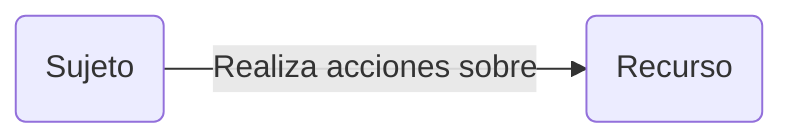
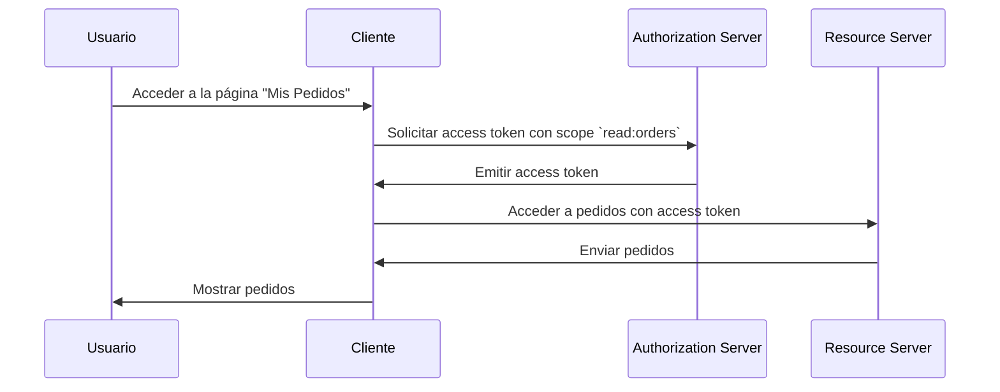

## ¿Qué es el control de acceso (Access control)?

El control de acceso (Access control) involucra tres componentes principales:

- **Sujeto**: Una entidad que realiza acciones sobre recursos. Los sujetos pueden ser usuarios, servicios o dispositivos.
- **Recurso**: Una entidad que está protegida por el control de acceso. Los recursos pueden ser archivos, bases de datos, APIs u otros activos digitales.
- **Acción**: Una operación que un sujeto puede realizar sobre un recurso. Las acciones pueden ser leer, escribir, ejecutar u cualquier otra operación.

> El control de acceso (Access control) define la restricción selectiva de acceso a **recursos** basada en el **sujeto** y la **acción**.

Aquí hay algunos ejemplos del mundo real de control de acceso (Access control):

- Un usuario (sujeto) **puede** leer (acción) sus pedidos (recurso) en un sistema de comercio electrónico.
- Un usuario (sujeto) **no puede** eliminar (acción) el perfil de otro usuario (recurso) en una red social.
- Un servicio (sujeto) **puede** escribir (acción) datos en una base de datos (recurso) en una arquitectura de microservicios.

A veces, el recurso se ignora en implementaciones técnicas y el control de acceso (Access control) se define como la restricción de quién (sujeto) puede realizar qué acciones. Por ejemplo, el marco básico de OAuth 2.0 solo especifica acciones utilizando scopes (permisos) y no define recursos.

El soporte para el control de acceso (Access control) puede variar dependiendo del <Ref slug="authorization-server" /> o el <Ref slug="identity-provider" />. Algunos sistemas pueden soportar [Resource Indicators for OAuth 2.0](https://datatracker.ietf.org/doc/html/rfc8707), una extensión de OAuth 2.0 que permite a los clientes especificar los recursos a los que desean acceder.

## Modelos de control de acceso (Access control) ||access-control-models||

Decidir restricciones entre unos pocos sujetos y recursos es simple, pero no escalable. Por lo tanto, la industria ha desarrollado muchos modelos de control de acceso (Access control) para gestionarlo de manera efectiva. En el contexto de <Ref slug="iam" />, los siguientes son algunos modelos comunes de control de acceso (Access control):

- <Ref slug="rbac" />: Un modelo que asigna permisos a roles y luego asigna roles a sujetos. Por ejemplo, un rol de administrador podría tener acceso a todos los recursos, mientras que un rol de usuario podría tener acceso a recursos limitados.
- <Ref slug="abac" />: Un modelo que utiliza atributos (propiedades) del sujeto, recurso y entorno para tomar decisiones de control de acceso (Access control). Por ejemplo, un usuario con el atributo "departamento=ingeniería" podría tener acceso a recursos de ingeniería.

También existen otros modelos de control de acceso (Access control) como [control de acceso basado en políticas (PBAC)](https://csrc.nist.gov/glossary/term/policy_based_access_control). Cada modelo tiene sus propias fortalezas y debilidades, y la elección del modelo depende de tu caso de uso y requisitos.

## Control de acceso (Access control) en OAuth 2.0

En el contexto de OAuth 2.0, el control de acceso (Access control) se implementa típicamente usando <Ref slug="scope">scopes</Ref>. Normalmente, el valor de un scope es una cadena que combina el recurso y la acción. Por ejemplo, `read:orders` o `write:profile`.

> [!Note]
> El término "scopes" es intercambiable con "permissions" en la mayoría de los casos.

Vale la pena destacar que OAuth 2.0 no define la estructura y el significado de los scopes. La interpretación de los scopes se deja al <Ref slug="resource-server" />, y la emisión de scopes se deja al <Ref slug="authorization-server" />.

Por ejemplo, un usuario (sujeto) necesita acceder a sus pedidos (recurso) en un sistema de comercio electrónico. Al aprovechar OAuth 2.0, puedes definir un scope `read:orders` y una aplicación web (cliente) solicitará este scope desde el servidor de autorización. Aquí hay un flujo simplificado:

En este flujo, dependiendo de la arquitectura técnica, el servidor de recursos puede ser un servicio API o puede ser el cliente (aplicación web) en sí, siempre y cuando tenga la capacidad de acceder al recurso (pedidos).

### El parámetro de indicador de recurso (resource indicator)

Aunque las personas a menudo definen scopes con recurso y acción (por ejemplo, `read:orders`, donde `orders` es el recurso y `read` es la acción), la escalabilidad de este enfoque es limitada cuando la cantidad de recursos y acciones crece. RFC 8707 introduce el parámetro `resource` (es decir, <Ref slug="resource-indicator">indicadores de recurso</Ref>) a OAuth 2.0, lo que permite a los clientes especificar los recursos a los que desean acceder.

El RFC especifica que el parámetro `resource` debe ser un URI que represente el recurso. Por ejemplo, en lugar de simplemente usar `orders`, podrías usar `https://api.example.com/orders`. Este método ayuda a evitar conflictos de nombres y mejora la precisión de la coincidencia de recursos al permitir el uso de la URL real del recurso.

### Soporte del servidor de autorización (authorization server)

OAuth 2.0 no define cómo debe llevar a cabo el control de acceso (Access control) el servidor de autorización (authorization server). Deja los detalles de implementación a discreción del servidor de autorización (authorization server). Por lo tanto, la elección del servidor de autorización puede afectar en gran medida el mecanismo de control de acceso (Access control). Por ejemplo, algunos servidores de autorización pueden soportar indicadores de recurso, mientras que otros no. Es importante decidir qué modelo de control de acceso (Access control) utilizar en función de tus requisitos empresariales y luego elegir un servidor de autorización que soporte ese modelo. Si no estás seguro sobre el modelo de control de acceso (Access control), <Ref slug="rbac" /> es suficiente para la mayoría de los casos.

<SeeAlso slugs={["rbac", "abac", "resource-indicator", "authorization"]} />

<Resources
  urls={[
    "https://blog.logto.io/mastering-rbac",
    "https://blog.logto.io/rbac-and-abac",
    "https://datatracker.ietf.org/doc/html/rfc8707",
    "https://blog.logto.io/organization-and-role-based-access-control",
  ]}
/>
