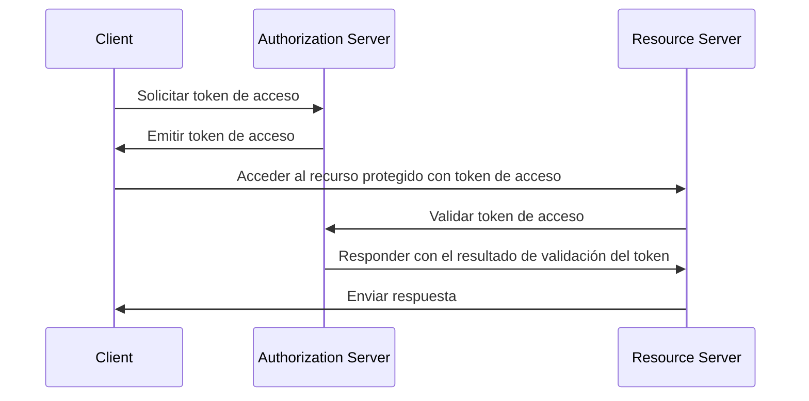
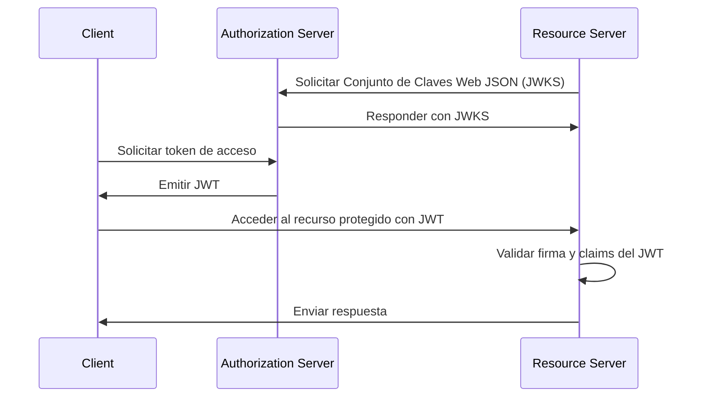
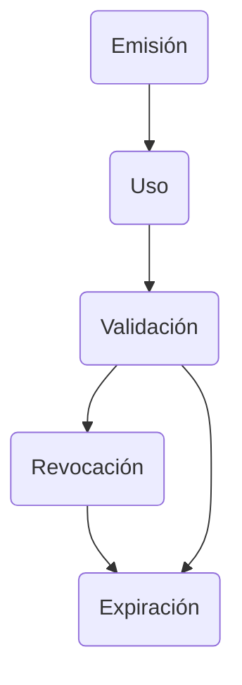

## ¿Qué es un token de acceso (access token)?

Un token de acceso (access token) es una credencial, típicamente una cadena de caracteres, que se utiliza para acceder a recursos protegidos. En el contexto de OAuth 2.0 y OpenID Connect (OIDC), los <Ref slug="authorization-server">servidores de autorización (authorization server)</Ref> pueden emitir tokens de acceso (access tokens) a clientes (aplicaciones) después de una autenticación y autorización exitosas.

Aunque los RFCs para OAuth 2.0 y OIDC no especifican los detalles de implementación de los tokens de acceso (access tokens), hay dos tipos comunes de tokens de acceso utilizados en la práctica:

- <Ref slug="opaque-token" />: Una cadena aleatoria que no tiene significado ("opaca") para el cliente. El cliente presenta el token al servidor de recursos, que valida el token con el servidor de autorización.
- <Ref slug="jwt" />: Un token autónomo que contiene <Ref slug="claim">claims</Ref> (por ejemplo, ID de usuario, tiempo de expiración) con una firma digital. El servidor de recursos puede validar el token sin hacer una solicitud adicional al servidor de autorización.

## ¿Cómo funciona un token de acceso (access token)?

Dependiendo del tipo de token de acceso, el flujo de uso de un token de acceso puede variar.

Aquí hay un ejemplo simplificado de uso de un token de acceso opaco:

Aquí hay un ejemplo simplificado de uso de un JWT:

La diferencia entre los dos tipos de tokens de acceso es cómo el servidor de recursos valida el token:

- El servidor de recursos debe hacer una solicitud adicional al servidor de autorización para validar un token opaco cada vez que recibe un token.
- El servidor de recursos puede validar un JWT sin hacer una solicitud adicional al servidor de autorización porque el token contiene toda la información necesaria y el servidor de recursos puede almacenar en caché la clave pública del Conjunto de Claves Web JSON (JWKS) del servidor de autorización.

Los tokens de acceso suelen tener una vida corta y un tiempo de expiración (por ejemplo, 1 hora). Los clientes deben solicitar un nuevo token de acceso cuando el token actual expire.

## ¿Qué tipo de token debería usar?

La elección entre un token opaco y un JWT depende del caso de uso y los requisitos de seguridad de la aplicación. Aquí tienes una comparación de los dos tipos de tokens:

|                | Token Opaco                | JWT                                                           |
|----------------|----------------------------|---------------------------------------------------------------|
| Formato        | Cadena aleatoria           | Objetos JSON autónomos                                        |
| Rendimiento    | Requiere una solicitud adicional | Validación más rápida                                        |
| Autónomo       | No                         | Sí                                                            |
| Tamaño del token| Más pequeño                | Más grande                                                    |
| Revocación     | Instantánea                | Requiere expiración del token o interacción con el servidor de autorización |
| Extensibilidad | Limitada                   | Claims personalizados                                         |
| Sin estado     | No                         | Sí                                                            |
| Seguridad      | Requiere validación del token | Requiere validación de firma                                  |
| Estándar       | No                         | Sí (RFC 7519)                                                 |

Para más información sobre la elección entre los dos tipos de tokens, consulta [Token opaco vs JWT](https://blog.logto.io/opaque-token-vs-jwt).

## Los roles del servidor de autorización y el servidor de recursos

En la mayoría de los casos, el <Ref slug="authorization-server" /> tiene las siguientes responsabilidades:

- Emite tokens de acceso (access tokens) a los clientes después de una autenticación y autorización exitosa. El servidor de autorización puede reducir (limitar los scopes a un subconjunto) o rechazar la solicitud de token basado en las políticas de control de acceso (por ejemplo, consentimiento del usuario, <Ref slug="rbac" />, <Ref slug="abac" />).
- Verifica si el token de acceso (access token) fue emitido por el servidor de autorización y no está vencido o revocado (<Ref slug="token-introspection" />).
- Proporciona la información sobre el token (por ejemplo, scopes, tiempo de expiración) a través de la introspección del token o el <Ref slug="userinfo-endpoint" />.

Puedes notar que el servidor de autorización no interpreta el significado del token de acceso. Por ejemplo, el token de acceso puede contener un scope `read:orders`, pero el servidor de autorización no sabe qué significa el scope. El servidor de recursos es responsable de interpretar el token de acceso y de hacer cumplir el <Ref slug="access-control" /> basado en los scopes del token. Es decir, el <Ref slug="resource-server" /> generalmente tiene las siguientes responsabilidades:

- Valida los <Ref slug="claim">claims</Ref> en el token de acceso (por ejemplo, tiempo de expiración, indicador de recursos, scopes).
- Hace cumplir el control de acceso basado en los claims del token (generalmente scopes).
- Proporciona los recursos protegidos si el token de acceso es válido.

## Ciclo de vida del token de acceso

El ciclo de vida de un token de acceso típicamente involucra las siguientes etapas:

<SeeAlso slugs={['opaque-token', 'jwt', 'token-introspection', 'userinfo-endpoint', 'access-control']} />

<Resources
  urls={[
    "https://blog.logto.io/opaque-token-vs-jwt",
    "https://blog.logto.io/oauth2-token-introspection",
    "https://blog.logto.io/understanding-tokens-in-oidc",
    {
      url: "https://datatracker.ietf.org/doc/html/rfc6749#section-1.4",
      result: {
        ogTitle: "OAuth 2.0 Access Token",
      },
    },
    "https://datatracker.ietf.org/doc/html/rfc7662",
  ]}
/>