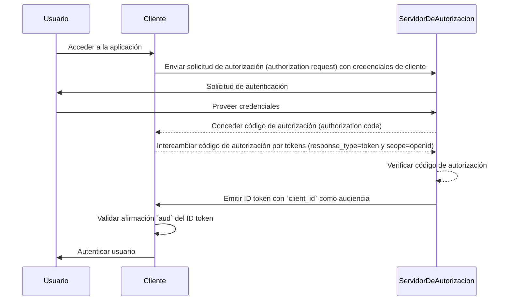
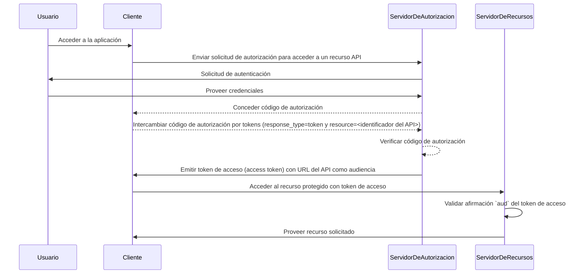

## ¿Qué es audiencia (audience)?

En el contexto de autenticación (authentication) y autorización (authorization), la audiencia (audience) es un componente clave que define a los destinatarios previstos de un token de autorización (authorization token). Referido como la afirmación [aud](https://datatracker.ietf.org/doc/html/rfc7519#section-4.1.3) en <Ref slug="jwt" />, esta afirmación asegura que el token solo sea aceptado por el servicio o aplicación designada. Típicamente, la afirmación de audiencia contiene ya sea el client_id de la aplicación para la cual se destina el token o una URL que representa el API o recurso al que el token está autorizado a acceder. Al especificar la audiencia, sirve como un control de seguridad para prevenir el uso indebido por servicios o usuarios no autorizados.

## ¿Cómo funciona la audiencia (audience)?

Cuando un cliente solicita un token de acceso (access token) a un servidor de autorización (authorization server), la afirmación de audiencia se incluye en la respuesta del token. Este valor de audiencia se valida luego por el servidor de recursos cuando se presenta el token. El servidor de recursos verifica si la afirmación de audiencia en el token coincide con su propio identificador o el identificador del servicio que está protegiendo. Si no coincide, el token será rechazado, mejorando la seguridad en sistemas distribuidos, especialmente en escenarios que involucran múltiples microservicios o APIs. Al controlar la afirmación de audiencia, los desarrolladores pueden asegurar que los tokens se usen en el contexto correcto, añadiendo una capa adicional de protección a los flujos de trabajo de autenticación y autorización de su aplicación.

- **Solicitante**: La aplicación cliente especifica el valor de audiencia al solicitar un token.
- **Emisor (Issuer)**: El servidor de autorización incluye la afirmación de audiencia en la respuesta del token.
- **Verificador**: El destinatario del token verifica la afirmación de audiencia contra su propio identificador. Si la afirmación de audiencia coincide con el identificador del destinatario, el token se considera válido. De lo contrario, es rechazado.

## Ejemplo de audiencia en JWT

### Afirmación de audiencia en un ID token de OpenID Connect (OIDC)

```json
{
  "header": {
    "alg": "RS256",
    "typ": "JWT",
    "kid": "abc123"
  },
  "payload": {
    "iss": "https://auth.logto.io",
    "sub": "test_user",
    "aud": "client_id_foo",
    "exp": 1516239022,
    "iat": 1516239022,
    "nonce": "n-0S6_WzA2Mj",
    "primary_email": "foo@logto.io",
    "email_verified": true,
    "username": "foo"
  },
  "signature": "..."
}
```

Un <Ref slug="id-token" /> en OpenID Connect (OIDC) es un token de seguridad que contiene información sobre el usuario autenticado, entregado a la aplicación cliente después de una autenticación exitosa. A diferencia de los tokens de acceso (access tokens), que se utilizan para otorgar permiso para acceder a recursos, los ID tokens están específicamente diseñados para transmitir información de identidad del usuario a la parte confiada (cliente). Estos tokens están típicamente codificados como JWTs (JSON Web Tokens) e incluyen afirmaciones tales como el identificador del usuario (sub claim), el emisor (iss claim), y la audiencia (aud claim), entre otros.

En este caso, la afirmación `aud` especifica la audiencia prevista para el ID token, que es la aplicación cliente. El valor de la afirmación `aud` usualmente corresponde al `client_id` de la aplicación que solicitó el token. Cuando la aplicación cliente recibe el ID token, puede verificar la afirmación de audiencia para asegurar que el token fue emitido para su consumo. Este paso de validación ayuda a prevenir el uso indebido del token y el acceso no autorizado a la información del usuario, mejorando la seguridad del proceso de autenticación.



### Afirmación de audiencia en un token de acceso

```json
{
  "header": {
    "alg": "RS256",
    "typ": "JWT",
    "kid": "abc123"
  },
  "payload": {
    "iss": "https://auth.logto.io",
    "sub": "test_user",
    "aud": "https://example.logto.app/api/users",
    "exp": 1516239022,
    "iat": 1516239022,
    "scope": "read write",
    "client_id": "client_id_foo"
  },
  "signature": "..."
}
```

A diferencia de los ID tokens, los tokens de acceso (access tokens) se utilizan para autorizar el acceso a recursos protegidos, como APIs o servicios. La afirmación `aud` en un token de acceso especifica el destinatario previsto del token, que es típicamente el API o servicio que el token tiene autorización para acceder. Típicamente, el servidor de recursos que aloja el API tiene un dominio diferente al de la aplicación cliente que solicitó el token. En este caso, en lugar de un `client_id`, la afirmación `aud` contiene la URL del punto final del API al que está destinado el token. Esta URL es conocida como el indicador de recurso o identificador del API que identifica de manera única el recurso objetivo.

Cuando el servidor de recursos recibe un token de acceso, valida la afirmación `aud` para asegurar que el token está destinado a su consumo. Al verificar la audiencia, el servidor de recursos puede prevenir el acceso no autorizado a sus recursos y aplicar políticas de control de acceso (access control) basadas en la audiencia prevista del token. Este mecanismo ayuda a proteger datos sensibles y asegura que los tokens de acceso se utilicen en el contexto adecuado, mejorando la seguridad del sistema en general.



## Preguntas frecuentes

### ¿Por qué es importante la afirmación de audiencia (audience claim) en la validación de tokens?

La afirmación de audiencia (audience claim) es crucial en la validación de tokens porque asegura que el token solo sea aceptado por el destinatario previsto. Al verificar la afirmación de audiencia, el destinatario puede prevenir el uso indebido del token y el acceso no autorizado a los recursos. Este control de seguridad es particularmente importante en sistemas distribuidos donde múltiples servicios interactúan entre sí, ya que ayuda a aplicar políticas de control de acceso y proteger datos sensibles.

### ¿Puede un token tener múltiples audiencias?

Por razones de seguridad, se recomienda que un token tenga una única audiencia para prevenir ambigüedades y asegurar que el token se use en el contexto correcto. Sin embargo, algunos escenarios pueden requerir tokens con múltiples audiencias, como cuando un token está destinado a múltiples servicios o APIs dentro del mismo dominio. En tales casos, los desarrolladores deben considerar cuidadosamente las implicaciones de usar tokens con múltiples audiencias e implementar medidas de seguridad apropiadas para mitigar los riesgos potenciales.

### ¿Qué debo usar como identificador de mi API en la afirmación de audiencia?

Al especificar la afirmación de audiencia en un token de acceso que representa un API o servicio, se recomienda usar un URI absoluto que identifique de manera única el recurso. Este URI puede ser la URL base del punto final del API o una ruta específica del recurso al que el token está autorizado a acceder. Al usar un URI como identificador del API, puedes asegurarte de que la afirmación de audiencia no sea ambigua y represente con precisión al destinatario previsto del token.