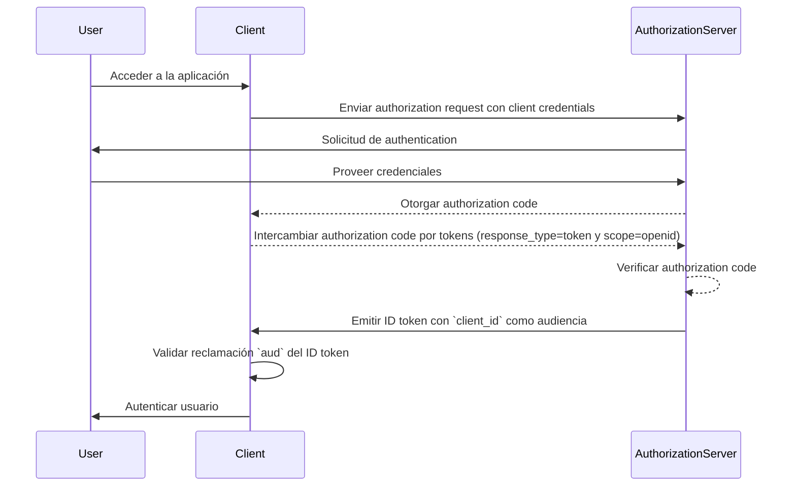
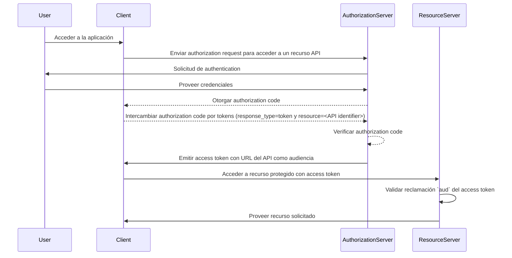

## ¿Qué es la audiencia (audience)?

En el contexto de <Ref slug="authentication" /> y <Ref slug="authorization" />, la audiencia (audience) es un componente clave que define los destinatarios previstos de un token de autorización. Referido como la reclamación [aud](https://datatracker.ietf.org/doc/html/rfc7519#section-4.1.3) en <Ref slug="jwt" />, esta reclamación asegura que el token solo sea aceptado por el servicio o aplicación designado. Típicamente, la reclamación de audiencia contiene ya sea el client_id de la aplicación para la cual está destinado el token o una URL que representa el API o recurso al que el token está autorizado a acceder. Al especificar la audiencia, sirve como un control de seguridad para prevenir el uso indebido por servicios o usuarios no autorizados.

## ¿Cómo funciona la audiencia (audience)?

Cuando un cliente solicita un <Ref slug="access-token" /> de un authorization server, la reclamación de audiencia se incluye en la respuesta del token. Este valor de audiencia es luego validado por el resource server cuando se presenta el token. El resource server verifica si la reclamación de audiencia en el token coincide con su propio identificador o el identificador del servicio que está protegiendo. Si no coincide, el token será rechazado, mejorando la seguridad en sistemas distribuidos, particularmente en escenarios que involucran múltiples microservicios o APIs. Al controlar la reclamación de audiencia, los desarrolladores pueden asegurar que los tokens se usen en el contexto correcto, añadiendo una capa adicional de protección a los flujos de authentication y authorization de su aplicación.

- **Solicitante**: La aplicación cliente especifica el valor de audiencia al solicitar un token.
- **Emisor**: El authorization server incluye la reclamación de audiencia en la respuesta del token.
- **Verificador**: El destinatario del token verifica la reclamación de audiencia contra su propio identificador. Si la reclamación de audiencia coincide con el identificador del destinatario, el token se considera válido. De lo contrario, se rechaza.

## Ejemplo de audiencia en JWT

### Reclamación de audiencia en un ID token de OpenID Connect (OIDC)

```json
{
  "header": {
    "alg": "RS256",
    "typ": "JWT",
    "kid": "abc123"
  },
  "payload": {
    "iss": "https://auth.logto.io",
    "sub": "test_user",
    "aud": "client_id_foo",
    "exp": 1516239022,
    "iat": 1516239022,
    "nonce": "n-0S6_WzA2Mj",
    "primary_email": "foo@logto.io",
    "email_verified": true,
    "username": "foo"
  },
  "signature": "..."
}
```

Un <Ref slug="id-token" /> en <Ref slug="openid-connect" /> es un token de seguridad que contiene información sobre el usuario autenticado, entregado a la aplicación cliente después de una authentication exitosa. A diferencia de los access tokens, que se utilizan para otorgar permiso para acceder a recursos, los ID tokens están diseñados específicamente para transmitir información de identidad del usuario a la parte que confía (cliente). Estos tokens suelen estar codificados como JWTs e incluyen reclamaciones como el identificador del usuario (reclamación sub), el emisor (reclamación iss) y la audiencia (reclamación aud), entre otros.

En este caso, la reclamación `aud` especifica la audiencia prevista para el ID token, que es la aplicación cliente. El valor de la reclamación `aud` generalmente corresponde al `client_id` de la aplicación que solicitó el token. Cuando la aplicación cliente recibe el ID token, puede verificar la reclamación de audiencia para asegurarse de que el token fue emitido para su consumo. Este paso de validación ayuda a prevenir el uso indebido del token y el acceso no autorizado a la información del usuario, mejorando la seguridad del proceso de authentication.



### Reclamación de audiencia en un access token

```json
{
  "header": {
    "alg": "RS256",
    "typ": "JWT",
    "kid": "abc123"
  },
  "payload": {
    "iss": "https://auth.logto.io",
    "sub": "test_user",
    "aud": "https://example.logto.app/api/users",
    "exp": 1516239022,
    "iat": 1516239022,
    "scope": "read write",
    "client_id": "client_id_foo"
  },
  "signature": "..."
}
```

A diferencia del ID token, los <Ref slug="access-token" /> se utilizan para autorizar el acceso a recursos protegidos, como APIs o servicios. La reclamación `aud` en un access token especifica el destinatario previsto del token, que típicamente es el API o servicio al que el token está autorizado a acceder. Típicamente, el resource server que aloja el API tiene un dominio diferente de la aplicación cliente que solicitó el token. En este caso, en lugar de un `client_id`, la reclamación `aud` contiene la URL del endpoint del API para el cual está destinado el token. Esta URL a menudo se conoce como el resource indicator o API identifier que identifica de manera única el recurso objetivo.

Cuando el resource server recibe un access token, valida la reclamación `aud` para asegurarse de que el token está destinado para su consumo. Al verificar la audiencia, el resource server puede prevenir el acceso no autorizado a sus recursos y hacer cumplir las políticas de access control basadas en la audiencia prevista del token. Este mecanismo ayuda a proteger datos sensibles y asegura que los access tokens se utilicen en el contexto apropiado, mejorando la seguridad del sistema en general.



## Preguntas frecuentes

### ¿Por qué es importante la reclamación de audiencia en la validación de tokens?

La reclamación de audiencia es crucial en la validación de tokens porque asegura que el token solo sea aceptado por el destinatario previsto. Al verificar la reclamación de audiencia, el destinatario puede prevenir el uso indebido del token y el acceso no autorizado a los recursos. Este control de seguridad es particularmente importante en sistemas distribuidos donde múltiples servicios interactúan entre sí, ya que ayuda a hacer cumplir las políticas de access control y proteger datos sensibles.

### ¿Puede un token tener múltiples audiencias?

Por razones de seguridad, se recomienda que un token tenga una sola audiencia para prevenir ambigüedades y asegurar que el token se use en el contexto correcto. Sin embargo, algunos escenarios pueden requerir tokens con múltiples audiencias, como cuando un token está destinado a múltiples servicios o APIs dentro del mismo dominio. En tales casos, los desarrolladores deben considerar cuidadosamente las implicaciones de usar tokens de múltiples audiencias e implementar medidas de seguridad apropiadas para mitigar riesgos potenciales.

### ¿Qué debo usar como mi API identifier en la reclamación de audiencia?

Al especificar la reclamación de audiencia en un access token que representa un API o servicio, se recomienda usar un URI absoluto que identifique de manera única el recurso. Este URI puede ser la URL base del endpoint del API o una ruta de recurso específica a la que el token está autorizado a acceder. Al usar un URI como el API identifier, puedes asegurar que la reclamación de audiencia sea inequívoca y represente con precisión el destinatario previsto del token.