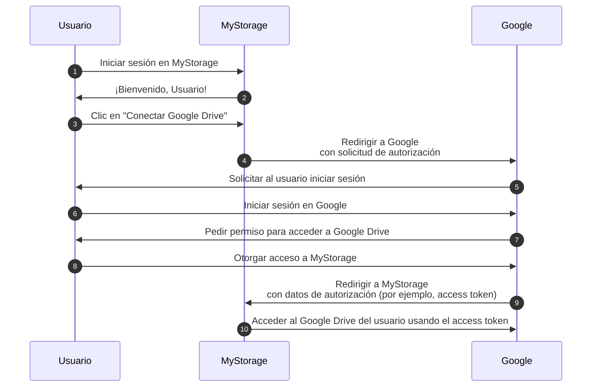

## Auth

Esta página es una desambiguación para el término "auth". A menudo se utiliza como una abreviatura para:

- <Ref slug="authentication" />: El proceso de verificar la propiedad de la identidad (por ejemplo, usuario o servicio). Responde a la pregunta "¿Qué identidad posees?"
- <Ref slug="authorization" />: El proceso de determinar qué acciones puede realizar una identidad sobre un recurso. Responde a la pregunta "¿Qué puedes hacer?"

> [!Note]
> A veces, authentication (autenticación) y authorization (autorización) se refieren como "AuthN" y "AuthZ", respectivamente.

Estos dos conceptos son esenciales en el ámbito de <Ref slug="iam" />, pero son fundamentalmente diferentes. Veamos un ejemplo: Una aplicación web MyStorage tiene la capacidad de subir archivos y conectarse a Google Drive. Un flujo de usuario típico sería:

En este flujo, el usuario realiza dos pasos de authentication (autenticación): uno con MyStorage (paso 1) y otro con Google (paso 6); y un paso de authorization (autorización): otorgar acceso a Google Drive (paso 8).

## ¿A cuál te refieres?

Cuando ves el término "auth", es importante aclarar si se refiere a authentication (autenticación) o authorization (autorización); de lo contrario, podrías esperar que ambos procesos estén cubiertos (tal como lo hace este sitio web).

<SeeAlso slugs={["authentication", "authorization", "iam", "oauth-2.0", "openid-connect"]} />