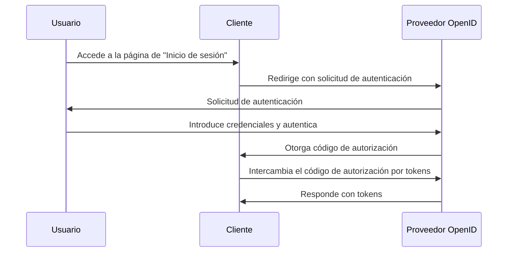

## ¿Qué es una solicitud de autenticación (Authentication request)?

Aunque el significado de una solicitud de autenticación (Authentication request) puede variar según el contexto, nos centraremos en la definición de la especificación de OpenID Connect (OIDC). En OIDC, una solicitud de autenticación (Authentication request) es una <Ref slug="authorization-request" /> al servidor de autorización (authorization server) para autenticar a un usuario.

La definición estándar parece muy confusa debido a que se utilizan términos similares, como "solicitud de autorización" (authorization request). Esto se debe a que OIDC se construye sobre OAuth 2.0, que está diseñado principalmente para la autorización (authorization), y OIDC hereda la terminología de OAuth 2.0 y la extiende para admitir la autenticación (authentication).

Para aclarar, añadamos algo de contexto a la definición:

> Una solicitud de autenticación (OpenID Connect) es una solicitud de autorización (OAuth 2.0 authorization) al servidor de autorización (OpenID Connect authorization server) para autenticar a un usuario.

¡Se hace aún más larga! Ahora eliminemos todos los paréntesis:

> Una solicitud de autenticación (Authentication request) es una solicitud al servidor para autenticar a un usuario.

Después de eliminar todos los atributos, la definición se vuelve sencilla. Aquí está el desglose de los términos:

- **Solicitud de autenticación (Authentication request)**: El término de la especificación de OIDC.
- <Ref slug="authorization-request" />: El término de la especificación de OAuth 2.0. OIDC reutiliza la especificación y la extiende.
- <Ref slug="authorization-server" />: El término de la especificación de OAuth 2.0. OIDC también usa el término <Ref slug="openid-connect" headingId="openid-provider-op" /> para referirse a la misma entidad que es capaz de autenticar usuarios.

En las siguientes secciones, usaremos "Proveedor OpenID (OP)" para referirnos al servidor de autorización (authorization server) que admite OIDC.

## ¿Cómo funciona una solicitud de autenticación (Authentication request)?

Cuando una aplicación cliente desea autenticar a un usuario, inicia una solicitud de autenticación (Authentication request) al Proveedor OpenID (OP). Como mencionamos anteriormente, la solicitud de autenticación (Authentication request) también es una solicitud de autorización (authorization request) en OAuth 2.0; por lo tanto, ciertos tipos de concesión de OAuth 2.0 (flows) pueden usarse para completar el proceso de autenticación (authentication).

OIDC define tres tipos de concesión (flows) para admitir la autenticación (authentication):

1. <Ref slug="authorization-code-flow" />: El flujo de autenticación (authentication flow) más recomendado. Por lo general, se usa con <Ref slug="pkce" /> para mayor seguridad y es adecuado para la mayoría de aplicaciones.
2. <Ref slug="implicit-flow" />: Un flujo simplificado que está obsoleto en <Ref slug="oauth-2.1" /> debido a preocupaciones de seguridad.
3. <Ref slug="hybrid-flow" />: Una combinación del flujo de código de autorización (authorization code flow) y el flujo implícito (implicit flow).

La solicitud de autenticación (Authentication request) es el primer paso en el flujo de autenticación (authentication flow) de OIDC. Los parámetros reales a incluir y los pasos a seguir dependen del flujo que elijas. Haz clic en los nombres de los flujos arriba para saber más sobre cada flujo.

Aquí hay un ejemplo simplificado de una solicitud de autenticación (Authentication request) usando el flujo de código de autorización (authorization code flow):

Una vez que el cliente recibe los tokens, puede usarlos (e.g., <Ref slug="access-token" />) para acceder a recursos protegidos (e.g., una API) en nombre del usuario.

### Parámetros clave en una solicitud de autenticación (Authentication request)

Aquí están algunos parámetros clave en una solicitud de autenticación (Authentication request):

- **`response_type`**: El tipo de respuesta que el cliente espera del servidor de autorización (authorization server). Puede ser `code` para el flujo de código de autorización (authorization code flow), `id_token` para el flujo implícito (implicit flow), o `code id_token` para el flujo híbrido (hybrid flow).
- **`client_id`**: El identificador de cliente emitido por el Proveedor OpenID (OP).
- **`redirect_uri`**: El URI al cual el servidor de autorización (authorization server) redirigirá al agente del usuario después de la solicitud de autenticación (authentication request).
- **`scope`**: Los <Ref slug="scope">alcances</Ref> (permisos) solicitados para el <Ref slug="id-token" /> y el <Ref slug="access-token" />.
- **`resource`**: El parámetro opcional que especifica el <Ref slug="resource-indicator" /> para los recursos solicitados. El servidor de autorización (authorization server) necesita admitir [RFC 8707](https://datatracker.ietf.org/doc/html/rfc8707) para usar este parámetro.

Tenga en cuenta que los parámetros anteriores no son exhaustivos. Antes de hacer una solicitud de autenticación (Authentication request), deberías consultar la lista completa de parámetros para el flujo específico que estés utilizando.

<SeeAlso slugs={["openid-connect", "oauth-2.0", "authorization-code-flow", "implicit-flow", "hybrid-flow"]} />

<Resources
  urls={[
    "https://openid.net/specs/openid-connect-core-1_0.html",
  ]}
/>