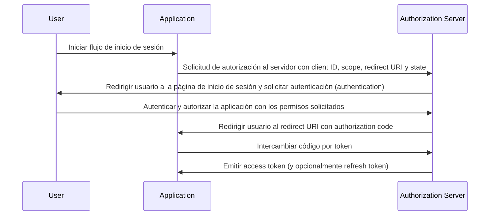

## ¿Qué es el flujo de código de autorización (authorization code flow)?

El flujo de código de autorización (authorization code flow, también conocido como autorización de código grant), definido en [OAuth 2.0 RFC 6749, sección 4.1](https://datatracker.ietf.org/doc/html/rfc6749#section-4.1), es un mecanismo de autorización de OAuth 2.0 ampliamente utilizado que permite a las aplicaciones obtener un access token en nombre de un usuario. Este flujo es particularmente adecuado para aplicaciones confidenciales (por ejemplo, aplicaciones web tradicionales que se ejecutan del lado del servidor) donde el secreto del cliente puede almacenarse de forma segura.

El flujo de código de autorización (authorization code flow) es un método robusto y seguro para obtener access tokens en OAuth 2.0, lo que lo convierte en una opción preferida para muchas aplicaciones web. Comprender este flujo es esencial para los desarrolladores que trabajan con OAuth 2.0 y las integraciones de API.

## ¿Cómo funciona el flujo de código de autorización (authorization code flow)?

El flujo de código de autorización (authorization code flow) involucra los siguientes pasos:

1. **Inicio del flujo**: El usuario inicia el flujo generalmente haciendo clic en un enlace o botón en la aplicación para iniciar sesión. La aplicación redirige al usuario al endpoint de autorización del authorization server, pasando junto con él el client ID, el scope solicitado, un redirect URI y un parámetro state. El authorization server valida los parámetros y solicita al usuario que se autentique (authenticate) en la página de inicio de sesión del authorization server.
2. **Autenticación (Authentication) y autorización (Authorization) del usuario**: El usuario se autentica con el authorization server y concede a la aplicación permiso para acceder a los recursos solicitados.
3. **Generación de código y redirección**: El authorization server genera un código de autorización (authorization code) y redirige al usuario de nuevo a la aplicación utilizando el redirect URI proporcionado anteriormente. El authorization code se incluye en la cadena de consulta del redirect URI.
4. **Intercambio de código (Code exchange)**: La aplicación extrae el authorization code de la cadena de consulta y realiza una solicitud POST al token endpoint del authorization server para intercambiar el authorization code por un access token. La aplicación también debe incluir el client ID, client secret, redirect URI y el authorization code en la solicitud.
5. **Recuperación del access token**: El authorization server valida el authorization code y emite un access token (y opcionalmente un refresh token) a la aplicación tras la validación exitosa. La aplicación puede entonces usar el access token para hacer solicitudes autorizadas a la API en nombre del usuario.

Los pasos pueden ilustrarse con el siguiente diagrama de secuencia:



## Solicitud de autenticación (Authentication request)

Los parámetros de solicitud son los siguientes:

- **client_id**: OBLIGATORIO. Identificador de cliente OAuth 2.0 válido.
- **scope**: OBLIGATORIO. Este valor especifica un conjunto de recursos que el usuario solicita del authorization server. Por ejemplo, `openid profile email`.
- **response_type**: OBLIGATORIO. El valor debe ser `code` para indicar que la aplicación espera un authorization code.
- **redirect_uri**: OBLIGATORIO. La URI a la que se enviará la respuesta de autenticación (authentication) y debe coincidir exactamente con el redirect URI pre-registrado por el cliente en el authorization server.
- **state**: RECOMENDADO. Un valor opaco utilizado para mantener el estado entre la solicitud y la devolución de llamada. También se usa para prevenir ataques de <Ref slug="csrf" />.
- **nonce**: OPCIONAL. Una cadena aleatoria utilizada para asociar una sesión de cliente con un id token y para mitigar ataques de repetición.
- **prompt**: OPCIONAL. Lista de valores de cadena delimitados por espacios y sensibles a mayúsculas y minúsculas que especifica si el authorization server solicita al usuario final re-autenticación y consentimiento. Los valores definidos son:
  - **none**: El authorization server NO DEBE mostrar ninguna página de usuario de autenticación o consentimiento. Se devuelve un error si un usuario final no está ya autenticado o el cliente no tiene consentimiento preconfigurado para los Claims solicitados o no cumple con otras condiciones para procesar la solicitud. El código de error típicamente será `login_required`, `interaction_required`. Esto puede usarse como un método para verificar la autenticación existente y/o el consentimiento.
  - **login**: El authorization server DEBERÍA solicitar al usuario final reautenticarse. Si no puede reautenticar al usuario final, DEBE devolver un error, típicamente `login_required`.
  - **consent**: El authorization server DEBERÍA solicitar al usuario final consentimiento antes de devolver información al cliente. Si no puede obtener consentimiento, DEBE devolver un error, típicamente `consent_required`.
  - **select_account**: El authorization server DEBERÍA solicitar al usuario final seleccionar una cuenta de usuario. Esto permite a un usuario final que tiene múltiples cuentas en el authorization server seleccionar entre múltiples cuentas para las cuales podrían tener sesiones actuales. Si no puede obtener una elección de selección de cuenta hecha por el usuario final, DEBE devolver un error, típicamente `account_selection_required`.

[Definición completa de parámetros de solicitud](https://openid.net/specs/openid-connect-core-1_0.html#AuthRequest)

### Ejemplo de solicitud de autenticación (Authentication request)

```bash
curl -X GET "https://authorization-server.com/auth" \
  -d "response_type=code" \
  -d "client_id=YOUR_APPLICATION_ID" \
  -d "redirect_uri=https://yourapp.com/callback" \
  -d "scope=openid profile email" \
  -d "state=RANDOM_STRING_FOR_STATE"
```

Una respuesta exitosa típica:

```http
HTTP/1.1 302 Found
Location: https://yourapp.com/callback?
  code=YOUR_AUTHORIZATION_CODE
  &state=RANDOM_STRING_FOR_STATE
```

## Solicitud de intercambio de token (Token exchange request)

Una vez que la solicitud de autenticación (authentication request) anterior responde con éxito, el cliente será redirigido automáticamente al callback URI `https://yourapp.com/callback`, con el código como un parámetro URI.

Se espera que el cliente obtenga y procese el `code` con una solicitud de intercambio de token posterior, para intercambiarlo por el access tooken.

### Ejemplo de solicitud de intercambio de token (Token exchange request)

```bash
curl -X POST "https://authorization-server.com/token" \
  -H "Content-Type: application/x-www-form-urlencoded" \
  -d "client_id=YOUR_CLIENT_ID" \
  -d "code=YOUR_AUTHORIZATION_CODE" \
  -d "redirect_uri=https://yourapp.com/callback" \
  -d "grant_type=authorization_code" \
```

## Beneficios

- **Seguridad mejorada**: El client secret nunca se expone al navegador del usuario, reduciendo el riesgo de suplantación de cliente.
- **Código de autorización (authorization code) de un solo uso**: El authorization code tiene una corta duración y solo puede usarse una vez, reduciendo el riesgo de interceptación y ataques de repetición.
- **Tokens de corta duración**: Los access tokens emitidos en este flujo tienen corta duración (típicamente 1 hora), reduciendo el riesgo de acceso no autorizado si el token es comprometido.
- **Refresh token**: El authorization server puede emitir opcionalmente un refresh token, permitiendo a la aplicación obtener un nuevo access token sin requerir interacción del usuario.

## ¿Cuál es la diferencia entre el flujo de código de autorización (authorization code flow) y el flujo implícito (implicit flow)?

La principal diferencia entre el flujo de código de autorización (authorization code flow) y el flujo implícito (implicit flow) es cómo se obtiene el access token:

- **Flujo de código de autorización (Authorization code flow)**: La aplicación cliente recibe un authorization code primero desde el endpoint de autorización, luego lo intercambia por un access token en una solicitud POST posterior al token endpoint.
- **Flujo implícito (Implicit flow)**: La aplicación cliente recibe el access token directamente desde el endpoint de autorización.

## ¿Cuál es la diferencia entre el flujo de código de autorización (authorization code flow) y el flujo de credenciales de cliente (client credentials flow)?

La principal diferencia entre el flujo de código de autorización (authorization code flow) y el flujo de credenciales de cliente (client credentials flow) es el contexto en el que se utiliza el flujo:

- **Flujo de código de autorización (Authorization code flow)**: Se utiliza cuando la aplicación cliente necesita acceder a recursos en nombre de un usuario. El flujo involucra autenticación (authentication) y autorización (authorization) del usuario.
- **Flujo de credenciales de cliente (Client credentials flow)**: Se utiliza cuando la aplicación cliente necesita acceder a recursos en su propio nombre. El flujo involucra autenticación del cliente pero no autenticación del usuario, siendo más adecuado para comunicación de máquina a máquina (machine-to-machine).

## ¿Cuáles son los casos de uso típicos para el flujo de código de autorización (authorization code flow)?

- Aplicaciones web tradicionales que requieren autenticación (authentication) del usuario y acceso a APIs.
- Aplicaciones que necesitan acceder de manera segura a los datos del usuario de servicios de terceros.

<SeeAlso slugs={['device-flow', 'implicit-flow', 'client-credentials-flow']} />

<Resources urls={['https://datatracker.ietf.org/doc/html/rfc6749']} />