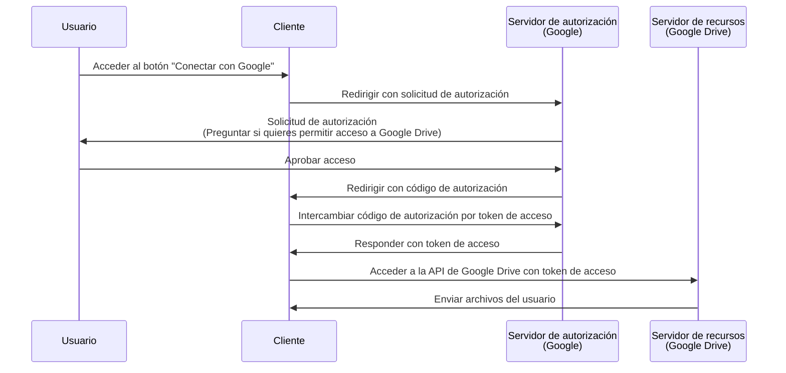

## ¿Qué es una solicitud de autorización (authorization request)?

Dependiendo del contexto, el término "solicitud de autorización (authorization request)" puede referirse a diferentes cosas. En este artículo, nos centraremos en la definición según la especificación de <Ref slug="oauth-2.0" />.

En OAuth 2.0, hay varios tipos de concesión (flujos) que definen cómo un <Ref slug="client" /> puede obtener autorización de un usuario para acceder a recursos protegidos.

> ![Nota]
> Las "solicitudes de autorización (authorization requests)" a menudo se confunden con las "solicitudes de autenticación (authentication requests)" en el contexto de <Ref slug="openid-connect" />. Consulta <Ref slug="authentication-request" /> para obtener detalles específicos de OIDC.

## ¿Cómo funciona una solicitud de autorización (authorization request)?

Cuando un cliente (aplicación) quiere acceder a recursos protegidos en nombre de un usuario, inicia una solicitud de autorización (authorization request) al <Ref slug="authorization-server" />. El cliente debe indicar el tipo de concesión solicitado junto con los parámetros necesarios en la solicitud.

Estos son algunos tipos de concesión (flujos) típicos para la autorización de usuarios finales en OAuth 2.0:

- <Ref slug="authorization-code-flow" />: El flujo más recomendado para la autorización de usuarios finales. Se suele usar con <Ref slug="pkce" /> para mayor seguridad y es adecuado para la mayoría de las aplicaciones.
- <Ref slug="implicit-flow" />: Un flujo simplificado que ha sido depreciado en <Ref slug="oauth-2.1" /> debido a preocupaciones de seguridad.
- [Credenciales de contraseña del propietario del recurso (ROPC) grant](https://datatracker.ietf.org/doc/html/rfc6749#section-4.3): Una concesión (flujo) donde las credenciales del usuario se intercambian directamente por un token de acceso. Este flujo no se recomienda debido a riesgos de seguridad.

También hay otras extensiones, como el <Ref slug="device-flow" /> para dispositivos con capacidades de entrada limitadas. Cada flujo tiene sus propias características y casos de uso. Para la mayoría de las aplicaciones web, el flujo de código de autorización es la elección recomendada.

> La autorización <Ref slug="machine-to-machine" /> generalmente se realiza utilizando el <Ref slug="client-credentials-flow" />, que no involucra la interacción del usuario.

Por ejemplo, un cliente (aplicación) puede solicitar autorización para acceder a los archivos de Google Drive de un usuario. Aquí tienes un diagrama de secuencia simplificado del flujo de código de autorización:

Una vez que se obtiene el <Ref slug="access-token" />, el cliente puede usarlo para acceder a los archivos de Google Drive del usuario en su nombre.

### Parámetros clave en una solicitud de autorización (authorization request)

La solicitud de autorización de OAuth 2.0 típicamente incluye los siguientes parámetros:

- **`response_type`**: El tipo de respuesta que espera el cliente. Los valores comunes son `code` para el flujo de código de autorización y `token` para el flujo implícito.
- **`client_id`**: El identificador del cliente emitido por el servidor de autorización.
- **`redirect_uri`**: El URI donde el servidor de autorización envía al usuario después del proceso de autorización.
- **`scope`**: Los <Ref slug="scope">alcances (scopes)</Ref> solicitados (permisos) para el token de acceso.
- **`resource`**: El parámetro opcional que especifica el <Ref slug="resource-indicator" /> para los recursos solicitados. El servidor de autorización necesita soportar [RFC 8707](https://datatracker.ietf.org/doc/html/rfc8707) para usar este parámetro.

Los parámetros anteriores no son exhaustivos. Los parámetros reales y sus valores dependen del tipo de concesión y de los requisitos específicos de la aplicación.

<SeeAlso slugs={["oauth-2.0", "authentication-request", "authorization-code-flow", "implicit-flow", "device-flow"]} />

<Resources
  urls={[
    { url: "https://datatracker.ietf.org/doc/html/rfc6749#section-4", result: {
      ogTitle: "Obtaining Authorization in OAuth 2.0",
      ogDescription: " To request an access token, the client obtains authorization from the resource owner."
    } }
  ]}
/>