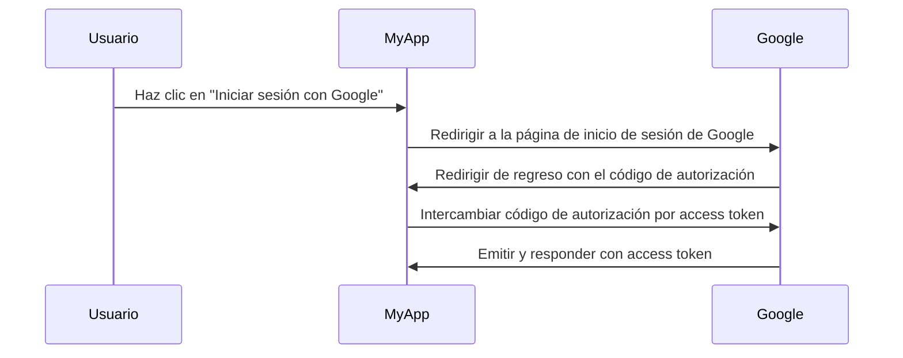

## ¿Qué es un servidor de autorización?

El término "servidor de autorización" puede ser un término general que se refiere a cualquier servidor que realiza autorización (authorization). Nos centraremos en la definición en el contexto de los marcos <Ref slug="oauth-2.0" /> y <Ref slug="openid-connect" />.

En OAuth 2.0, un servidor de autorización es un componente que emite <Ref slug="access-token">access tokens (tokens de acceso)</Ref> a <Ref slug="client">clientes</Ref> después de autenticar (authenticate) y autorizar (authorize) con éxito. Los access tokens (tokens de acceso) son utilizados por los clientes para acceder a recursos protegidos en nombre del usuario (propietario del recurso).

¿Demasiado terminología? Veamos un ejemplo del mundo real: un usuario hace clic en "Iniciar sesión con Google" en una aplicación "MyApp" que utiliza el <Ref slug="authorization-code-flow" /> para iniciar sesión con Google.

En este ejemplo, Google actúa como el **servidor de autorización** que emite un access token (token de acceso) al **cliente** (MyApp) después de que el usuario inicia sesión exitosamente. El cliente puede entonces usar el **access token (token de acceso)** para obtener el perfil del usuario (recurso protegido) en Google.

### Servidor de autorización en OpenID Connect (OIDC)

Dado que OpenID Connect se construye sobre OAuth 2.0, reutiliza algunos términos y conceptos de OAuth 2.0. OIDC agrega la capacidad de autenticación al servidor de autorización OAuth 2.0, lo que convierte al servidor de autorización también en un <Ref slug="openid-connect" headingId="openid-provider-op" />. Para evitar ambigüedades, recomendamos siempre usar el término "OpenID Provider" cuando se refiere al servidor de autorización en OIDC.

Además de emitir access tokens (tokens de acceso), el OpenID Provider (servidor de autorización) en OIDC también emite <Ref slug="id-token">ID tokens (tokens de identificación)</Ref> a los clientes. Los ID tokens contienen información del usuario y se utilizan para autenticar (authenticate) a los usuarios.

## ¿Cómo funciona un servidor de autorización?

Un servidor de autorización debe admitir los <Ref slug="oauth-2.0-grant">OAuth 2.0 grants (concesiones, flujos)</Ref> para emitir access tokens (tokens de acceso) a los clientes. Un tipo de concesión generalmente consiste en una serie de pasos que el cliente y el servidor de autorización siguen para obtener un access token.

- Para la autorización de usuario, la mayoría de los tipos de concesión requieren que el cliente inicie un <Ref slug="authorization-request" /> al servidor de autorización. En el ejemplo anterior de inicio de sesión con Google, el paso "Redirigir a la página de inicio de sesión de Google" es una solicitud de autorización iniciada por el cliente.
- Para la autorización <Ref slug="machine-to-machine" />, el cliente puede usar el <Ref slug="client-credentials-flow" /> para enviar directamente una <Ref slug="token-request" /> al servidor de autorización.

El servidor de autorización también debería validar la solicitud del cliente, autenticar (authenticate) al cliente y verificar la identidad del usuario antes de emitir un access token. También puede aplicar medidas de seguridad adicionales, como <Ref slug="pkce" /> para el <Ref slug="authorization-code-flow" />.

## Casos de uso del servidor de autorización

Como su nombre lo indica, los servidores de autorización se utilizan para manejar <Ref slug="authorization" />. El servidor de autorización puede involucrar a primeras y terceras partes:

- El ejemplo anterior de inicio de sesión con Google.
- Un sitio web de comercio electrónico (cliente) solicitando acceso a la información de pago de un usuario (recurso protegido) desde otro sitio web.
- Una aplicación móvil (cliente) solicitando acceso a datos de ubicación de un usuario (recurso protegido) de un proveedor de servicios de ubicación.

O, puede ser utilizado solo para autorización interna, como:

- Un usuario necesita acceder a sus pedidos (recurso protegido) en un sitio web de comercio electrónico (cliente).
- Un servicio (cliente) necesita acceder a una base de datos (recurso protegido) en una arquitectura de microservicios.

En aplicaciones modernas, un servidor de autorización también puede ser un <Ref slug="identity-provider" /> que también admite <Ref slug="openid-connect" /> para la autenticación de usuarios.

<SeeAlso slugs={["oauth-2.0", "authorization-request", "access-token"]} />
 
<Resources
  urls={[
    "https://blog.logto.io/ciam-102-authz-and-rbac",
    "https://tools.ietf.org/html/rfc6749",
  ]}
/>
