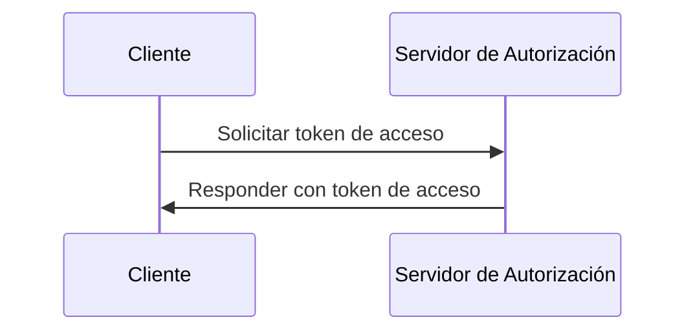
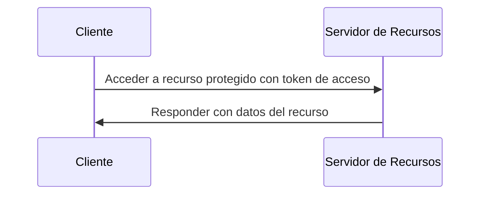

## ¿Qué es el flujo de credenciales del cliente (Client credentials flow)?

El flujo de credenciales del cliente (Client credentials flow) es un tipo de <Ref slug="oauth-2.0-grant" /> que permite a los clientes confidenciales obtener <Ref slug="access-token">tokens de acceso</Ref> para acceder a recursos protegidos. Usualmente, este flujo se utiliza para la comunicación de <Ref slug="machine-to-machine" /> donde el cliente es un servidor o un servicio.

> [!Note]
> El flujo de credenciales del cliente no es adecuado para la autorización de usuarios finales. Para la autorización de usuarios finales, deberías usar <Ref slug="authentication-request" /> o <Ref slug="authorization-request" />.

## ¿Cómo funciona el flujo de credenciales del cliente (Client credentials flow)?

El flujo de credenciales del cliente es un proceso simple de dos pasos:

1. **Solicitud de token (Token request)**: El cliente envía una <Ref slug="token-request" /> con sus credenciales del cliente (ID de cliente y secreto del cliente) y los <Ref slug="scope">alcances</Ref> solicitados.
2. **Respuesta de token (Token response)**: El <Ref slug="authorization-server" /> valida las credenciales del cliente y emite un token de acceso si el cliente está autorizado.

Aquí tienes un diagrama de secuencia simplificado del flujo de credenciales del cliente:



Aquí hay un ejemplo no normativo de una solicitud de token en el flujo de credenciales del cliente:

```http
POST /token HTTP/1.1
Host: your-authorization-server.com
Content-Type: application/x-www-form-urlencoded

grant_type=client_credentials
  &client_id=YOUR_CLIENT_ID
  &client_secret=YOUR_CLIENT_SECRET
  &scope=read write
```

El servidor de autorización validará las credenciales del cliente y emitirá un token de acceso si el cliente está autorizado. Una vez que el cliente recibe el token de acceso, puede usarlo para acceder a recursos protegidos (por ejemplo, una API) en su propio nombre. Aquí tienes un ejemplo de cómo un cliente usa el token de acceso para acceder a una API:



Tenga en cuenta que el <Ref slug="resource-server" /> debe validar el token de acceso y hacer cumplir las políticas de <Ref slug="access-control" /> para asegurarse de que el cliente tenga los permisos necesarios para acceder al recurso.

### Parámetros clave en una solicitud de token en el flujo de credenciales del cliente

A diferencia de otros flujos de OAuth 2.0, el flujo de credenciales del cliente tiene una <Ref slug="token-request" /> simple con los siguientes parámetros clave:

- **`grant_type`**: El tipo de otorgamiento debe establecerse en `client_credentials` para indicar el flujo de credenciales del cliente.
- **`client_id`**: El identificador del cliente emitido por el servidor de autorización.
- **`client_secret`**: El secreto del cliente emitido por el servidor de autorización.
- **`scope`**: Los <Ref slug="scope">alcances</Ref> solicitados (permisos) para el token de acceso.
- **`resource`**: El parámetro opcional que especifica el <Ref slug="resource-indicator" /> para los recursos solicitados. El servidor de autorización necesita soportar [RFC 8707](https://datatracker.ietf.org/doc/html/rfc8707) para utilizar este parámetro.

## Consideraciones de seguridad

### Clientes confidenciales

El flujo de credenciales del cliente es adecuado para <Ref slug="client" headingId="confidential-clients" /> (clientes confidenciales) que pueden almacenar de manera segura el secreto del cliente. Si el cliente es un cliente público (por ejemplo, una aplicación de una sola página), no debería utilizar el flujo de credenciales del cliente porque el secreto del cliente podría ser expuesto.

### Expiración del token

Aunque el token de acceso obtenido en el flujo de credenciales del cliente puede tener un largo tiempo de expiración, se recomienda usar tokens de acceso de corta duración (por ejemplo, 1 hora) para reducir el riesgo de acceso no autorizado si el token es comprometido.

### Rotación de secretos del cliente

Para mejorar la seguridad, se recomienda rotar el secreto del cliente periódicamente. El servidor de autorización debe soportar la rotación de secretos del cliente sin afectar la capacidad del cliente para obtener tokens de acceso. Por ejemplo, el servidor de autorización debe soportar múltiples secretos de cliente para compatibilidad retroactiva durante el proceso de rotación.

<SeeAlso slugs={["machine-to-machine", "token-request", "access-token", "scope", "resource-indicator"]} />

<Resources
  urls={[
    "https://blog.logto.io/programmatic-authentication-methods",
    { 
      url: "https://datatracker.ietf.org/doc/html/rfc6749#section-4.4",
      result: {
        ogTitle: "Client Credentials Grant",
        ogDescription: "El cliente puede solicitar un token de acceso utilizando solo sus credenciales de cliente (u otros medios de autenticación soportados) cuando el cliente está solicitando acceso a los recursos protegidos bajo su control, o aquellos de otro propietario de recurso que se han arreglado previamente con el servidor de autorización."
      }
    }
  ]}
/>
