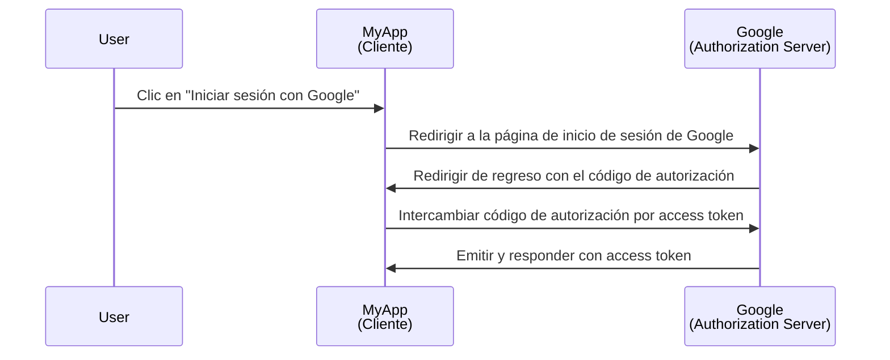
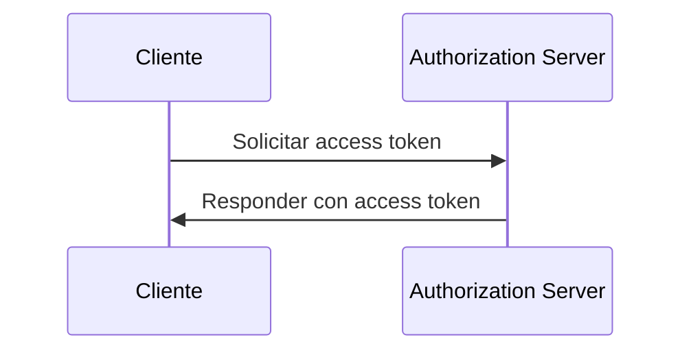

## ¿Qué es un cliente?

Un cliente, en el contexto de <Ref slug="oauth-2.0" /> y <Ref slug="openid-connect" />, es una aplicación que solicita autenticación (authentication) o autorización (authorization). Por ejemplo, cuando un usuario hace clic en "Iniciar sesión con Google" en una aplicación, la aplicación actúa como un **cliente** que solicita autorización a Google.

> "Cliente" y "aplicación" a menudo se usan indistintamente en el contexto de <Ref slug="iam" />.

Existen múltiples categorizaciones de clientes basadas en sus capacidades y niveles de confianza, pero para los frameworks, una distinción significativa es entre clientes públicos y confidenciales. Esto afecta cómo el cliente puede obtener tokens y los tipos de concesiones que puede usar.

### Clientes públicos ||public-clients||

Los clientes públicos son aplicaciones que no pueden mantener sus credenciales confidenciales, lo que significa que el propietario del recurso (usuario) puede acceder a ellas. Ejemplos de clientes públicos incluyen:

- Aplicaciones de una sola página (SPAs)
- Aplicaciones móviles
- Aplicaciones de escritorio

Podrías argumentar que las aplicaciones móviles y de escritorio tienen capacidades de almacenamiento seguro, pero la mayoría de los frameworks las consideran clientes públicos porque se distribuyen a los usuarios finales y se asume que los usuarios finales pueden acceder a las credenciales.

### Clientes confidenciales ||confidential-clients||

Los clientes confidenciales (privados) son aplicaciones que pueden almacenar información sensible de manera confidencial sin exponerla a los propietarios de los recursos (usuarios finales). Ejemplos de clientes confidenciales incluyen:

- Servidores web
- Servicios backend

## ¿Cómo funciona un cliente?

### Autenticación (authentication) y autorización (authorization) del usuario

Cuando un cliente quiere autenticar a un usuario, un cliente inicia una <Ref slug="authorization-request" /> al <Ref slug="authorization-server" /> para obtener un <Ref slug="access-token" />. El cliente debe incluir los parámetros necesarios en la solicitud, como el ID del cliente, la URI de redirección y los ámbitos (scopes). Aquí tienes un diagrama de secuencia simplificado del flujo de código de autorización (authorization code flow):

En este ejemplo, Google actúa como el **authorization server** que emite un access token al **cliente** (MyApp) después de que el usuario inicia sesión exitosamente. El cliente puede entonces usar el **access token** para obtener el perfil del usuario (recurso protegido) en Google.

Para los clientes de OpenID Connect (OIDC), el cliente necesita iniciar una <Ref slug="authentication-request" /> para autenticar al usuario. Utiliza el mismo endpoint que el authorization request, pero los parámetros y la respuesta son diferentes.

### Comunicación máquina a máquina

Para la comunicación <Ref slug="machine-to-machine" />, el cliente puede usar el <Ref slug="client-credentials-flow" /> para enviar directamente una <Ref slug="token-request" /> al authorization server. El cliente debe incluir el ID del cliente, el secreto del cliente y los ámbitos (scopes) en la solicitud. Aquí tienes un diagrama de secuencia simplificado del flujo de client credentials flow:

El authorization server validará las credenciales del cliente y emitirá un access token si el cliente está autorizado. Dado que el cliente necesita enviar el secreto del cliente, es importante usar el client credentials flow solo para clientes confidenciales.

## Consideraciones de seguridad

### Tipos de clientes

El tipo de cliente (público o privado) afecta las consideraciones de seguridad para el cliente.

- Los clientes públicos no deben usar el client credentials flow porque no pueden almacenar de forma segura el secreto del cliente. En su lugar, se recomienda el uso del <Ref slug="authorization-code-flow" /> con <Ref slug="pkce" /> para que los clientes públicos autentiquen a los usuarios.
- Los clientes confidenciales pueden usar el client credentials flow para la comunicación máquina a máquina. Deben almacenar de forma segura el secreto del cliente y usarlo solo en entornos seguros.

### Almacenamiento de tokens

Los clientes deben usar el nivel más alto de seguridad posible para almacenar tokens. Por ejemplo, en aplicaciones web, se recomiendan cookies HTTP-only para almacenar access tokens y prevenir ataques XSS.

### Expiración de tokens

Los access tokens tienen una vida útil limitada para reducir el riesgo de acceso no autorizado. Los clientes deben manejar la expiración de los tokens de manera eficiente usando <Ref slug="refresh-token">refresh tokens</Ref> para obtener nuevos access tokens.

### Revocación de tokens

Los clientes deben estar preparados para manejar la revocación de tokens. Si el usuario cierra sesión o el authorization server revoca el token, el cliente debe borrar el token del almacenamiento del lado del cliente.

<SeeAlso slugs={["oauth-2.0", "oauth-2.0-grant", "openid-connect", "authorization-request", "authentication-request"]} />

<Resources
  urls={[
    "https://blog.logto.io/secure-cloud-apps-with-oauth-and-openid-connect",
    "https://datatracker.ietf.org/doc/html/rfc6749",
    "https://openid.net/specs/openid-connect-core-1_0.html"
  ]}
/>
